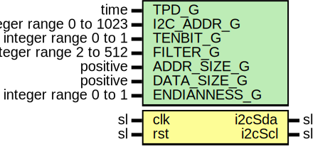

# Entity: i2cRamSlave

- **File**: i2cRamSlave.vhd
## Diagram

## Description

Company    : SLAC National Accelerator Laboratory
Description: Simulation testbed for i2cRamSlave
This file is part of 'SLAC Firmware Standard Library'.
It is subject to the license terms in the LICENSE.txt file found in the
top-level directory of this distribution and at:
   https://confluence.slac.stanford.edu/display/ppareg/LICENSE.html.
No part of 'SLAC Firmware Standard Library', including this file,
may be copied, modified, propagated, or distributed except according to
the terms contained in the LICENSE.txt file.
## Generics

| Generic name | Type                    | Value | Description |
| ------------ | ----------------------- | ----- | ----------- |
| TPD_G        | time                    | 1 ns  |             |
| I2C_ADDR_G   | integer range 0 to 1023 | 0     |             |
| TENBIT_G     | integer range 0 to 1    | 0     |             |
| FILTER_G     | integer range 2 to 512  | 4     |             |
| ADDR_SIZE_G  | positive                | 2     |             |
| DATA_SIZE_G  | positive                | 2     |             |
| ENDIANNESS_G | integer range 0 to 1    | 0     |             |
## Ports

| Port name | Direction | Type | Description |
| --------- | --------- | ---- | ----------- |
| clk       | in        | sl   |             |
| rst       | in        | sl   |             |
| i2cSda    | inout     | sl   |             |
| i2cScl    | inout     | sl   |             |
## Signals

| Name   | Type                          | Description |
| ------ | ----------------------------- | ----------- |
| i2ci   | i2c_in_type                   |             |
| i2co   | i2c_out_type                  |             |
| ram    | RamType                       |             |
| addr   | slv(8*ADDR_SIZE_G-1 downto 0) |             |
| wrEn   | sl                            |             |
| wrData | slv(8*DATA_SIZE_G-1 downto 0) |             |
| rdEn   | sl                            |             |
| rdData | slv(8*DATA_SIZE_G-1 downto 0) |             |
## Types

| Name    | Type | Description |
| ------- | ---- | ----------- |
| RamType |      |             |
## Processes
- ram_proc: ( clk )
## Instantiations

- i2cRegSlave_1: surf.i2cRegSlave
