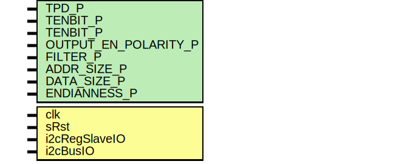

# Entity: i2cRegSlave

- **File**: i2cRegSlave.sv
## Diagram

## Description

                             -*- Mode: Verilog -*-
 Filename        : i2cRegSlave.sv
 Description     : Implements an I2C slave attached to a generic RAM interface.
 Author          : Benjamin Reese
 Created On      : Mon Apr 22 10:04:49 2013
 Last Modified By: Benjamin Reese
 Last Modified On: Mon Apr 22 10:04:49 2013
 Update Count    : 0
 Status          : Unknown, Use with caution!
 i2cRegSlaveIntf
 
## Generics

| Generic name         | Type | Value | Description |
| -------------------- | ---- | ----- | ----------- |
| TPD_P                |      | 1     |             |
| TENBIT_P             |      | 0     |             |
| TENBIT_P             |      | 111   |             |
| OUTPUT_EN_POLARITY_P |      | 0     |             |
| FILTER_P             |      | 4     |             |
| ADDR_SIZE_P          |      | 2     | in bytes    |
| DATA_SIZE_P          |      | 2     | in bytes    |
| ENDIANNESS_P         |      | 0     |             |
## Ports

| Port name     | Direction | Type | Description |
| ------------- | --------- | ---- | ----------- |
| clk           | input     |      |             |
| sRst          | input     |      |             |
| i2cRegSlaveIO | input     |      |             |
| i2cBusIO      | input     |      |             |
## Signals

| Name | Type    | Description |
| ---- | ------- | ----------- |
| r    | RegType |             |
| rin  | RegType |             |
## Types

| Name      | Type                                                                                                                                                                                                                                                                                                                                                                                                                                                                                                                                                                                                                                                                              | Description |
| --------- | --------------------------------------------------------------------------------------------------------------------------------------------------------------------------------------------------------------------------------------------------------------------------------------------------------------------------------------------------------------------------------------------------------------------------------------------------------------------------------------------------------------------------------------------------------------------------------------------------------------------------------------------------------------------------------- | ----------- |
| StateType | enum logic[1:0] {  IDLE_S,  ADDR_S,  WRITE_DATA_S,  READ_DATA_S }                                                                                                                                                                                                                                                                                                                                                                                                                                                                     |             |
| RegType   | struct {        StateType state;        logic [3:0] 		   byteCount;        logic 			   enable;        logic [ADDR_SIZE_P-1:0][7:0] addr ;        logic [DATA_SIZE_P-1:0][7:0] wrData;        logic 			   wrEn;        logic 			   rdEn;                logic 			   txValid;        logic [7:0] 		   txData;       } |             |
## Processes
- unnamed: (  )
- unnamed: ( @(posedge clk) )
**Description**
always_comb

## Instantiations

- i2cSlaveIO: i2cSlaveIntf
- i2cSlaveInst: i2cSlave
**Description**
Instantiate I2C Slave

