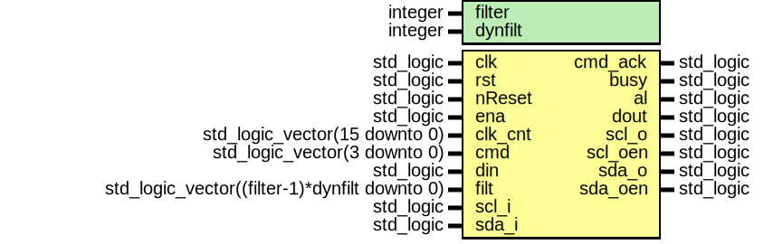
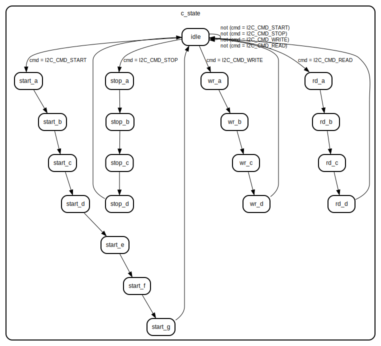

# Entity: i2c_master_bit_ctrl

- **File**: i2c_master_bit_ctrl.vhd
## Diagram

## Description

 CVS Log
 $Id: i2c_master_bit_ctrl.vhd,v 1.14 2006/10/11 12:10:13 rherveille Exp $
 $Date: 2006/10/11 12:10:13 $
 $Revision: 1.14 $
 $Author: rherveille $
 $Locker:  $
 $State: Exp $
Change History:
              $Log: i2c_master_bit_ctrl.vhd,v $
              Revision 1.14  2006/10/11 12:10:13  rherveille
              Added missing semicolons ';' on endif
              Revision 1.13  2006/10/06 10:48:24  rherveille
              fixed short scl high pulse after clock stretch
              Revision 1.12  2004/05/07 11:53:31  rherveille
              Fixed previous fix :) Made a variable vs signal mistake.
              Revision 1.11  2004/05/07 11:04:00  rherveille
              Fixed a bug where the core would signal an arbitration lost (AL bit set), when another master controls the bus and the other master generates a STOP bit.
              Revision 1.10  2004/02/27 07:49:43  rherveille
              Fixed a bug in the arbitration-lost signal generation. VHDL version only.
              Revision 1.9  2003/08/12 14:48:37  rherveille
              Forgot an 'end if' :-/
              Revision 1.8  2003/08/09 07:01:13  rherveille
              Fixed a bug in the Arbitration Lost generation caused by delay on the (external) sda line.
              Fixed a potential bug in the byte controller's host-acknowledge generation.
              Revision 1.7  2003/02/05 00:06:02  rherveille
              Fixed a bug where the core would trigger an erroneous 'arbitration lost' interrupt after being reset, when the reset pulse width < 3 clk cycles.
              Revision 1.6  2003/02/01 02:03:06  rherveille
              Fixed a few 'arbitration lost' bugs. VHDL version only.
              Revision 1.5  2002/12/26 16:05:47  rherveille
              Core is now a Multimaster I2C controller.
              Revision 1.4  2002/11/30 22:24:37  rherveille
              Cleaned up code
              Revision 1.3  2002/10/30 18:09:53  rherveille
              Fixed some reported minor start/stop generation timing issuess.
              Revision 1.2  2002/06/15 07:37:04  rherveille
              Fixed a small timing bug in the bit controller.\nAdded verilog simulation environment.
              Revision 1.1  2001/11/05 12:02:33  rherveille
              Split i2c_master_core.vhd into separate files for each entity; same layout as verilog version.
              Code updated, is now up-to-date to doc. rev.0.4.
              Added headers.
Modified by Jan Andersson (jan@gaisler.com):
             * Added two start states to fulfill Set-up time for
               repeated START condition.
             * Modified synchronization of SCL and SDA. START and STOP detection
               is now performed after a two stage synchronizer and is also
               filtered.
             * Changed evaluation order of 'slave_wait', 'en' and 'cnt' in
               generation of clk_en signal to prevent clk_en assertion when
               slave_wait is asserted.
             * Needed to differentiate between slave clock stretching and master
               clock synchronization.
             * Added register s_state which contains the next state in case
               of clock synchronization
             * Incorporated change in wr_b state from SVN rev. 72 of
               original OC version (delay check of SDA).
             * Added 'filter' generic that determines length of filter.
               Original OC core has a median filter implemented. The solution
               implemented in this version is a plain shift register with a
               length determined by the new generic. All samples in this
               register must be equal, otherwise the SCL or SDA value used by
               the core will not be changed. Every SCL/SDA transition that is
               not stable for 'filter' system clock cycles is disregarded.
               This solution is potentially more vulnerable against short
               periods of relatively quick fluctuations on the line, however
               it should do a better job of ignoring 50 ns pulses and still
               allow us to respond quickly to events on the line - assuming
               that the core has been correctly configured.
               Core revision has been increased to 2 (in GRLIB PnP)
             * Added 'dynfilt' generic to allow dynamic adjustment of the
               filter. This component takes in a filt vector that is used to
               reload a filter counter. The filt vector is assigned via the
               core's APB interface.
               Reorganized parts of the code, moving signals into blocks.
               Core revision increased to 3.
Bit controller section
Translate simple commands into SCL/SDA transitions
Each command has 5 states, A/B/C/D/idle
start:    SCL  ~~~~~~~~~~~~~~\____
repstart  SCL  ______/~~~~~~~\___
stop      SCL  _______/~~~~~~~~~~~
Timing:      Normal mode     Fast mode
Fscl         100KHz          400KHz
Th_scl       4.0us           0.6us   High period of SCL
Tl_scl       4.7us           1.3us   Low period of SCL
Tsu:sta      4.7us           0.6us   setup time for a repeated start condition
Tsu:sto      4.0us           0.6us   setup time for a stop conditon
Tbuf         4.7us           1.3us   Bus free time between a stop and start condition
## Generics

| Generic name | Type    | Value | Description |
| ------------ | ------- | ----- | ----------- |
| filter       | integer |       |             |
| dynfilt      | integer |       |             |
## Ports

| Port name | Direction | Type                                          | Description                              |
| --------- | --------- | --------------------------------------------- | ---------------------------------------- |
| clk       | in        | std_logic                                     |                                          |
| rst       | in        | std_logic                                     |                                          |
| nReset    | in        | std_logic                                     |                                          |
| ena       | in        | std_logic                                     | core enable signal                       |
| clk_cnt   | in        | std_logic_vector(15 downto 0)                 | clock prescale value                     |
| cmd       | in        | std_logic_vector(3 downto 0)                  |                                          |
| cmd_ack   | out       | std_logic                                     | command completed                        |
| busy      | out       | std_logic                                     | i2c bus busy                             |
| al        | out       | std_logic                                     | arbitration lost                         |
| din       | in        | std_logic                                     |                                          |
| dout      | out       | std_logic                                     |                                          |
| filt      | in        | std_logic_vector((filter-1)*dynfilt downto 0) |                                          |
| scl_i     | in        | std_logic                                     | i2c clock line input                     |
| scl_o     | out       | std_logic                                     | i2c clock line output                    |
| scl_oen   | out       | std_logic                                     | i2c clock line output enable, active low |
| sda_i     | in        | std_logic                                     | i2c data line input                      |
| sda_o     | out       | std_logic                                     | i2c data line output                     |
| sda_oen   | out       | std_logic                                     | i2c data line output enable, active low  |
## Signals

| Name        | Type                          | Description                                 |
| ----------- | ----------------------------- | ------------------------------------------- |
| c_state     | states                        |                                             |
|  s_state    | states                        |                                             |
| iscl_oen    | std_logic                     | internal I2C lines                          |
|  isda_oen   | std_logic                     | internal I2C lines                          |
| sda_chk     | std_logic                     | check SDA status (multi-master arbitration) |
| fSCL        | std_logic_vector(1 downto 0)  | Filtered SCL and SDA inputs                 |
|  fSDA       | std_logic_vector(1 downto 0)  | Filtered SCL and SDA inputs                 |
| clk_en      | std_logic                     | clock generation signals                    |
|  slave_wait | std_logic                     | clock generation signals                    |
| ial         | std_logic                     | internal arbitration lost signal            |
| cnt         | std_logic_vector(15 downto 0) | clock divider counter                       |
| csync       | std_logic                     |                                             |
## Constants

| Name          | Type                         | Value   | Description |
| ------------- | ---------------------------- | ------- | ----------- |
| I2C_CMD_NOP   | std_logic_vector(3 downto 0) |  "0000" |             |
| I2C_CMD_START | std_logic_vector(3 downto 0) |  "0001" |             |
| I2C_CMD_STOP  | std_logic_vector(3 downto 0) |  "0010" |             |
| I2C_CMD_READ  | std_logic_vector(3 downto 0) |  "0100" |             |
| I2C_CMD_WRITE | std_logic_vector(3 downto 0) |  "1000" |             |
## Types

| Name   | Type                                                                                                                                                                                                                                                                                                                                                                                                                                                                                                                                                                                                                                                                                                                                                                                                                                                               | Description |
| ------ | ------------------------------------------------------------------------------------------------------------------------------------------------------------------------------------------------------------------------------------------------------------------------------------------------------------------------------------------------------------------------------------------------------------------------------------------------------------------------------------------------------------------------------------------------------------------------------------------------------------------------------------------------------------------------------------------------------------------------------------------------------------------------------------------------------------------------------------------------------------------ | ----------- |
| states | (idle,  start_a,  start_b,  start_c,  start_d,  start_e,  start_f,  start_g,  stop_a,  stop_b,  stop_c,  stop_d,  rd_a,  rd_b,  rd_c,  rd_d,  wr_a,  wr_b,  wr_c,  wr_d)  |             |
## Processes
- gen_clken: ( clk, nReset )
- nxt_state_decoder: ( clk, nReset, c_state, cmd )
**Description**
generate statemachine

## State machines

- generate statemachine
