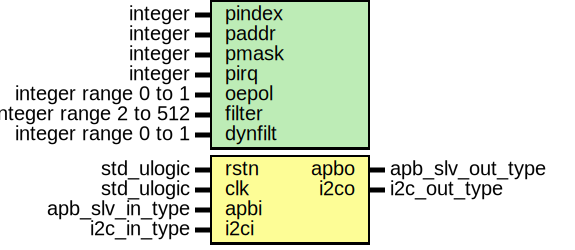

# Entity: i2cmst

- **File**: i2cmst.vhd
## Diagram

## Description

 This file is a part of the GRLIB VHDL IP LIBRARY
 Copyright (C) 2003 - 2008, Gaisler Research
 Copyright (C) 2008 - 2012, Aeroflex Gaisler
 This program is free software; you can redistribute it and/or modify
 it under the terms of the GNU General Public License as published by
 the Free Software Foundation; either version 2 of the License, or
 (at your option) any later version.
 This program is distributed in the hope that it will be useful,
 but WITHOUT ANY WARRANTY; without even the implied warranty of
 MERCHANTABILITY or FITNESS FOR A PARTICULAR PURPOSE.  See the
 GNU General Public License for more details.
 You should have received a copy of the GNU General Public License
 along with this program; if not, write to the Free Software
 Foundation, Inc., 59 Temple Place, Suite 330, Boston, MA  02111-1307  USA
Entity:      i2cmst
File:        i2cmst.vhd
Author:      Jan Andersson - Gaisler Research
Contact:     support@gaisler.com
Description:
        APB interface to OpenCores I2C-master. This is an GRLIB AMBA wrapper
        that instantiates the byte- and bit-controller of the OpenCores I2C
        master (OC core developed by Richard Herveille, richard@asics.ws).
        The OC byte- and bit-controller are located under lib/opencores/i2c
        The original master had a WISHBONE interface with registers
        aligned at byte boundaries. This wrapper has a slighly different
        alignment of the registers, and also (optionally) adds a filter
        filter register (FR):
        +------------+--------------------------------------+
        |  Offset    |            Bits in word              |
        |            |---------+---------+---------+--------+
        |            | 31 - 24 | 23 - 16 | 15 - 8  | 7 - 0  |
        +------------+---------+---------+---------+--------+
        |   0x00     |  0x00   |   0x00  | PRERhi  | PRERlo |
        |   0x04     |  0x00   |   0x00  |  0x00   |  CTR   |
        |   0x08     |  0x00   |   0x00  |  0x00   |  TXR   |
        |   0x08     |  0x00   |   0x00  |  0x00   |  RXR   |
        |   0x0C     |  0x00   |   0x00  |  0x00   |  CR    |
        |   0x0C     |  0x00   |   0x00  |  0x00   |  SR    |
        |   0x10     |                   FR                 |
        +------------+---------+---------+---------+--------+
Revision 1 of this core also sets the TIP bit when STO is set.
Revision 2 of this core adds a filter generic to adjust the low pass filter
Revision 3 of this core adds yet another filter generic that can be set to
           make the filter soft configurable.
## Generics

| Generic name | Type                   | Value   | Description            |
| ------------ | ---------------------- | ------- | ---------------------- |
| pindex       | integer                | 0       | slave bus index        |
| paddr        | integer                | 0       |                        |
| pmask        | integer                | 16#fff# |                        |
| pirq         | integer                | 0       | interrupt index        |
| oepol        | integer range 0 to 1   | 0       | output enable polarity |
| filter       | integer range 2 to 512 | 2       | filter bit size        |
| dynfilt      | integer range 0 to 1   | 0       |                        |
## Ports

| Port name | Direction | Type             | Description |
| --------- | --------- | ---------------- | ----------- |
| rstn      | in        | std_ulogic       |             |
| clk       | in        | std_ulogic       |             |
| apbi      | in        | apb_slv_in_type  | APB signals |
| apbo      | out       | apb_slv_out_type |             |
| i2ci      | in        | i2c_in_type      | I2C signals |
| i2co      | out       | i2c_out_type     |             |
## Signals

| Name    | Type                         | Description                    |
| ------- | ---------------------------- | ------------------------------ |
| rxr     | std_logic_vector(7 downto 0) | Receive register               |
| done    | std_logic                    | Signals completion of command  |
| rxack   | std_logic                    | Received acknowledge           |
| busy    | std_logic                    | I2C core busy                  |
| al      | std_logic                    | Aribitration lost              |
| irst    | std_ulogic                   | Internal, negated reset signal |
| iscloen | std_ulogic                   | Internal SCL output enable     |
| isdaoen | std_ulogic                   | Internal SDA output enable     |
| r       | i2c_reg_type                 | Register interface             |
|  rin    | i2c_reg_type                 | Register interface             |
| vcc     | std_logic                    |                                |
## Constants

| Name       | Type                         | Value                                                                                                                                                                                                                                                                                                                                  | Description |
| ---------- | ---------------------------- | -------------------------------------------------------------------------------------------------------------------------------------------------------------------------------------------------------------------------------------------------------------------------------------------------------------------------------------- | ----------- |
| I2CMST_REV | integer                      |  3                                                                                                                                                                                                                                                                                                                                     |             |
| PCONFIG    | apb_config_type              |  (   0 => ahb_device_reg(VENDOR_GAISLER,  GAISLER_I2CMST,  0,  I2CMST_REV,  pirq),    1 => apb_iobar(paddr,  pmask)) |             |
| PRER_addr  | std_logic_vector(7 downto 2) |  "000000"                                                                                                                                                                                                                                                                                                                              |             |
| CTR_addr   | std_logic_vector(7 downto 2) |  "000001"                                                                                                                                                                                                                                                                                                                              |             |
| TXR_addr   | std_logic_vector(7 downto 2) |  "000010"                                                                                                                                                                                                                                                                                                                              |             |
| RXR_addr   | std_logic_vector(7 downto 2) |  "000010"                                                                                                                                                                                                                                                                                                                              |             |
| CR_addr    | std_logic_vector(7 downto 2) |  "000011"                                                                                                                                                                                                                                                                                                                              |             |
| SR_addr    | std_logic_vector(7 downto 2) |  "000011"                                                                                                                                                                                                                                                                                                                              |             |
| FR_addr    | std_logic_vector(7 downto 2) |  "000100"                                                                                                                                                                                                                                                                                                                              |             |
## Types

| Name          | Type | Description        |
| ------------- | ---- | ------------------ |
| ctrl_reg_type |      | Register interface |
| cmd_reg_type  |      |                    |
| sts_reg_type  |      |                    |
| i2c_reg_type  |      | Core registers     |
## Processes
- comb: ( r, rstn, rxr, rxack, busy, al, done, apbi )
- reg: ( clk )
## Instantiations

- byte_ctrl: i2c_master_byte_ctrl
- bootmsg: report_version
**Description**
Boot message
pragma translate_off

