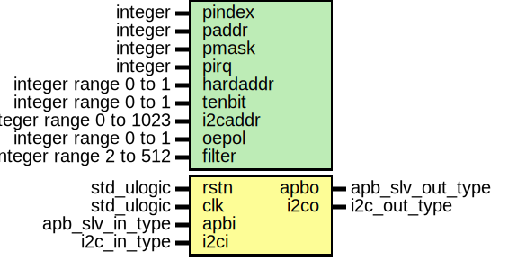

# Entity: i2cslv

- **File**: i2cslv.vhd
## Diagram

## Description

----------------------------------------------------------------------------
  This file is a part of the GRLIB VHDL IP LIBRARY
  Copyright (C) 2003 - 2008, Gaisler Research
  Copyright (C) 2008 - 2012, Aeroflex Gaisler

  This program is free software; you can redistribute it and/or modify
  it under the terms of the GNU General Public License as published by
  the Free Software Foundation; either version 2 of the License, or
  (at your option) any later version.

  This program is distributed in the hope that it will be useful,
  but WITHOUT ANY WARRANTY; without even the implied warranty of
  MERCHANTABILITY or FITNESS FOR A PARTICULAR PURPOSE.  See the
  GNU General Public License for more details.

  You should have received a copy of the GNU General Public License
  along with this program; if not, write to the Free Software
  Foundation, Inc., 59 Temple Place, Suite 330, Boston, MA  02111-1307  USA
-----------------------------------------------------------------------------
 Entity: i2cslv
 File:   i2cslv.vhd
 Author: Jan Andersson - Gaisler Research
         jan@gaisler.com

 Description: Simple I2C-slave with AMBA APB interface

 Documentation of generics:

 [hardaddr]
 If this generic is set to 1 the core uses i2caddr as the hard coded address.
 If hardaddr is set to 0 the core's address can be changed via the SLVADDR
 register.

 [tenbit]
 Support for ten bit addresses.

 [i2caddr]
 The slave's (initial) i2c address.

 [oepol]
 Output enable polarity

 [filter]
 Length of filters used on SCL and SDA

 The slave has four different modes operation. The mode is defined by the
 value of the bits RMODE and TMODE.
 RMODE TMODE   I2CSLAVE Mode
   0     0          0
   0     1          1
   1     0          2
   1     1          3

 RMODE 0:
 The slave accepts one byte and NAKs all other transfers until software has
 acknowledged the received byte.
 RMODE 1:
 The slave accepts one byte and keeps SCL low until software has acknowledged
 the received byte
 TMODE 0:
 The slave transmits the same byte to all if the master requests more than
 one byte in the transfer. The slave then NAKs all read requests unless the
 Transmit Always Valid (TAV) bit in the control register is set.
 TMODE 1:
 The slave transmits one byte and then keeps SCL low until software has
 acknowledged that the byte has been transmitted.
## Generics

| Generic name | Type                    | Value   | Description            |
| ------------ | ----------------------- | ------- | ---------------------- |
| pindex       | integer                 | 0       |  slave bus index       |
| paddr        | integer                 | 0       |                        |
| pmask        | integer                 | 16#fff# |                        |
| pirq         | integer                 | 0       |  interrupt index       |
| hardaddr     | integer range 0 to 1    | 0       |  See description above |
| tenbit       | integer range 0 to 1    | 0       |                        |
| i2caddr      | integer range 0 to 1023 | 0       |                        |
| oepol        | integer range 0 to 1    | 0       |                        |
| filter       | integer range 2 to 512  | 2       |                        |
## Ports

| Port name | Direction | Type             | Description |
| --------- | --------- | ---------------- | ----------- |
| rstn      | in        | std_ulogic       |             |
| clk       | in        | std_ulogic       |             |
| apbi      | in        | apb_slv_in_type  | APB signals |
| apbo      | out       | apb_slv_out_type |             |
| i2ci      | in        | i2c_in_type      | I2C signals |
| i2co      | out       | i2c_out_type     |             |
## Signals

| Name | Type            | Description                                                                                                                                                                           |
| ---- | --------------- | ------------------------------------------------------------------------------------------------------------------------------------------------------------------------------------- |
| r    | i2cslv_reg_type | ---------------------------------------------------------------------------  Signals ---------------------------------------------------------------------------  Register interface  |
|  rin | i2cslv_reg_type | ---------------------------------------------------------------------------  Signals ---------------------------------------------------------------------------  Register interface  |
## Constants

| Name              | Type                                      | Value                                                                                                                                                                                                                                                                                                                                    | Description          |
| ----------------- | ----------------------------------------- | ---------------------------------------------------------------------------------------------------------------------------------------------------------------------------------------------------------------------------------------------------------------------------------------------------------------------------------------- | -------------------- |
| I2CSLV_REV        | integer                                   |  0                                                                                                                                                                                                                                                                                                                                       |                      |
| PCONFIG           | apb_config_type                           |  (    0 => ahb_device_reg(VENDOR_GAISLER,  GAISLER_I2CSLV,  0,  I2CSLV_REV,  pirq),     1 => apb_iobar(paddr,  pmask)) |  AMBA PnP            |
| SLV_ADDR          | std_logic_vector(7 downto 2)              |  "000000"                                                                                                                                                                                                                                                                                                                                |  Register addresses  |
| CTRL_ADDR         | std_logic_vector(7 downto 2)              |  "000001"                                                                                                                                                                                                                                                                                                                                |                      |
| STS_ADDR          | std_logic_vector(7 downto 2)              |  "000010"                                                                                                                                                                                                                                                                                                                                |                      |
| MSK_ADDR          | std_logic_vector(7 downto 2)              |  "000011"                                                                                                                                                                                                                                                                                                                                |                      |
| RD_ADDR           | std_logic_vector(7 downto 2)              |  "000100"                                                                                                                                                                                                                                                                                                                                |                      |
| TD_ADDR           | std_logic_vector(7 downto 2)              |  "000101"                                                                                                                                                                                                                                                                                                                                |                      |
| TENBIT_SUPPORT    | integer                                   |  tenbit                                                                                                                                                                                                                                                                                                                                  |  Core configuration  |
| I2CADDRLEN        | integer                                   |  7 + tenbit*3                                                                                                                                                                                                                                                                                                                            |                      |
| HARDCADDR         | integer                                   |  hardaddr                                                                                                                                                                                                                                                                                                                                |                      |
| I2CSLVADDR        | std_logic_vector((I2CADDRLEN-1) downto 0) |     conv_std_logic_vector(i2caddr,  I2CADDRLEN)                                                                                                                                                                                                                                                       |                      |
| I2C_READ          | std_ulogic                                |  '1'                                                                                                                                                                                                                                                                                                                                     |  R/Wn bit            |
| I2C_WRITE         | std_ulogic                                |  '0'                                                                                                                                                                                                                                                                                                                                     |                      |
| OEPOL_LEVEL       | std_ulogic                                |  conv_std_logic(oepol = 1)                                                                                                                                                                                                                                                                                                               |                      |
| I2C_LOW           | std_ulogic                                |  OEPOL_LEVEL                                                                                                                                                                                                                                                                                                                             |  OE                  |
| I2C_HIZ           | std_ulogic                                |  not OEPOL_LEVEL                                                                                                                                                                                                                                                                                                                         |                      |
| I2C_ACK           | std_ulogic                                |  '0'                                                                                                                                                                                                                                                                                                                                     |                      |
| TENBIT_ADDR_START | std_logic_vector(4 downto 0)              |  "11110"                                                                                                                                                                                                                                                                                                                                 |                      |
## Types

| Name             | Type                                                                                                                                                                                                                                                 | Description                                                                                                                                                     |
| ---------------- | ---------------------------------------------------------------------------------------------------------------------------------------------------------------------------------------------------------------------------------------------------- | --------------------------------------------------------------------------------------------------------------------------------------------------------------- |
| ctrl_reg_type    |                                                                                                                                                                                                                                                      | ---------------------------------------------------------------------------  Types ---------------------------------------------------------------------------  |
| sts_reg_type     |                                                                                                                                                                                                                                                      |                                                                                                                                                                 |
| slvaddr_reg_type |                                                                                                                                                                                                                                                      |                                                                                                                                                                 |
| i2cslv_reg_bank  |                                                                                                                                                                                                                                                      |                                                                                                                                                                 |
| i2c_in_array     |                                                                                                                                                                                                                                                      |                                                                                                                                                                 |
| slv_state_type   | (idle,  checkaddr,  check10bitaddr,  sclhold,  movebyte,  handshake)  |                                                                                                                                                                 |
| i2cslv_reg_type  |                                                                                                                                                                                                                                                      |                                                                                                                                                                 |
## Functions
- compaddr1stb ( ibyte : std_logic_vector(7 downto 0);       -- I2C byte sr    : slvaddr_reg_type)  return boolean 
 **Description**
---------------------------------------------------------------------------
 Subprograms
---------------------------------------------------------------------------
 purpose: Compares the first byte of a received address with the slave's
 address. The tba input determines if the slave is using a ten bit address.

- compaddr2ndb ( ibyte   : std_logic_vector(7 downto 0);                -- I2C byte slvaddr : std_logic_vector((I2CADDRLEN-1) downto 0))  return boolean 
 **Description**
 purpose: Compares the 2nd byte of a ten bit address with the slave address

## Processes
- comb: ( r, rstn, apbi, i2ci )
- reg: ( clk )
## Instantiations

- bootmsg: report_version
 **Description**
 Boot message
 pragma translate_off

