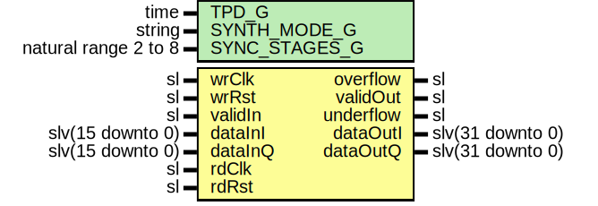

# Entity: iq16bTo32b

- **File**: iq16bTo32b.vhd
## Diagram

## Description

-----------------------------------------------------------------------------
 Company    : SLAC National Accelerator Laboratory
-----------------------------------------------------------------------------
 Description: Converts the 16-bit I/Q data to 32-bit I/Q data
-----------------------------------------------------------------------------
 This file is part of 'SLAC Firmware Standard Library'.
 It is subject to the license terms in the LICENSE.txt file found in the
 top-level directory of this distribution and at:
    https://confluence.slac.stanford.edu/display/ppareg/LICENSE.html.
 No part of 'SLAC Firmware Standard Library', including this file,
 may be copied, modified, propagated, or distributed except according to
 the terms contained in the LICENSE.txt file.
-----------------------------------------------------------------------------
## Generics

| Generic name  | Type                 | Value      | Description |
| ------------- | -------------------- | ---------- | ----------- |
| TPD_G         | time                 | 1 ns       |             |
| SYNTH_MODE_G  | string               | "inferred" |             |
| SYNC_STAGES_G | natural range 2 to 8 | 3          |             |
## Ports

| Port name | Direction | Type             | Description            |
| --------- | --------- | ---------------- | ---------------------- |
| wrClk     | in        | sl               | 16-bit Write Interface |
| wrRst     | in        | sl               |                        |
| validIn   | in        | sl               |                        |
| overflow  | out       | sl               |                        |
| dataInI   | in        | slv(15 downto 0) |                        |
| dataInQ   | in        | slv(15 downto 0) |                        |
| rdClk     | in        | sl               | 32-bit Read Interface  |
| rdRst     | in        | sl               |                        |
| validOut  | out       | sl               |                        |
| underflow | out       | sl               |                        |
| dataOutI  | out       | slv(31 downto 0) |                        |
| dataOutQ  | out       | slv(31 downto 0) |                        |
## Signals

| Name    | Type    | Description |
| ------- | ------- | ----------- |
| r       | RegType |             |
| rin     | RegType |             |
| s_valid | sl      |             |
## Constants

| Name       | Type    | Value                                                                                                                                                                                                                          | Description |
| ---------- | ------- | ------------------------------------------------------------------------------------------------------------------------------------------------------------------------------------------------------------------------------ | ----------- |
| REG_INIT_C | RegType |  (       wordSel => '0',        wrEn    => '0',        dataI   => (others => '0'),        dataQ   => (others => '0')) |             |
## Types

| Name    | Type | Description |
| ------- | ---- | ----------- |
| RegType |      |             |
## Processes
- comb: ( dataInI, dataInQ, r, validIn, wrRst )
- seq: ( wrClk )
## Instantiations

- U_FIFO: surf.Fifo
