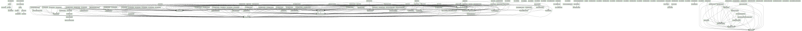

# Documentation for: 

Generated by **TerosHDL** © 2020-2021 License GPLv3 Carlos Alberto Ruiz Naranjo (carlosruiznaranjo@gmail.com) Ismael Perez Rojo (ismaelprojo@gmail.com)  Project revision 2021-07-19 15:19:09  

## Designs

- Module: [irqc ](./doc_internal/irqc.md)
- Module: [irqc_core ](./doc_internal/irqc_core.md)
- Module: [irqc_pif ](./doc_internal/irqc_pif.md)
- Package: [irqc_pif_pkg ](./doc_internal/irqc_pif_pkg.md)
- Module: [uart ](./doc_internal/uart.md)
- Module: [uart_core ](./doc_internal/uart_core.md)
- Module: [uart_pif ](./doc_internal/uart_pif.md)
- Package: [uart_pif_pkg ](./doc_internal/uart_pif_pkg.md)
- Package: [uart_pkg ](./doc_internal/uart_pkg.md)
- Package: [avalon_mm_bfm_pkg ](./doc_internal/avalon_mm_bfm_pkg.md)
- Module: [avalon_mm_vvc ](./doc_internal/avalon_mm_vvc.md)
- Package: [transaction_pkg ](./doc_internal/transaction_pkg.md)
- Package: [vvc_cmd_pkg ](./doc_internal/vvc_cmd_pkg.md)
- Package: [vvc_methods_pkg ](./doc_internal/vvc_methods_pkg.md)
- Package: [avalon_st_bfm_pkg ](./doc_internal/avalon_st_bfm_pkg.md)
- Module: [avalon_st_vvc ](./doc_internal/avalon_st_vvc.md)
- Package: [local_adaptations_pkg ](./doc_internal/local_adaptations_pkg.md)
- Package: [transaction_pkg ](./doc_internal/transaction_pkg.md)
- Package: [vvc_cmd_pkg ](./doc_internal/vvc_cmd_pkg.md)
- Package: [vvc_methods_pkg ](./doc_internal/vvc_methods_pkg.md)
- Package: [axi_bfm_pkg ](./doc_internal/axi_bfm_pkg.md)
- Package: [axi_channel_handler_pkg ](./doc_internal/axi_channel_handler_pkg.md)
- Package: [axi_read_data_queue_pkg ](./doc_internal/axi_read_data_queue_pkg.md)
- Package: [local_pkg ](./doc_internal/axi_sb_pkg.md)
- Module: [axi_vvc ](./doc_internal/axi_vvc.md)
- Package: [transaction_pkg ](./doc_internal/transaction_pkg.md)
- Package: [vvc_cmd_pkg ](./doc_internal/vvc_cmd_pkg.md)
- Package: [vvc_methods_pkg ](./doc_internal/vvc_methods_pkg.md)
- Package: [axilite_bfm_pkg ](./doc_internal/axilite_bfm_pkg.md)
- Package: [axilite_channel_handler_pkg ](./doc_internal/axilite_channel_handler_pkg.md)
- Module: [axilite_vvc ](./doc_internal/axilite_vvc.md)
- Package: [transaction_pkg ](./doc_internal/transaction_pkg.md)
- Package: [vvc_cmd_pkg ](./doc_internal/vvc_cmd_pkg.md)
- Package: [vvc_methods_pkg ](./doc_internal/vvc_methods_pkg.md)
- Package: [axistream_bfm_pkg ](./doc_internal/axistream_bfm_pkg.md)
- Module: [axistream_vvc ](./doc_internal/axistream_vvc.md)
- Package: [transaction_pkg ](./doc_internal/transaction_pkg.md)
- Package: [vvc_cmd_pkg ](./doc_internal/vvc_cmd_pkg.md)
- Package: [vvc_methods_pkg ](./doc_internal/vvc_methods_pkg.md)
- Module: [clock_generator_vvc ](./doc_internal/clock_generator_vvc.md)
- Package: [vvc_cmd_pkg ](./doc_internal/vvc_cmd_pkg.md)
- Package: [vvc_methods_pkg ](./doc_internal/vvc_methods_pkg.md)
- Package: [error_injection_pkg ](./doc_internal/error_injection_pkg.md)
- Module: [error_injection_sl ](./doc_internal/error_injection_sl.md)
- Module: [error_injection_slv ](./doc_internal/error_injection_slv.md)
- Module: [ei_demo_tb ](./doc_internal/ei_demo_tb.md)
- Module: [ethernet_rx_vvc ](./doc_internal/ethernet_rx_vvc.md)
- Module: [ethernet_tx_vvc ](./doc_internal/ethernet_tx_vvc.md)
- Module: [ethernet_vvc ](./doc_internal/ethernet_vvc.md)
- Package: [support_pkg ](./doc_internal/support_pkg.md)
- Package: [transaction_pkg ](./doc_internal/transaction_pkg.md)
- Package: [vvc_cmd_pkg ](./doc_internal/vvc_cmd_pkg.md)
- Package: [vvc_methods_pkg ](./doc_internal/vvc_methods_pkg.md)
- Module: [ethernet_mac ](./doc_internal/ethernet_mac.md)
- Package: [ethernet_mac_pkg ](./doc_internal/ethernet_mac_pkg.md)
- Module: [ethernet_sbi_gmii_demo_th ](./doc_internal/ethernet_sbi_gmii_demo_th.md)
- Module: [sbi_fifo ](./doc_internal/sbi_fifo.md)
- Package: [gmii_bfm_pkg ](./doc_internal/gmii_bfm_pkg.md)
- Module: [gmii_rx_vvc ](./doc_internal/gmii_rx_vvc.md)
- Module: [gmii_tx_vvc ](./doc_internal/gmii_tx_vvc.md)
- Module: [gmii_vvc ](./doc_internal/gmii_vvc.md)
- Package: [transaction_pkg ](./doc_internal/transaction_pkg.md)
- Package: [vvc_cmd_pkg ](./doc_internal/vvc_cmd_pkg.md)
- Package: [vvc_methods_pkg ](./doc_internal/vvc_methods_pkg.md)
- Package: [gpio_bfm_pkg ](./doc_internal/gpio_bfm_pkg.md)
- Module: [gpio_vvc ](./doc_internal/gpio_vvc.md)
- Package: [transaction_pkg ](./doc_internal/transaction_pkg.md)
- Package: [vvc_cmd_pkg ](./doc_internal/vvc_cmd_pkg.md)
- Package: [vvc_methods_pkg ](./doc_internal/vvc_methods_pkg.md)
- Module: [hvvc_to_vvc_bridge ](./doc_internal/hvvc_to_vvc_bridge.md)
- Package: [support_pkg ](./doc_internal/support_pkg.md)
- Package: [i2c_bfm_pkg ](./doc_internal/i2c_bfm_pkg.md)
- Module: [i2c_vvc ](./doc_internal/i2c_vvc.md)
- Package: [transaction_pkg ](./doc_internal/transaction_pkg.md)
- Package: [vvc_cmd_pkg ](./doc_internal/vvc_cmd_pkg.md)
- Package: [vvc_methods_pkg ](./doc_internal/vvc_methods_pkg.md)
- Package: [rgmii_bfm_pkg ](./doc_internal/rgmii_bfm_pkg.md)
- Module: [rgmii_rx_vvc ](./doc_internal/rgmii_rx_vvc.md)
- Module: [rgmii_tx_vvc ](./doc_internal/rgmii_tx_vvc.md)
- Module: [rgmii_vvc ](./doc_internal/rgmii_vvc.md)
- Package: [transaction_pkg ](./doc_internal/transaction_pkg.md)
- Package: [vvc_cmd_pkg ](./doc_internal/vvc_cmd_pkg.md)
- Package: [vvc_methods_pkg ](./doc_internal/vvc_methods_pkg.md)
- Package: [sbi_bfm_pkg ](./doc_internal/sbi_bfm_pkg.md)
- Module: [sbi_vvc ](./doc_internal/sbi_vvc.md)
- Package: [transaction_pkg ](./doc_internal/transaction_pkg.md)
- Package: [vvc_cmd_pkg ](./doc_internal/vvc_cmd_pkg.md)
- Package: [vvc_methods_pkg ](./doc_internal/vvc_methods_pkg.md)
- Package: [generic_sb_pkg ](./doc_internal/generic_sb_pkg.md)
- Package: [generic_sb_support_pkg ](./doc_internal/generic_sb_support_pkg.md)
- Package: [local_pkg ](./doc_internal/predefined_sb.md)
- Module: [uart_vvc_tb ](./doc_internal/uart_vvc_tb.md)
- Package: [csv_file_reader_pkg ](./doc_internal/csv_file_reader_pkg.md)
- Package: [local_adaptations_pkg ](./doc_internal/local_adaptations_pkg.md)
- Package: [spec_cov_pkg ](./doc_internal/spec_cov_pkg.md)
- Package: [spi_bfm_pkg ](./doc_internal/spi_bfm_pkg.md)
- Module: [spi_vvc ](./doc_internal/spi_vvc.md)
- Package: [transaction_pkg ](./doc_internal/transaction_pkg.md)
- Package: [vvc_cmd_pkg ](./doc_internal/vvc_cmd_pkg.md)
- Package: [vvc_methods_pkg ](./doc_internal/vvc_methods_pkg.md)
- Package: [monitor_cmd_pkg ](./doc_internal/monitor_cmd_pkg.md)
- Package: [transaction_pkg ](./doc_internal/transaction_pkg.md)
- Package: [uart_bfm_pkg ](./doc_internal/uart_bfm_pkg.md)
- Module: [uart_monitor ](./doc_internal/uart_monitor.md)
- Module: [uart_rx_vvc ](./doc_internal/uart_rx_vvc.md)
- Module: [uart_tx_vvc ](./doc_internal/uart_tx_vvc.md)
- Module: [uart_vvc ](./doc_internal/uart_vvc.md)
- Package: [vvc_cmd_pkg ](./doc_internal/vvc_cmd_pkg.md)
- Package: [vvc_methods_pkg ](./doc_internal/vvc_methods_pkg.md)
- Module: [uvvm_demo_th ](./doc_internal/uvvm_demo_th.md)
- Package: [vvc_cmd_pkg ](./doc_internal/vvc_cmd_pkg.md)
- Package: [vvc_methods_pkg ](./doc_internal/vvc_methods_pkg.md)
- Package: [wishbone_bfm_pkg ](./doc_internal/wishbone_bfm_pkg.md)
- Module: [wishbone_vvc ](./doc_internal/wishbone_vvc.md)
- Package: [adaptations_pkg ](./doc_internal/adaptations_pkg.md)
- Package: [alert_hierarchy_pkg ](./doc_internal/alert_hierarchy_pkg.md)
- Package: [bfm_common_pkg ](./doc_internal/bfm_common_pkg.md)
- Package: [data_fifo_pkg ](./doc_internal/data_fifo_pkg.md)
- Package: [data_queue_pkg ](./doc_internal/data_queue_pkg.md)
- Package: [data_stack_pkg ](./doc_internal/data_stack_pkg.md)
- Package: [generic_queue_pkg ](./doc_internal/generic_queue_pkg.md)
- Package: [global_signals_and_shared_variables_pkg ](./doc_internal/global_signals_and_shared_variables_pkg.md)
- Package: [hierarchy_linked_list_pkg ](./doc_internal/hierarchy_linked_list_pkg.md)
- Package: [license_pkg ](./doc_internal/license_pkg.md)
- Package: [protected_types_pkg ](./doc_internal/protected_types_pkg.md)
- Package: [string_methods_pkg ](./doc_internal/string_methods_pkg.md)
- Package: [types_pkg ](./doc_internal/types_pkg.md)
- Package: [ti_data_fifo_pkg ](./doc_internal/ti_data_fifo_pkg.md)
- Package: [ti_data_queue_pkg ](./doc_internal/ti_data_queue_pkg.md)
- Package: [ti_data_stack_pkg ](./doc_internal/ti_data_stack_pkg.md)
- Package: [ti_generic_queue_pkg ](./doc_internal/ti_generic_queue_pkg.md)
- Package: [ti_protected_types_pkg ](./doc_internal/ti_protected_types_pkg.md)
- Package: [ti_vvc_framework_support_pkg ](./doc_internal/ti_vvc_framework_support_pkg.md)
- Package: [td_target_support_pkg ](./doc_internal/td_target_support_pkg.md)
- Package: [td_vvc_entity_support_pkg ](./doc_internal/td_vvc_entity_support_pkg.md)
- Package: [td_vvc_framework_common_methods_pkg ](./doc_internal/td_vvc_framework_common_methods_pkg.md)

