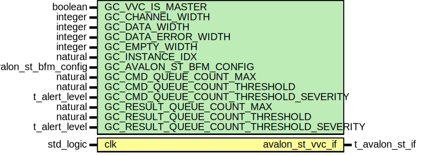

# Entity: avalon_st_vvc
## Diagram

## Generics
| Generic name                             | Type                   | Value                          | Description |
| ---------------------------------------- | ---------------------- | ------------------------------ | ----------- |
| GC_VVC_IS_MASTER                         | boolean                |                                |             |
| GC_CHANNEL_WIDTH                         | integer                | 1                              |             |
| GC_DATA_WIDTH                            | integer                |                                |             |
| GC_DATA_ERROR_WIDTH                      | integer                | 1                              |             |
| GC_EMPTY_WIDTH                           | integer                | 1                              |             |
| GC_INSTANCE_IDX                          | natural                |                                |             |
| GC_AVALON_ST_BFM_CONFIG                  | t_avalon_st_bfm_config | C_AVALON_ST_BFM_CONFIG_DEFAULT |             |
| GC_CMD_QUEUE_COUNT_MAX                   | natural                | 1000                           |             |
| GC_CMD_QUEUE_COUNT_THRESHOLD             | natural                | 950                            |             |
| GC_CMD_QUEUE_COUNT_THRESHOLD_SEVERITY    | t_alert_level          | WARNING                        |             |
| GC_RESULT_QUEUE_COUNT_MAX                | natural                | 1000                           |             |
| GC_RESULT_QUEUE_COUNT_THRESHOLD          | natural                | 950                            |             |
| GC_RESULT_QUEUE_COUNT_THRESHOLD_SEVERITY | t_alert_level          | WARNING                        |             |
## Ports
| Port name        | Direction | Type           | Description |
| ---------------- | --------- | -------------- | ----------- |
| clk              | in        | std_logic      |             |
| avalon_st_vvc_if | inout     | t_avalon_st_if |             |
## Signals
| Name                               | Type          | Description |
| ---------------------------------- | ------------- | ----------- |
| executor_is_busy                   | boolean       |             |
| queue_is_increasing                | boolean       |             |
| last_cmd_idx_executed              | natural       |             |
| terminate_current_cmd              | t_flag_record |             |
| entry_num_in_vvc_activity_register | integer       |             |
## Constants
| Name         | Type         | Value                                                        | Description |
| ------------ | ------------ | ------------------------------------------------------------ | ----------- |
| C_SCOPE      | string       |  C_VVC_NAME & "," & to_string(GC_INSTANCE_IDX)               |             |
| C_VVC_LABELS | t_vvc_labels |  assign_vvc_labels(C_SCOPE, C_VVC_NAME, GC_INSTANCE_IDX, NA) |             |
## Functions
- get_msg_id_panel (    constant command    : in t_vvc_cmd_record;
    constant vvc_config : in t_vvc_config
  ) return t_msg_id_panel
## Processes
- cmd_interpreter: _(  )_

- cmd_executor: _(  )_

