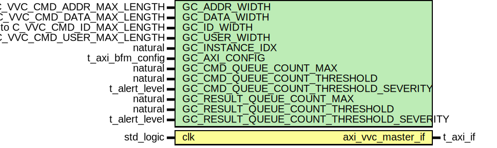

# Entity: axi_vvc
## Diagram

## Generics
| Generic name                             | Type                                         | Value                    | Description |
| ---------------------------------------- | -------------------------------------------- | ------------------------ | ----------- |
| GC_ADDR_WIDTH                            | integer range 1 to C_VVC_CMD_ADDR_MAX_LENGTH | 8                        |             |
| GC_DATA_WIDTH                            | integer range 1 to C_VVC_CMD_DATA_MAX_LENGTH | 32                       |             |
| GC_ID_WIDTH                              | integer range 0 to C_VVC_CMD_ID_MAX_LENGTH   | 8                        |             |
| GC_USER_WIDTH                            | integer range 0 to C_VVC_CMD_USER_MAX_LENGTH | 8                        |             |
| GC_INSTANCE_IDX                          | natural                                      | 1                        |             |
| GC_AXI_CONFIG                            | t_axi_bfm_config                             | C_AXI_BFM_CONFIG_DEFAULT |             |
| GC_CMD_QUEUE_COUNT_MAX                   | natural                                      | 1000                     |             |
| GC_CMD_QUEUE_COUNT_THRESHOLD             | natural                                      | 950                      |             |
| GC_CMD_QUEUE_COUNT_THRESHOLD_SEVERITY    | t_alert_level                                | WARNING                  |             |
| GC_RESULT_QUEUE_COUNT_MAX                | natural                                      | 1000                     |             |
| GC_RESULT_QUEUE_COUNT_THRESHOLD          | natural                                      | 950                      |             |
| GC_RESULT_QUEUE_COUNT_THRESHOLD_SEVERITY | t_alert_level                                | WARNING                  |             |
## Ports
| Port name         | Direction | Type      | Description |
| ----------------- | --------- | --------- | ----------- |
| clk               | in        | std_logic |             |
| axi_vvc_master_if | inout     | t_axi_if  |             |
## Signals
| Name                                       | Type          | Description |
| ------------------------------------------ | ------------- | ----------- |
| executor_is_busy                           | boolean       |             |
| write_address_channel_executor_is_busy     | boolean       |             |
| write_data_channel_executor_is_busy        | boolean       |             |
| write_response_channel_executor_is_busy    | boolean       |             |
| read_address_channel_executor_is_busy      | boolean       |             |
| read_data_channel_executor_is_busy         | boolean       |             |
| any_executors_busy                         | boolean       |             |
| queue_is_increasing                        | boolean       |             |
| write_address_channel_queue_is_increasing  | boolean       |             |
| write_data_channel_queue_is_increasing     | boolean       |             |
| write_response_channel_queue_is_increasing | boolean       |             |
| read_address_channel_queue_is_increasing   | boolean       |             |
| read_data_channel_queue_is_increasing      | boolean       |             |
| last_cmd_idx_executed                      | natural       |             |
| last_write_response_channel_idx_executed   | natural       |             |
| last_read_data_channel_idx_executed        | natural       |             |
| terminate_current_cmd                      | t_flag_record |             |
| entry_num_in_vvc_activity_register         | integer       |             |
## Constants
| Name         | Type         | Value                                                        | Description |
| ------------ | ------------ | ------------------------------------------------------------ | ----------- |
| C_SCOPE      | string       |  C_VVC_NAME & "," & to_string(GC_INSTANCE_IDX)               |             |
| C_VVC_LABELS | t_vvc_labels |  assign_vvc_labels(C_SCOPE, C_VVC_NAME, GC_INSTANCE_IDX, NA) |             |
## Functions
- get_msg_id_panel (    constant command    : in t_vvc_cmd_record;
    constant vvc_config : in t_vvc_config
  ) return t_msg_id_panel
- peek_command_and_prepare_executor (    variable command              : inout t_vvc_cmd_record;
    variable command_queue        : inout work.td_cmd_queue_pkg.t_generic_queue;
    constant vvc_config           : in    t_vvc_config;
    variable vvc_status           : inout t_vvc_status;
    signal   queue_is_increasing  : in    boolean;
    signal   executor_is_busy     : inout boolean;
    constant vvc_labels           : in    t_vvc_labels;
    constant msg_id_panel         : in    t_msg_id_panel := shared_msg_id_panel; UVVM: unused, remove in v3.0
    constant executor_id          : in    t_msg_id := ID_CMD_EXECUTOR;
    constant executor_wait_id     : in    t_msg_id := ID_CMD_EXECUTOR_WAIT
  ) return ()
## Processes
- cmd_interpreter: _(  )_

- cmd_executor: _(  )_

- read_address_channel_executor: _(  )_

- read_data_channel_executor: _(  )_

- write_address_channel_executor: _(  )_

- write_data_channel_executor: _(  )_

- write_response_channel_executor: _(  )_

