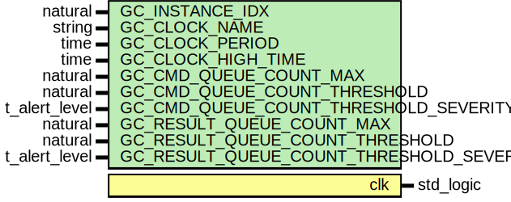

# Entity: clock_generator_vvc
## Diagram

## Generics
| Generic name                             | Type          | Value   | Description |
| ---------------------------------------- | ------------- | ------- | ----------- |
| GC_INSTANCE_IDX                          | natural       | 1       |             |
| GC_CLOCK_NAME                            | string        | "clk"   |             |
| GC_CLOCK_PERIOD                          | time          | 10 ns   |             |
| GC_CLOCK_HIGH_TIME                       | time          | 5 ns    |             |
| GC_CMD_QUEUE_COUNT_MAX                   | natural       | 1000    |             |
| GC_CMD_QUEUE_COUNT_THRESHOLD             | natural       | 950     |             |
| GC_CMD_QUEUE_COUNT_THRESHOLD_SEVERITY    | t_alert_level | WARNING |             |
| GC_RESULT_QUEUE_COUNT_MAX                | natural       | 1000    |             |
| GC_RESULT_QUEUE_COUNT_THRESHOLD          | natural       | 950     |             |
| GC_RESULT_QUEUE_COUNT_THRESHOLD_SEVERITY | t_alert_level | warning |             |
## Ports
| Port name | Direction | Type      | Description |
| --------- | --------- | --------- | ----------- |
| clk       | out       | std_logic |             |
## Signals
| Name                               | Type          | Description |
| ---------------------------------- | ------------- | ----------- |
| executor_is_busy                   | boolean       |             |
| queue_is_increasing                | boolean       |             |
| last_cmd_idx_executed              | natural       |             |
| terminate_current_cmd              | t_flag_record |             |
| clock_ena                          | boolean       |             |
| entry_num_in_vvc_activity_register | integer       |             |
## Constants
| Name         | Type         | Value                                                        | Description |
| ------------ | ------------ | ------------------------------------------------------------ | ----------- |
| C_SCOPE      | string       |  C_VVC_NAME & "," & to_string(GC_INSTANCE_IDX)               |             |
| C_VVC_LABELS | t_vvc_labels |  assign_vvc_labels(C_SCOPE, C_VVC_NAME, GC_INSTANCE_IDX, NA) |             |
## Functions
## Processes
- config_initializer: _(  )_

- cmd_interpreter: _(  )_

- cmd_executor: _(  )_

- clock_generator: _(  )_

