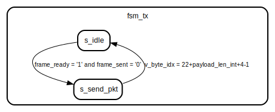

# Entity: ethernet_mac
## Diagram

## Ports
| Port name | Direction | Type                         | Description |
| --------- | --------- | ---------------------------- | ----------- |
| clk       | in        | std_logic                    |             |
| sbi_cs    | in        | std_logic                    |             |
| sbi_addr  | in        | unsigned(7 downto 0)         |             |
| sbi_rena  | in        | std_logic                    |             |
| sbi_wena  | in        | std_logic                    |             |
| sbi_wdata | in        | std_logic_vector(7 downto 0) |             |
| sbi_ready | out       | std_logic                    |             |
| sbi_rdata | out       | std_logic_vector(7 downto 0) |             |
| gtxclk    | out       | std_logic                    |             |
| txd       | out       | std_logic_vector(7 downto 0) |             |
| txen      | out       | std_logic                    |             |
## Signals
| Name            | Type                                      | Description |
| --------------- | ----------------------------------------- | ----------- |
| mac_dest_addr   | std_logic_vector(47 downto 0)             |             |
| mac_src_addr    | std_logic_vector(47 downto 0)             |             |
| payload_len     | std_logic_vector(15 downto 0)             |             |
| payload_len_int | integer                                   |             |
| payload         | t_byte_array(0 to C_MAX_PAYLOAD_LENGTH-1) |             |
| dummy_reg       | std_logic_vector(7 downto 0)              |             |
| frame_ready     | std_logic                                 |             |
| frame_sent      | std_logic                                 |             |
| read_ready      | std_logic                                 |             |
| fsm_tx          | t_state                                   |             |
## Types
| Name    | Type                 | Description |
| ------- | -------------------- | ----------- |
| t_state | (s_idle, s_send_pkt) |             |
## Processes
- p_sbi_write_regs: _( clk )_

- p_sbi_read_regs: _( sbi_cs, sbi_rena, sbi_addr )_

- p_gmii_send_frame: _( clk )_

## State machines
