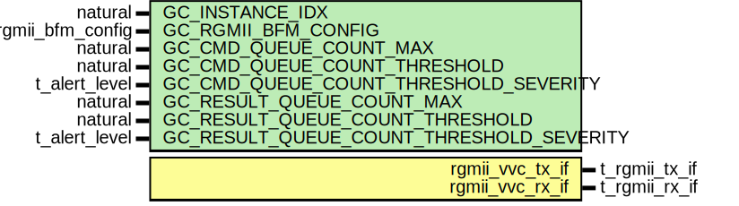

# Entity: rgmii_vvc
## Diagram

## Generics
| Generic name                             | Type               | Value                      | Description |
| ---------------------------------------- | ------------------ | -------------------------- | ----------- |
| GC_INSTANCE_IDX                          | natural            |                            |             |
| GC_RGMII_BFM_CONFIG                      | t_rgmii_bfm_config | C_RGMII_BFM_CONFIG_DEFAULT |             |
| GC_CMD_QUEUE_COUNT_MAX                   | natural            | 1000                       |             |
| GC_CMD_QUEUE_COUNT_THRESHOLD             | natural            | 950                        |             |
| GC_CMD_QUEUE_COUNT_THRESHOLD_SEVERITY    | t_alert_level      | WARNING                    |             |
| GC_RESULT_QUEUE_COUNT_MAX                | natural            | 1000                       |             |
| GC_RESULT_QUEUE_COUNT_THRESHOLD          | natural            | 950                        |             |
| GC_RESULT_QUEUE_COUNT_THRESHOLD_SEVERITY | t_alert_level      | WARNING                    |             |
## Ports
| Port name       | Direction | Type          | Description |
| --------------- | --------- | ------------- | ----------- |
| rgmii_vvc_tx_if | inout     | t_rgmii_tx_if |             |
| rgmii_vvc_rx_if | inout     | t_rgmii_rx_if |             |
## Instantiations
- i_rgmii_tx: work.rgmii_tx_vvc
- i_rgmii_rx: work.rgmii_rx_vvc
