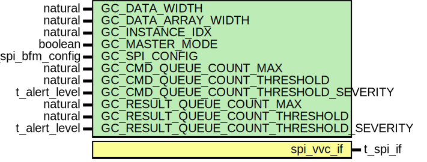

# Entity: spi_vvc

- **File**: spi_vvc.vhd
## Diagram

## Description

================================================================================================================================
 Copyright 2020 Bitvis
 Licensed under the Apache License, Version 2.0 (the "License"); you may not use this file except in compliance with the License.
 You may obtain a copy of the License at http://www.apache.org/licenses/LICENSE-2.0 and in the provided LICENSE.TXT.

 Unless required by applicable law or agreed to in writing, software distributed under the License is distributed on
 an "AS IS" BASIS, WITHOUT WARRANTIES OR CONDITIONS OF ANY KIND, either express or implied.
 See the License for the specific language governing permissions and limitations under the License.
================================================================================================================================
 Note : Any functionality not explicitly described in the documentation is subject to change at any time
--------------------------------------------------------------------------------------------------------------------------------
----------------------------------------------------------------------------------------
 Description   : See library quick reference (under 'doc') and README-file(s)
----------------------------------------------------------------------------------------
=================================================================================================
## Generics

| Generic name                             | Type             | Value                      | Description                                |
| ---------------------------------------- | ---------------- | -------------------------- | ------------------------------------------ |
| GC_DATA_WIDTH                            | natural          | 8                          |                                            |
| GC_DATA_ARRAY_WIDTH                      | natural          | C_SPI_VVC_DATA_ARRAY_WIDTH |                                            |
| GC_INSTANCE_IDX                          | natural          | 1                          |  Instance index for this SPI_VVCT instance |
| GC_MASTER_MODE                           | boolean          | true                       |                                            |
| GC_SPI_CONFIG                            | t_spi_bfm_config | C_SPI_BFM_CONFIG_DEFAULT   |  Behavior specification for BFM            |
| GC_CMD_QUEUE_COUNT_MAX                   | natural          | 1000                       |                                            |
| GC_CMD_QUEUE_COUNT_THRESHOLD             | natural          | 950                        |                                            |
| GC_CMD_QUEUE_COUNT_THRESHOLD_SEVERITY    | t_alert_level    | warning                    |                                            |
| GC_RESULT_QUEUE_COUNT_MAX                | natural          | 1000                       |                                            |
| GC_RESULT_QUEUE_COUNT_THRESHOLD          | natural          | 950                        |                                            |
| GC_RESULT_QUEUE_COUNT_THRESHOLD_SEVERITY | t_alert_level    | warning                    |                                            |
## Ports

| Port name  | Direction | Type     | Description |
| ---------- | --------- | -------- | ----------- |
| spi_vvc_if | inout     | t_spi_if |             |
## Signals

| Name                               | Type          | Description     |
| ---------------------------------- | ------------- | --------------- |
| executor_is_busy                   | boolean       |                 |
| queue_is_increasing                | boolean       |                 |
| last_cmd_idx_executed              | natural       |                 |
| terminate_current_cmd              | t_flag_record |                 |
| entry_num_in_vvc_activity_register | integer       |  VVC Activity   |
## Constants

| Name         | Type         | Value                                                                                                                                                                    | Description |
| ------------ | ------------ | ------------------------------------------------------------------------------------------------------------------------------------------------------------------------ | ----------- |
| C_SCOPE      | string       |  C_VVC_NAME & ", " & to_string(GC_INSTANCE_IDX)                                                                                       |             |
| C_VVC_LABELS | t_vvc_labels |  assign_vvc_labels(C_SCOPE,  C_VVC_NAME,  GC_INSTANCE_IDX,  NA) |             |
## Functions
- get_msg_id_panel ( constant command    : in t_vvc_cmd_record;  constant vvc_config : in t_vvc_config )  return t_msg_id_panel 
**Description**
UVVM: temporary fix for HVVC, remove function below in v3.0

## Processes
- cmd_interpreter: (  )
**Description**
=============================================================================================== ===============================================================================================  Command interpreter  - Interpret, decode and acknowledge commands from the central sequencer =============================================================================================== 
- cmd_executor: (  )
**Description**
=============================================================================================== ===============================================================================================  Command executor  - Fetch and execute the commands =============================================================================================== 
