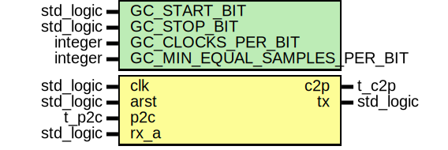

# Entity: uart_core
## Diagram

## Generics
| Generic name                 | Type      | Value | Description |
| ---------------------------- | --------- | ----- | ----------- |
| GC_START_BIT                 | std_logic | '0'   |             |
| GC_STOP_BIT                  | std_logic | '1'   |             |
| GC_CLOCKS_PER_BIT            | integer   | 16    |             |
| GC_MIN_EQUAL_SAMPLES_PER_BIT | integer   | 15    |             |
## Ports
| Port name | Direction | Type      | Description |
| --------- | --------- | --------- | ----------- |
| clk       | in        | std_logic |             |
| arst      | in        | std_logic |             |
| p2c       | in        | t_p2c     |             |
| c2p       | out       | t_c2p     |             |
| rx_a      | in        | std_logic |             |
| tx        | out       | std_logic |             |
## Signals
| Name           | Type                                           | Description |
| -------------- | ---------------------------------------------- | ----------- |
| tx_data        | t_slv_array                                    |             |
| tx_buffer      | std_logic_vector(7 downto 0)                   |             |
| tx_data_valid  | std_logic                                      |             |
| tx_ready       | std_logic                                      |             |
| tx_active      | std_logic                                      |             |
| tx_clk_counter | unsigned(f_log2(GC_CLOCKS_PER_BIT)-1 downto 0) |             |
| tx_bit_counter | unsigned(3 downto 0)                           |             |
| rx_buffer      | std_logic_vector(7 downto 0)                   |             |
| rx_active      | std_logic                                      |             |
| rx_clk_counter | unsigned(f_log2(GC_CLOCKS_PER_BIT)-1 downto 0) |             |
| rx_bit_counter | unsigned(3 downto 0)                           |             |
| rx_bit_samples | std_logic_vector(GC_CLOCKS_PER_BIT-1 downto 0) |             |
| rx_data        | t_slv_array                                    |             |
| rx_data_valid  | std_logic                                      |             |
| rx_data_full   | std_logic                                      |             |
| rx_s           | std_logic_vector(1 downto 0)                   |             |
| rx_just_active | boolean                                        |             |
| parity_err     | std_logic                                      |             |
| stop_err       | std_logic                                      |             |
| transient_err  | std_logic                                      |             |
| c2p_i          | t_c2p                                          |             |
## Types
| Name        | Type | Description |
| ----------- | ---- | ----------- |
| t_slv_array |      |             |
## Processes
- p_rx_s: _( clk, arst )_

- uart_tx: _( clk, arst )_

- uart_rx: _( clk, arst )_

- p_busy_assert: _( clk )_

