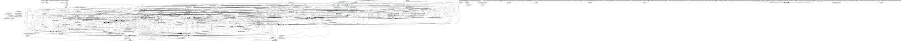

# Documentation for: 

Generated by **TerosHDL** © 2020-2021 License GPLv3 Carlos Alberto Ruiz Naranjo (carlosruiznaranjo@gmail.com) Ismael Perez Rojo (ismaelprojo@gmail.com)  Project revision 2021-07-14 20:50:38

## Designs

- Module: [uart_rx ](./doc_internal/uart_rx.md)
- Module: [uart_tx ](./doc_internal/uart_tx.md)
- Module: [sobel_x ](./doc_internal/sobel_x.md)
- Module: [tb_sobel_x ](./doc_internal/tb_sobel_x.md)
- Module: [axis_buffer ](./doc_internal/axis_buffer.md)
- Module: [fifo ](./doc_internal/fifo.md)
- Module: [tb_axis_loop ](./doc_internal/tb_axis_loop.md)
- Module: [vc_axis ](./doc_internal/vc_axis.md)
- Module: [axi_burst_gen ](./doc_internal/axi_burst_gen.md)
- Module: [axi_dma ](./doc_internal/axi_dma.md)
- Module: [axi_dma_regs ](./doc_internal/axi_dma_regs.md)
- Package: [axi_dma_regs_pkg ](./doc_internal/axi_dma_regs_pkg.md)
- Package: [axi_pkg ](./doc_internal/axi_pkg.md)
- Package: [axil_pkg ](./doc_internal/axil_pkg.md)
- Module: [tb_axi_dma ](./doc_internal/tb_axi_dma.md)
- Module: [tb_axi_dma_regs ](./doc_internal/tb_axi_dma_regs.md)
- Module: [tb_util_pkg ](./doc_internal/tb_util_pkg.md)
- Package: [util_pkg ](./doc_internal/util_pkg.md)
- Module: [tb_example ](./doc_internal/tb_example.md)
- Module: [adder ](./doc_internal/adder.md)
- Package: [memory_bfm_pkg ](./doc_internal/memory_bfm_pkg.md)
- Module: [tb_user_guide ](./doc_internal/tb_user_guide.md)
- Module: [tb_composite_generics ](./doc_internal/tb_composite_generics.md)
- Package: [pkg ](./doc_internal/tb_coverage.md)
- Module: [tb_generated ](./doc_internal/tb_generated.md)
- Module: [tb_json_gens ](./doc_internal/tb_json_gens.md)
- Module: [tb_logging_example ](./doc_internal/tb_logging_example.md)
- Module: [tb_counting_errors ](./doc_internal/tb_counting_errors.md)
- Module: [tb_magic_paths ](./doc_internal/tb_magic_paths.md)
- Module: [tb_many_ways_to_fail ](./doc_internal/tb_many_ways_to_fail.md)
- Module: [tb_minimal ](./doc_internal/tb_minimal.md)
- Module: [tb_running_test_case ](./doc_internal/tb_running_test_case.md)
- Module: [tb_standalone ](./doc_internal/tb_standalone.md)
- Module: [tb_with_lower_level_control ](./doc_internal/tb_with_lower_level_control.md)
- Module: [tb_with_test_cases ](./doc_internal/tb_with_test_cases.md)
- Module: [tb_with_watchdog ](./doc_internal/tb_with_watchdog.md)
- Module: [test_control ](./doc_internal/test_control.md)
- Module: [tb_external_framework_integration ](./doc_internal/tb_external_framework_integration.md)
- Module: [tb_uart_rx ](./doc_internal/tb_uart_rx.md)
- Module: [tb_uart_tx ](./doc_internal/tb_uart_tx.md)
- Module: [uart_rx ](./doc_internal/uart_rx.md)
- Module: [uart_tx ](./doc_internal/uart_tx.md)
- Module: [tb_example ](./doc_internal/tb_example.md)
- Module: [tb_example_many ](./doc_internal/tb_example_many.md)
- Module: [tb_top ](./doc_internal/tb_top.md)
- Module: [top ](./doc_internal/top.md)
- Module: [bool_driver ](./doc_internal/bool_driver.md)
- Module: [other_file_tests ](./doc_internal/other_file_tests.md)
- Module: [tb_assert_stop_level ](./doc_internal/tb_assert_stop_level.md)
- Module: [tb_elab_fail ](./doc_internal/tb_elab_fail.md)
- Module: [tb_fail ](./doc_internal/tb_fail.md)
- Module: [tb_fail_on_warning ](./doc_internal/tb_fail_on_warning.md)
- Module: [tb_ieee_warning ](./doc_internal/tb_ieee_warning.md)
- Module: [tb_infinite_events ](./doc_internal/tb_infinite_events.md)
- Module: [tb_magic_paths ](./doc_internal/tb_magic_paths.md)
- Module: [tb_no_fail_after_cleanup ](./doc_internal/tb_no_fail_after_cleanup.md)
- Module: [tb_no_fail_on_warning ](./doc_internal/tb_no_fail_on_warning.md)
- Module: [tb_no_generic_override ](./doc_internal/tb_no_generic_override.md)
- Module: [tb_other_file_tests ](./doc_internal/tb_other_file_tests.md)
- Module: [tb_pass ](./doc_internal/tb_pass.md)
- Module: [tb_same_sim_all_pass ](./doc_internal/tb_same_sim_all_pass.md)
- Module: [tb_same_sim_some_fail ](./doc_internal/tb_same_sim_some_fail.md)
- Module: [tb_set_generic ](./doc_internal/tb_set_generic.md)
- Module: [tb_with_checks ](./doc_internal/tb_with_checks.md)
- Module: [tb_with_generic_config ](./doc_internal/tb_with_generic_config.md)
- Module: [tb_with_vhdl_runner ](./doc_internal/tb_with_vhdl_runner.md)
- Package: [pkg ](./doc_internal/pkg.md)
- Module: [tb_pkg ](./doc_internal/tb_pkg.md)
- Module: [vunit_pkg ](./doc_internal/vunit_pkg.md)
- Package: [array_pkg ](./doc_internal/array_pkg.md)
- Module: [tb_array ](./doc_internal/tb_array.md)
- Package: [check_pkg ](./doc_internal/check_api.md)
- Package: [check_deprecated_pkg ](./doc_internal/check_deprecated_pkg.md)
- Package: [checker_pkg ](./doc_internal/checker_pkg.md)
- Module: [tb_check ](./doc_internal/tb_check.md)
- Module: [tb_check_equal_real ](./doc_internal/tb_check_equal_real.md)
- Module: [tb_check_failed ](./doc_internal/tb_check_failed.md)
- Module: [tb_check_false ](./doc_internal/tb_check_false.md)
- Module: [tb_check_implication ](./doc_internal/tb_check_implication.md)
- Module: [tb_check_next ](./doc_internal/tb_check_next.md)
- Module: [tb_check_not_unknown ](./doc_internal/tb_check_not_unknown.md)
- Module: [tb_check_one_hot ](./doc_internal/tb_check_one_hot.md)
- Module: [tb_check_passed ](./doc_internal/tb_check_passed.md)
- Module: [tb_check_relation ](./doc_internal/tb_check_relation.md)
- Module: [tb_check_relation_2008 ](./doc_internal/tb_check_relation_2008p.md)
- Module: [tb_check_sequence ](./doc_internal/tb_check_sequence.md)
- Module: [tb_check_stable ](./doc_internal/tb_check_stable.md)
- Module: [tb_check_zero_one_hot ](./doc_internal/tb_check_zero_one_hot.md)
- Module: [tb_checker ](./doc_internal/tb_checker.md)
- Module: [tb_deprecated ](./doc_internal/tb_deprecated.md)
- Module: [tb_result ](./doc_internal/tb_result.md)
- Package: [test_support ](./doc_internal/test_support.md)
- Package: [com_pkg ](./doc_internal/com_api.md)
- Package: [com_common_pkg ](./doc_internal/com_common.md)
- Package: [com_debug_codec_builder_pkg ](./doc_internal/com_debug_codec_builder.md)
- Package: [com_deprecated_pkg ](./doc_internal/com_deprecated.md)
- Package: [com_messenger_pkg ](./doc_internal/com_messenger.md)
- Package: [com_string_pkg ](./doc_internal/com_string.md)
- Package: [com_support_pkg ](./doc_internal/com_support.md)
- Package: [com_types_pkg ](./doc_internal/com_types.md)
- Package: [constants_pkg ](./doc_internal/constants.md)
- Package: [custom_types_pkg ](./doc_internal/custom_types.md)
- Package: [more_constants_pkg ](./doc_internal/more_constants.md)
- Module: [tb_com ](./doc_internal/tb_com.md)
- Module: [tb_com_codec ](./doc_internal/tb_com_codec.md)
- Module: [tb_com_deprecated ](./doc_internal/tb_com_deprecated.md)
- Module: [tb_com_msg_building ](./doc_internal/tb_com_msg_building.md)
- Package: [core_pkg ](./doc_internal/core_pkg.md)
- Package: [stop_pkg ](./doc_internal/stop_pkg.md)
- Package: [external_integer_vector_pkg ](./doc_internal/external_integer_vector_pkg.md)
- Package: [external_string_pkg ](./doc_internal/external_string_pkg.md)
- Package: [byte_vector_ptr_pkg ](./doc_internal/byte_vector_ptr_pkg.md)
- Package: [codec_2008p_pkg ](./doc_internal/codec-2008p.md)
- Package: [codec_pkg ](./doc_internal/codec.md)
- Package: [codec_builder_2008p_pkg ](./doc_internal/codec_builder-2008p.md)
- Package: [codec_builder_pkg ](./doc_internal/codec_builder.md)
- Package: [dict_pkg ](./doc_internal/dict_pkg.md)
- Package: [integer_array_pkg ](./doc_internal/integer_array_pkg.md)
- Package: [integer_vector_ptr_pkg ](./doc_internal/integer_vector_ptr_pkg.md)
- Package: [integer_vector_ptr_pool_pkg ](./doc_internal/integer_vector_ptr_pool_pkg.md)
- Package: [queue_2008p_pkg ](./doc_internal/queue_pkg-2008p.md)
- Package: [queue_pkg ](./doc_internal/queue_pkg.md)
- Package: [queue_pool_pkg ](./doc_internal/queue_pool_pkg.md)
- Package: [string_ptr_pkg ](./doc_internal/string_ptr_pkg.md)
- Package: [string_ptr_pool_pkg ](./doc_internal/string_ptr_pool_pkg.md)
- Package: [types_pkg ](./doc_internal/types.md)
- Module: [tb_byte_vector_ptr ](./doc_internal/tb_byte_vector_ptr.md)
- Module: [tb_codec_2008p ](./doc_internal/tb_codec-2008p.md)
- Module: [tb_codec ](./doc_internal/tb_codec.md)
- Module: [tb_dict ](./doc_internal/tb_dict.md)
- Module: [tb_integer_array ](./doc_internal/tb_integer_array.md)
- Module: [tb_integer_vector_ptr ](./doc_internal/tb_integer_vector_ptr.md)
- Module: [tb_integer_vector_ptr_pool ](./doc_internal/tb_integer_vector_ptr_pool.md)
- Module: [tb_queue_2008p ](./doc_internal/tb_queue-2008p.md)
- Module: [tb_queue ](./doc_internal/tb_queue.md)
- Module: [tb_queue_pool ](./doc_internal/tb_queue_pool.md)
- Module: [tb_string_ptr ](./doc_internal/tb_string_ptr.md)
- Module: [tb_string_ptr_pool ](./doc_internal/tb_string_ptr_pool.md)
- Package: [dictionary ](./doc_internal/dictionary.md)
- Module: [tb_dictionary ](./doc_internal/tb_dictionary.md)
- Package: [ansi_pkg ](./doc_internal/ansi_pkg.md)
- Package: [file_pkg ](./doc_internal/file_pkg.md)
- Package: [log_deprecated_pkg ](./doc_internal/log_deprecated_pkg.md)
- Package: [log_handler_pkg ](./doc_internal/log_handler_pkg.md)
- Package: [log_levels_pkg ](./doc_internal/log_levels_pkg.md)
- Package: [logger_pkg ](./doc_internal/logger_pkg.md)
- Package: [print_pkg ](./doc_internal/print_pkg.md)
- Module: [tb_log_deprecated ](./doc_internal/tb_deprecated.md)
- Module: [tb_log ](./doc_internal/tb_log.md)
- Module: [tb_log_levels ](./doc_internal/tb_log_levels.md)
- Package: [test_support_pkg ](./doc_internal/test_support_pkg.md)
- Package: [path ](./doc_internal/path.md)
- Module: [tb_path ](./doc_internal/tb_path.md)
- Package: [random_pkg ](./doc_internal/random_pkg.md)
- Module: [tb_random ](./doc_internal/tb_random_pkg.md)
- Package: [run_pkg ](./doc_internal/run_api.md)
- Package: [run_deprecated_pkg ](./doc_internal/run_deprecated_pkg.md)
- Package: [run_types_pkg ](./doc_internal/run_types.md)
- Package: [runner_pkg ](./doc_internal/runner_pkg.md)
- Module: [run_tests ](./doc_internal/run_tests.md)
- Module: [tb_run ](./doc_internal/tb_run.md)
- Module: [tb_watchdog ](./doc_internal/tb_watchdog.md)
- Package: [string_ops ](./doc_internal/string_ops.md)
- Module: [tb_string_ops ](./doc_internal/tb_string_ops.md)
- Module: [avalon_master ](./doc_internal/avalon_master.md)
- Package: [avalon_pkg ](./doc_internal/avalon_pkg.md)
- Module: [avalon_sink ](./doc_internal/avalon_sink.md)
- Module: [avalon_slave ](./doc_internal/avalon_slave.md)
- Module: [avalon_source ](./doc_internal/avalon_source.md)
- Package: [avalon_stream_pkg ](./doc_internal/avalon_stream_pkg.md)
- Module: [axi_lite_master ](./doc_internal/axi_lite_master.md)
- Package: [axi_lite_master_pkg ](./doc_internal/axi_lite_master_pkg.md)
- Package: [axi_pkg ](./doc_internal/axi_pkg.md)
- Module: [axi_read_slave ](./doc_internal/axi_read_slave.md)
- Package: [axi_slave_pkg ](./doc_internal/axi_slave_pkg.md)
- Package: [axi_slave_private_pkg ](./doc_internal/axi_slave_private_pkg.md)
- Package: [axi_statistics_pkg ](./doc_internal/axi_statistics_pkg.md)
- Module: [axi_stream_master ](./doc_internal/axi_stream_master.md)
- Module: [axi_stream_monitor ](./doc_internal/axi_stream_monitor.md)
- Package: [axi_stream_pkg ](./doc_internal/axi_stream_pkg.md)
- Package: [axi_stream_private_pkg ](./doc_internal/axi_stream_private_pkg.md)
- Module: [axi_stream_protocol_checker ](./doc_internal/axi_stream_protocol_checker.md)
- Module: [axi_stream_slave ](./doc_internal/axi_stream_slave.md)
- Module: [axi_write_slave ](./doc_internal/axi_write_slave.md)
- Module: [bus2memory ](./doc_internal/bus2memory.md)
- Package: [bus_master_pkg ](./doc_internal/bus_master_pkg.md)
- Package: [memory_pkg ](./doc_internal/memory_pkg.md)
- Package: [memory_utils_pkg ](./doc_internal/memory_utils_pkg.md)
- Module: [ram_master ](./doc_internal/ram_master.md)
- Package: [signal_checker_pkg ](./doc_internal/signal_checker_pkg.md)
- Module: [std_logic_checker ](./doc_internal/std_logic_checker.md)
- Package: [stream_master_pkg ](./doc_internal/stream_master_pkg.md)
- Package: [stream_slave_pkg ](./doc_internal/stream_slave_pkg.md)
- Package: [sync_pkg ](./doc_internal/sync_pkg.md)
- Module: [uart_master ](./doc_internal/uart_master.md)
- Package: [uart_pkg ](./doc_internal/uart_pkg.md)
- Module: [uart_slave ](./doc_internal/uart_slave.md)
- Module: [wishbone_master ](./doc_internal/wishbone_master.md)
- Package: [wishbone_pkg ](./doc_internal/wishbone_pkg.md)
- Module: [wishbone_slave ](./doc_internal/wishbone_slave.md)
- Module: [tb_avalon ](./doc_internal/tb_avalon.md)
- Module: [tb_avalon_master ](./doc_internal/tb_avalon_master.md)
- Module: [tb_avalon_slave ](./doc_internal/tb_avalon_slave.md)
- Module: [tb_avalon_stream ](./doc_internal/tb_avalon_stream.md)
- Module: [tb_avalon_stream_pkg ](./doc_internal/tb_avalon_stream_pkg.md)
- Module: [tb_axi_lite_master ](./doc_internal/tb_axi_lite_master.md)
- Module: [tb_axi_read_slave ](./doc_internal/tb_axi_read_slave.md)
- Module: [tb_axi_slave_private_pkg ](./doc_internal/tb_axi_slave_private_pkg.md)
- Module: [tb_axi_statistics_pkg ](./doc_internal/tb_axi_statistics_pkg.md)
- Module: [tb_axi_stream ](./doc_internal/tb_axi_stream.md)
- Module: [tb_axi_stream_protocol_checker ](./doc_internal/tb_axi_stream_protocol_checker.md)
- Module: [tb_axi_write_slave ](./doc_internal/tb_axi_write_slave.md)
- Module: [tb_bus_master_pkg ](./doc_internal/tb_bus_master_pkg.md)
- Module: [tb_memory ](./doc_internal/tb_memory.md)
- Module: [tb_memory_utils ](./doc_internal/tb_memory_utils_pkg.md)
- Module: [tb_ram_master ](./doc_internal/tb_ram_master.md)
- Module: [tb_std_logic_checker ](./doc_internal/tb_std_logic_checker.md)
- Module: [tb_sync_pkg ](./doc_internal/tb_sync_pkg.md)
- Module: [tb_uart ](./doc_internal/tb_uart.md)
- Module: [tb_wishbone_master ](./doc_internal/tb_wishbone_master.md)
- Module: [tb_wishbone_slave ](./doc_internal/tb_wishbone_slave.md)

