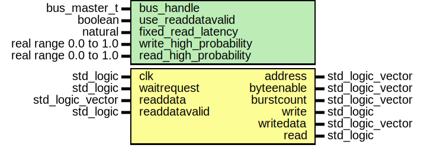

# Entity: avalon_master
## Diagram

## Generics
| Generic name           | Type                  | Value | Description |
| ---------------------- | --------------------- | ----- | ----------- |
| bus_handle             | bus_master_t          |       |             |
| use_readdatavalid      | boolean               | true  |             |
| fixed_read_latency     | natural               | 1     |             |
| write_high_probability | real range 0.0 to 1.0 | 1.0   |             |
| read_high_probability  | real range 0.0 to 1.0 | 1.0   |             |
## Ports
| Port name     | Direction | Type             | Description |
| ------------- | --------- | ---------------- | ----------- |
| clk           | in        | std_logic        |             |
| address       | out       | std_logic_vector |             |
| byteenable    | out       | std_logic_vector |             |
| burstcount    | out       | std_logic_vector |             |
| waitrequest   | in        | std_logic        |             |
| write         | out       | std_logic        |             |
| writedata     | out       | std_logic_vector |             |
| read          | out       | std_logic        |             |
| readdata      | in        | std_logic_vector |             |
| readdatavalid | in        | std_logic        |             |
## Signals
| Name            | Type    | Description |
| --------------- | ------- | ----------- |
| burst_read_flag | boolean |             |
## Constants
| Name                    | Type    | Value      | Description |
| ----------------------- | ------- | ---------- | ----------- |
| av_master_read_actor    | actor_t |  new_actor |             |
| avmm_burst_rd_actor     | actor_t |  new_actor |             |
| acknowledge_queue       | queue_t |  new_queue |             |
| burst_acknowledge_queue | queue_t |  new_queue |             |
| burstlen_queue          | queue_t |  new_queue |             |
## Processes
- main: _(  )_

- read_capture: _(  )_

- burst_read_capture: _(  )_

