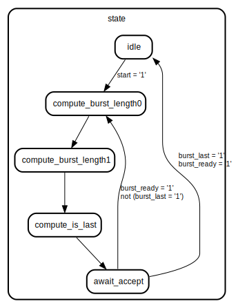

# Entity: axi_burst_gen

## Diagram

## Description

This Source Code Form is subject to the terms of the Mozilla Public
License, v. 2.0. If a copy of the MPL was not distributed with this file,
You can obtain one at http://mozilla.org/MPL/2.0/.
Copyright (c) 2014-2021, Lars Asplund lars.anders.asplund@gmail.com
## Generics

| Generic name     | Type                   | Value | Description |
| ---------------- | ---------------------- | ----- | ----------- |
| max_burst_length | natural range 1 to 256 |       |             |
| bytes_per_beat   | natural                |       |             |
## Ports

| Port name    | Direction | Type                                | Description         |
| ------------ | --------- | ----------------------------------- | ------------------- |
| clk          | in        | std_logic                           |                     |
| start        | in        | std_logic                           | Start pulse         |
| start_addr   | in        | std_logic_vector(31 downto 0)       |                     |
| num_bytes    | in        | std_logic_vector(31 downto 0)       |                     |
| burst_valid  | out       | std_logic                           | Output burst stream |
| burst_ready  | in        | std_logic                           |                     |
| burst_addr   | out       | std_logic_vector(31 downto 0)       |                     |
| burst_length | out       | natural range 1 to max_burst_length |                     |
| burst_last   | out       | std_logic                           |                     |
## Signals

| Name             | Type                       | Description |
| ---------------- | -------------------------- | ----------- |
| state            | state_t                    |             |
| addr             | unsigned(start_addr'range) |             |
|  remaining_bytes | unsigned(start_addr'range) |             |
## Constants

| Name    | Type    | Value | Description |
| ------- | ------- | ----- | ----------- |
| c4kbyte | natural |  4096 |             |
## Types

| Name    | Type                                                                                                                                                                                                                                 | Description |
| ------- | ------------------------------------------------------------------------------------------------------------------------------------------------------------------------------------------------------------------------------------ | ----------- |
| state_t | (idle,  compute_burst_length0,  compute_burst_length1,  compute_is_last,  await_accept)  |             |
## Processes
- main: (  )
## State machines

