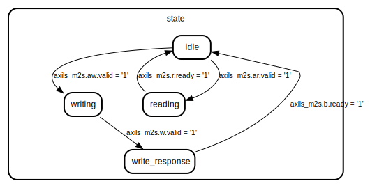

# Entity: axi_dma_regs
## Diagram

## Ports
| Port name      | Direction | Type                          | Description |
| -------------- | --------- | ----------------------------- | ----------- |
| clk            | in        | std_logic                     |             |
| axils_m2s      | in        | axil_m2s_t                    |             |
| axils_s2m      | out       | axil_s2m_t                    |             |
| start_transfer | out       | std_logic                     |             |
| transfer_done  | in        | std_logic                     |             |
| src_address    | out       | std_logic_vector(31 downto 0) |             |
| dst_address    | out       | std_logic_vector(31 downto 0) |             |
| num_bytes      | out       | std_logic_vector(31 downto 0) |             |
## Signals
| Name  | Type                                      | Description |
| ----- | ----------------------------------------- | ----------- |
| state | state_t                                   |             |
| addr  | std_logic_vector(axils_m2s.ar.addr'range) |             |
## Types
| Name    | Type                                                                                              | Description |
| ------- | ------------------------------------------------------------------------------------------------- | ----------- |
| state_t | (idle,                    writing,                    write_response,                    reading) |             |
## Functions
- cmp_word_address (byte_addr : std_logic_vector;                            word_addr : natural) return boolean
## Processes
- main: _(  )_

## State machines
