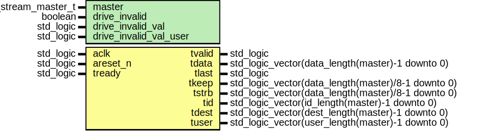

# Entity: axi_stream_master
## Diagram

## Generics
| Generic name           | Type                | Value | Description |
| ---------------------- | ------------------- | ----- | ----------- |
| master                 | axi_stream_master_t |       |             |
| drive_invalid          | boolean             | true  |             |
| drive_invalid_val      | std_logic           | 'X'   |             |
| drive_invalid_val_user | std_logic           | '0'   |             |
## Ports
| Port name | Direction | Type                                               | Description |
| --------- | --------- | -------------------------------------------------- | ----------- |
| aclk      | in        | std_logic                                          |             |
| areset_n  | in        | std_logic                                          |             |
| tvalid    | out       | std_logic                                          |             |
| tready    | in        | std_logic                                          |             |
| tdata     | out       | std_logic_vector(data_length(master)-1 downto 0)   |             |
| tlast     | out       | std_logic                                          |             |
| tkeep     | out       | std_logic_vector(data_length(master)/8-1 downto 0) |             |
| tstrb     | out       | std_logic_vector(data_length(master)/8-1 downto 0) |             |
| tid       | out       | std_logic_vector(id_length(master)-1 downto 0)     |             |
| tdest     | out       | std_logic_vector(dest_length(master)-1 downto 0)   |             |
| tuser     | out       | std_logic_vector(user_length(master)-1 downto 0)   |             |
## Signals
| Name                    | Type      | Description |
| ----------------------- | --------- | ----------- |
| notify_bus_process_done | std_logic |             |
## Constants
| Name               | Type       | Value                           | Description |
| ------------------ | ---------- | ------------------------------- | ----------- |
| notify_request_msg | msg_type_t |  new_msg_type("notify request") |             |
| message_queue      | queue_t    |  new_queue                      |             |
## Functions
- drive_invalid_output (signal l_tdata : out std_logic_vector(data_length(master)-1 downto 0);                                 signal l_tkeep : out std_logic_vector(data_length(master)/8-1 downto 0);
                                 signal l_tstrb : out std_logic_vector(data_length(master)/8-1 downto 0);
                                 signal l_tid   : out std_logic_vector(id_length(master)-1 downto 0);
                                 signal l_tdest : out std_logic_vector(dest_length(master)-1 downto 0);
                                 signal l_tuser : out std_logic_vector(user_length(master)-1 downto 0)) return ()
## Processes
- main: _(  )_

- bus_process: _(  )_

