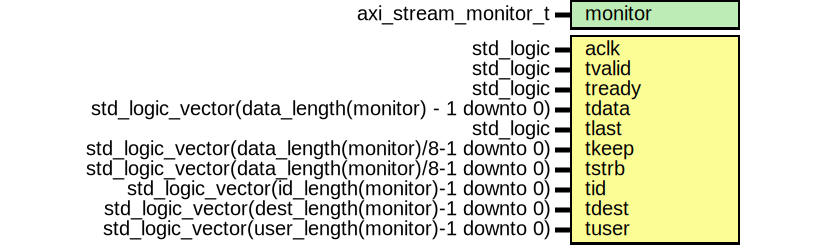

# Entity: axi_stream_monitor

## Diagram

## Description

This Source Code Form is subject to the terms of the Mozilla Public
License, v. 2.0. If a copy of the MPL was not distributed with this file,
You can obtain one at http://mozilla.org/MPL/2.0/.
Copyright (c) 2014-2021, Lars Asplund lars.anders.asplund@gmail.com
## Generics

| Generic name | Type                 | Value | Description |
| ------------ | -------------------- | ----- | ----------- |
| monitor      | axi_stream_monitor_t |       |             |
## Ports

| Port name | Direction | Type                                                | Description |
| --------- | --------- | --------------------------------------------------- | ----------- |
| aclk      | in        | std_logic                                           |             |
| tvalid    | in        | std_logic                                           |             |
| tready    | in        | std_logic                                           |             |
| tdata     | in        | std_logic_vector(data_length(monitor) - 1 downto 0) |             |
| tlast     | in        | std_logic                                           |             |
| tkeep     | in        | std_logic_vector(data_length(monitor)/8-1 downto 0) |             |
| tstrb     | in        | std_logic_vector(data_length(monitor)/8-1 downto 0) |             |
| tid       | in        | std_logic_vector(id_length(monitor)-1 downto 0)     |             |
| tdest     | in        | std_logic_vector(dest_length(monitor)-1 downto 0)   |             |
| tuser     | in        | std_logic_vector(user_length(monitor)-1 downto 0)   |             |
## Processes
- main: (  )
