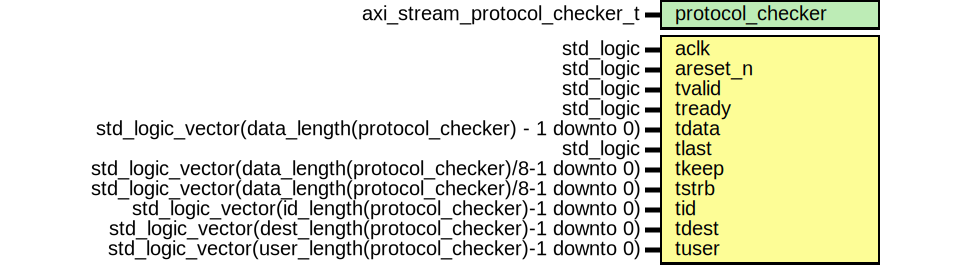

# Entity: axi_stream_protocol_checker
## Diagram

## Generics
| Generic name     | Type                          | Value | Description |
| ---------------- | ----------------------------- | ----- | ----------- |
| protocol_checker | axi_stream_protocol_checker_t |       |             |
## Ports
| Port name | Direction | Type                                                         | Description |
| --------- | --------- | ------------------------------------------------------------ | ----------- |
| aclk      | in        | std_logic                                                    |             |
| areset_n  | in        | std_logic                                                    |             |
| tvalid    | in        | std_logic                                                    |             |
| tready    | in        | std_logic                                                    |             |
| tdata     | in        | std_logic_vector(data_length(protocol_checker) - 1 downto 0) |             |
| tlast     | in        | std_logic                                                    |             |
| tkeep     | in        | std_logic_vector(data_length(protocol_checker)/8-1 downto 0) |             |
| tstrb     | in        | std_logic_vector(data_length(protocol_checker)/8-1 downto 0) |             |
| tid       | in        | std_logic_vector(id_length(protocol_checker)-1 downto 0)     |             |
| tdest     | in        | std_logic_vector(dest_length(protocol_checker)-1 downto 0)   |             |
| tuser     | in        | std_logic_vector(user_length(protocol_checker)-1 downto 0)   |             |
## Signals
| Name                | Type      | Description |
| ------------------- | --------- | ----------- |
| handshake_is_not_x  | std_logic |             |
| enable_rule1_check  | std_logic |             |
| enable_rule2_check  | std_logic |             |
| enable_rule11_check | std_logic |             |
| enable_rule12_check | std_logic |             |
| enable_rule13_check | std_logic |             |
| enable_rule14_check | std_logic |             |
| enable_rule15_check | std_logic |             |
| rule20_check_value  | std_logic |             |
| areset_n_d          | std_logic |             |
| areset_rose         | std_logic |             |
| not_tvalid          | std_logic |             |
## Constants
| Name           | Type      | Value                                                          | Description |
| -------------- | --------- | -------------------------------------------------------------- | ----------- |
| rule1_checker  | checker_t |  new_checker(get_name(protocol_checker.p_logger) & ":rule 1")  |             |
| rule2_checker  | checker_t |  new_checker(get_name(protocol_checker.p_logger) & ":rule 2")  |             |
| rule3_checker  | checker_t |  new_checker(get_name(protocol_checker.p_logger) & ":rule 3")  |             |
| rule4_checker  | checker_t |  new_checker(get_name(protocol_checker.p_logger) & ":rule 4")  |             |
| rule5_checker  | checker_t |  new_checker(get_name(protocol_checker.p_logger) & ":rule 5")  |             |
| rule6_checker  | checker_t |  new_checker(get_name(protocol_checker.p_logger) & ":rule 6")  |             |
| rule7_checker  | checker_t |  new_checker(get_name(protocol_checker.p_logger) & ":rule 7")  |             |
| rule8_checker  | checker_t |  new_checker(get_name(protocol_checker.p_logger) & ":rule 8")  |             |
| rule9_checker  | checker_t |  new_checker(get_name(protocol_checker.p_logger) & ":rule 9")  |             |
| rule10_checker | checker_t |  new_checker(get_name(protocol_checker.p_logger) & ":rule 10") |             |
| rule11_checker | checker_t |  new_checker(get_name(protocol_checker.p_logger) & ":rule 11") |             |
| rule12_checker | checker_t |  new_checker(get_name(protocol_checker.p_logger) & ":rule 12") |             |
| rule13_checker | checker_t |  new_checker(get_name(protocol_checker.p_logger) & ":rule 13") |             |
| rule14_checker | checker_t |  new_checker(get_name(protocol_checker.p_logger) & ":rule 14") |             |
| rule15_checker | checker_t |  new_checker(get_name(protocol_checker.p_logger) & ":rule 15") |             |
| rule16_checker | checker_t |  new_checker(get_name(protocol_checker.p_logger) & ":rule 16") |             |
| rule17_checker | checker_t |  new_checker(get_name(protocol_checker.p_logger) & ":rule 17") |             |
| rule18_checker | checker_t |  new_checker(get_name(protocol_checker.p_logger) & ":rule 18") |             |
| rule19_checker | checker_t |  new_checker(get_name(protocol_checker.p_logger) & ":rule 19") |             |
| rule20_checker | checker_t |  new_checker(get_name(protocol_checker.p_logger) & ":rule 20") |             |
| rule21_checker | checker_t |  new_checker(get_name(protocol_checker.p_logger) & ":rule 21") |             |
| rule22_checker | checker_t |  new_checker(get_name(protocol_checker.p_logger) & ":rule 22") |             |
## Processes
- unnamed: _(  )_

- unnamed: _(  )_

- unnamed: _( aclk )_

