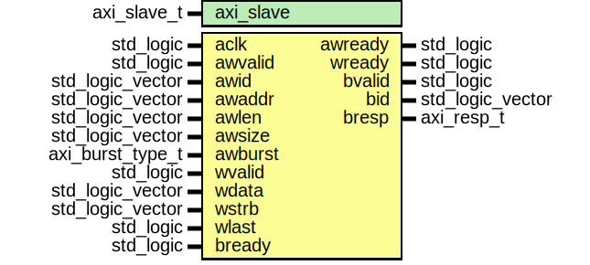

# Entity: axi_write_slave

- **File**: axi_write_slave.vhd
## Diagram

## Description

This Source Code Form is subject to the terms of the Mozilla Public
License, v. 2.0. If a copy of the MPL was not distributed with this file,
You can obtain one at http://mozilla.org/MPL/2.0/.
Copyright (c) 2014-2021, Lars Asplund lars.anders.asplund@gmail.com
## Generics

| Generic name | Type        | Value | Description |
| ------------ | ----------- | ----- | ----------- |
| axi_slave    | axi_slave_t |       |             |
## Ports

| Port name | Direction | Type             | Description |
| --------- | --------- | ---------------- | ----------- |
| aclk      | in        | std_logic        |             |
| awvalid   | in        | std_logic        |             |
| awready   | out       | std_logic        |             |
| awid      | in        | std_logic_vector |             |
| awaddr    | in        | std_logic_vector |             |
| awlen     | in        | std_logic_vector |             |
| awsize    | in        | std_logic_vector |             |
| awburst   | in        | axi_burst_type_t |             |
| wvalid    | in        | std_logic        |             |
| wready    | out       | std_logic        |             |
| wdata     | in        | std_logic_vector |             |
| wstrb     | in        | std_logic_vector |             |
| wlast     | in        | std_logic        |             |
| bvalid    | out       | std_logic        |             |
| bready    | in        | std_logic        |             |
| bid       | out       | std_logic_vector |             |
| bresp     | out       | axi_resp_t       |             |
## Signals

| Name        | Type    | Description |
| ----------- | ------- | ----------- |
| initialized | boolean |             |
## Constants

| Name               | Type                      | Value                                 | Description |
| ------------------ | ------------------------- | ------------------------------------- | ----------- |
| data_vector_length | natural                   |  max_axi4_burst_length * wdata'length |             |
| data_pool          | integer_vector_ptr_pool_t |  new_integer_vector_ptr_pool          |             |
## Types

| Name         | Type | Description |
| ------------ | ---- | ----------- |
| burst_data_t |      |             |
## Functions
- push_burst_data (queue : queue_t;  variable burst_data : inout burst_data_t)  return ()
- recycle (variable burst_data : inout burst_data_t)  return ()
## Processes
- control_process: (  )
- axi_process: (  )
- well_behaved_check: (  )
