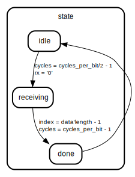

# Entity: uart_rx

## Diagram

## Description

This Source Code Form is subject to the terms of the Mozilla Public
License, v. 2.0. If a copy of the MPL was not distributed with this file,
You can obtain one at http://mozilla.org/MPL/2.0/.
Copyright (c) 2014-2021, Lars Asplund lars.anders.asplund@gmail.com
pragma translate_on
## Generics

| Generic name   | Type    | Value | Description |
| -------------- | ------- | ----- | ----------- |
| cycles_per_bit | natural | 434   |             |
## Ports

| Port name | Direction | Type                         | Description                 |
| --------- | --------- | ---------------------------- | --------------------------- |
| clk       | in        | std_logic                    |                             |
| rx        | in        | std_logic                    | Serial input bit            |
| overflow  | out       | std_logic                    |                             |
| tready    | in        | std_logic                    | AXI stream for output bytes |
| tvalid    | out       | std_Logic                    |                             |
| tdata     | out       | std_logic_vector(7 downto 0) |                             |
## Signals

| Name       | Type      | Description |
| ---------- | --------- | ----------- |
| tvalid_int | std_logic |             |
## Processes
- main: ( clk )
## State machines

