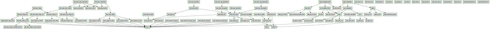

# Documentation for: 

Generated by **TerosHDL** © 2020-2021 License GPLv3 Carlos Alberto Ruiz Naranjo (carlosruiznaranjo@gmail.com) Ismael Perez Rojo (ismaelprojo@gmail.com)  Project revision 2021-07-19 15:11:26  

## Designs

- Module: [arp ](./doc_internal/arp.md)
- Module: [arp_cache ](./doc_internal/arp_cache.md)
- Module: [axis_baser_rx_64 ](./doc_internal/axis_baser_rx_64.md)
- Module: [axis_baser_tx_64 ](./doc_internal/axis_baser_tx_64.md)
- Module: [axis_eth_fcs ](./doc_internal/axis_eth_fcs.md)
- Module: [axis_eth_fcs_check ](./doc_internal/axis_eth_fcs_check.md)
- Module: [axis_eth_fcs_check_64 ](./doc_internal/axis_eth_fcs_check_64.md)
- Module: [axis_eth_fcs_insert ](./doc_internal/axis_eth_fcs_insert.md)
- Module: [axis_eth_fcs_insert_64 ](./doc_internal/axis_eth_fcs_insert_64.md)
- Module: [axis_gmii_rx ](./doc_internal/axis_gmii_rx.md)
- Module: [axis_gmii_tx ](./doc_internal/axis_gmii_tx.md)
- Module: [axis_xgmii_rx_32 ](./doc_internal/axis_xgmii_rx_32.md)
- Module: [axis_xgmii_rx_64 ](./doc_internal/axis_xgmii_rx_64.md)
- Module: [axis_xgmii_tx_32 ](./doc_internal/axis_xgmii_tx_32.md)
- Module: [axis_xgmii_tx_64 ](./doc_internal/axis_xgmii_tx_64.md)
- Module: [eth_arb_mux ](./doc_internal/eth_arb_mux.md)
- Module: [eth_demux ](./doc_internal/eth_demux.md)
- Module: [eth_mac_10g ](./doc_internal/eth_mac_10g.md)
- Module: [eth_mac_10g_fifo ](./doc_internal/eth_mac_10g_fifo.md)
- Module: [eth_mac_1g ](./doc_internal/eth_mac_1g.md)
- Module: [eth_mac_1g_fifo ](./doc_internal/eth_mac_1g_fifo.md)
- Module: [eth_mac_1g_gmii ](./doc_internal/eth_mac_1g_gmii.md)
- Module: [eth_mac_1g_gmii_fifo ](./doc_internal/eth_mac_1g_gmii_fifo.md)
- Module: [eth_mac_1g_rgmii ](./doc_internal/eth_mac_1g_rgmii.md)
- Module: [eth_mac_1g_rgmii_fifo ](./doc_internal/eth_mac_1g_rgmii_fifo.md)
- Module: [eth_mac_mii ](./doc_internal/eth_mac_mii.md)
- Module: [eth_mac_mii_fifo ](./doc_internal/eth_mac_mii_fifo.md)
- Module: [eth_mac_phy_10g ](./doc_internal/eth_mac_phy_10g.md)
- Module: [eth_mac_phy_10g_fifo ](./doc_internal/eth_mac_phy_10g_fifo.md)
- Module: [eth_mac_phy_10g_rx ](./doc_internal/eth_mac_phy_10g_rx.md)
- Module: [eth_mac_phy_10g_tx ](./doc_internal/eth_mac_phy_10g_tx.md)
- Module: [eth_mux ](./doc_internal/eth_mux.md)
- Module: [eth_phy_10g ](./doc_internal/eth_phy_10g.md)
- Module: [eth_phy_10g_rx ](./doc_internal/eth_phy_10g_rx.md)
- Module: [eth_phy_10g_rx_ber_mon ](./doc_internal/eth_phy_10g_rx_ber_mon.md)
- Module: [eth_phy_10g_rx_frame_sync ](./doc_internal/eth_phy_10g_rx_frame_sync.md)
- Module: [eth_phy_10g_rx_if ](./doc_internal/eth_phy_10g_rx_if.md)
- Module: [eth_phy_10g_tx ](./doc_internal/eth_phy_10g_tx.md)
- Module: [eth_phy_10g_tx_if ](./doc_internal/eth_phy_10g_tx_if.md)
- Module: [gmii_phy_if ](./doc_internal/gmii_phy_if.md)
- Module: [iddr ](./doc_internal/iddr.md)
- Module: [ip ](./doc_internal/ip.md)
- Module: [ip_64 ](./doc_internal/ip_64.md)
- Module: [ip_arb_mux ](./doc_internal/ip_arb_mux.md)
- Module: [ip_complete ](./doc_internal/ip_complete.md)
- Module: [ip_complete_64 ](./doc_internal/ip_complete_64.md)
- Module: [ip_demux ](./doc_internal/ip_demux.md)
- Module: [ip_eth_rx ](./doc_internal/ip_eth_rx.md)
- Module: [ip_eth_rx_64 ](./doc_internal/ip_eth_rx_64.md)
- Module: [ip_eth_tx ](./doc_internal/ip_eth_tx.md)
- Module: [ip_eth_tx_64 ](./doc_internal/ip_eth_tx_64.md)
- Module: [ip_mux ](./doc_internal/ip_mux.md)
- Module: [lfsr ](./doc_internal/lfsr.md)
- Module: [mii_phy_if ](./doc_internal/mii_phy_if.md)
- Module: [oddr ](./doc_internal/oddr.md)
- Module: [ptp_clock ](./doc_internal/ptp_clock.md)
- Module: [ptp_clock_cdc ](./doc_internal/ptp_clock_cdc.md)
- Module: [ptp_perout ](./doc_internal/ptp_perout.md)
- Module: [ptp_tag_insert ](./doc_internal/ptp_tag_insert.md)
- Module: [ptp_ts_extract ](./doc_internal/ptp_ts_extract.md)
- Module: [rgmii_phy_if ](./doc_internal/rgmii_phy_if.md)
- Module: [ssio_ddr_in ](./doc_internal/ssio_ddr_in.md)
- Module: [ssio_ddr_in_diff ](./doc_internal/ssio_ddr_in_diff.md)
- Module: [ssio_ddr_out ](./doc_internal/ssio_ddr_out.md)
- Module: [ssio_ddr_out_diff ](./doc_internal/ssio_ddr_out_diff.md)
- Module: [ssio_sdr_in ](./doc_internal/ssio_sdr_in.md)
- Module: [ssio_sdr_in_diff ](./doc_internal/ssio_sdr_in_diff.md)
- Module: [ssio_sdr_out ](./doc_internal/ssio_sdr_out.md)
- Module: [ssio_sdr_out_diff ](./doc_internal/ssio_sdr_out_diff.md)
- Module: [udp ](./doc_internal/udp.md)
- Module: [udp_64 ](./doc_internal/udp_64.md)
- Module: [udp_arb_mux ](./doc_internal/udp_arb_mux.md)
- Module: [udp_checksum_gen ](./doc_internal/udp_checksum_gen.md)
- Module: [udp_checksum_gen_64 ](./doc_internal/udp_checksum_gen_64.md)
- Module: [udp_complete ](./doc_internal/udp_complete.md)
- Module: [udp_complete_64 ](./doc_internal/udp_complete_64.md)
- Module: [udp_demux ](./doc_internal/udp_demux.md)
- Module: [udp_ip_rx ](./doc_internal/udp_ip_rx.md)
- Module: [udp_ip_rx_64 ](./doc_internal/udp_ip_rx_64.md)
- Module: [udp_ip_tx ](./doc_internal/udp_ip_tx.md)
- Module: [udp_ip_tx_64 ](./doc_internal/udp_ip_tx_64.md)
- Module: [udp_mux ](./doc_internal/udp_mux.md)
- Module: [xgmii_baser_dec_64 ](./doc_internal/xgmii_baser_dec_64.md)
- Module: [xgmii_baser_enc_64 ](./doc_internal/xgmii_baser_enc_64.md)
- Module: [xgmii_deinterleave ](./doc_internal/xgmii_deinterleave.md)
- Module: [xgmii_interleave ](./doc_internal/xgmii_interleave.md)

