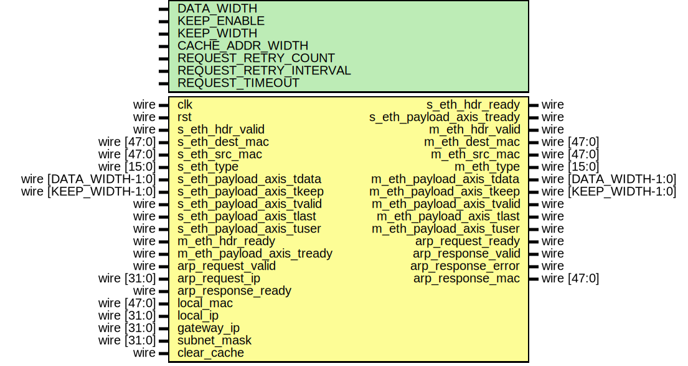

# Entity: arp

- **File**: arp.v
## Diagram

## Description

 Language: Verilog 2001

## Generics

| Generic name           | Type | Value        | Description                                                     |
| ---------------------- | ---- | ------------ | --------------------------------------------------------------- |
| DATA_WIDTH             |      | 8            |  Width of AXI stream interfaces in bits                         |
| KEEP_ENABLE            |      | undefined    |  Propagate tkeep signal  If disabled, tkeep assumed to be 1'b1  |
| KEEP_WIDTH             |      | undefined    |  tkeep signal width (words per cycle)                           |
| CACHE_ADDR_WIDTH       |      | 9            |  Log2 of ARP cache size                                         |
| REQUEST_RETRY_COUNT    |      | 4            |  ARP request retry count                                        |
| REQUEST_RETRY_INTERVAL |      | 125000000*2  |  ARP request retry interval (in cycles)                         |
| REQUEST_TIMEOUT        |      | 125000000*30 |  ARP request timeout (in cycles)                                |
## Ports

| Port name                 | Direction | Type                  | Description                           |
| ------------------------- | --------- | --------------------- | ------------------------------------- |
| clk                       | input     | wire                  |                                       |
| rst                       | input     | wire                  |                                       |
| s_eth_hdr_valid           | input     | wire                  |      * Ethernet frame input      */   |
| s_eth_hdr_ready           | output    | wire                  |                                       |
| s_eth_dest_mac            | input     | wire [47:0]           |                                       |
| s_eth_src_mac             | input     | wire [47:0]           |                                       |
| s_eth_type                | input     | wire [15:0]           |                                       |
| s_eth_payload_axis_tdata  | input     | wire [DATA_WIDTH-1:0] |                                       |
| s_eth_payload_axis_tkeep  | input     | wire [KEEP_WIDTH-1:0] |                                       |
| s_eth_payload_axis_tvalid | input     | wire                  |                                       |
| s_eth_payload_axis_tready | output    | wire                  |                                       |
| s_eth_payload_axis_tlast  | input     | wire                  |                                       |
| s_eth_payload_axis_tuser  | input     | wire                  |                                       |
| m_eth_hdr_valid           | output    | wire                  |      * Ethernet frame output      */  |
| m_eth_hdr_ready           | input     | wire                  |                                       |
| m_eth_dest_mac            | output    | wire [47:0]           |                                       |
| m_eth_src_mac             | output    | wire [47:0]           |                                       |
| m_eth_type                | output    | wire [15:0]           |                                       |
| m_eth_payload_axis_tdata  | output    | wire [DATA_WIDTH-1:0] |                                       |
| m_eth_payload_axis_tkeep  | output    | wire [KEEP_WIDTH-1:0] |                                       |
| m_eth_payload_axis_tvalid | output    | wire                  |                                       |
| m_eth_payload_axis_tready | input     | wire                  |                                       |
| m_eth_payload_axis_tlast  | output    | wire                  |                                       |
| m_eth_payload_axis_tuser  | output    | wire                  |                                       |
| arp_request_valid         | input     | wire                  |      * ARP requests      */           |
| arp_request_ready         | output    | wire                  |                                       |
| arp_request_ip            | input     | wire [31:0]           |                                       |
| arp_response_valid        | output    | wire                  |                                       |
| arp_response_ready        | input     | wire                  |                                       |
| arp_response_error        | output    | wire                  |                                       |
| arp_response_mac          | output    | wire [47:0]           |                                       |
| local_mac                 | input     | wire [47:0]           |      * Configuration      */          |
| local_ip                  | input     | wire [31:0]           |                                       |
| gateway_ip                | input     | wire [31:0]           |                                       |
| subnet_mask               | input     | wire [31:0]           |                                       |
| clear_cache               | input     | wire                  |                                       |
## Signals

| Name                           | Type        | Description |
| ------------------------------ | ----------- | ----------- |
| incoming_frame_valid           | wire        |             |
| incoming_frame_ready           | reg         |             |
| incoming_eth_dest_mac          | wire [47:0] |             |
| incoming_eth_src_mac           | wire [47:0] |             |
| incoming_eth_type              | wire [15:0] |             |
| incoming_arp_htype             | wire [15:0] |             |
| incoming_arp_ptype             | wire [15:0] |             |
| incoming_arp_hlen              | wire [7:0]  |             |
| incoming_arp_plen              | wire [7:0]  |             |
| incoming_arp_oper              | wire [15:0] |             |
| incoming_arp_sha               | wire [47:0] |             |
| incoming_arp_spa               | wire [31:0] |             |
| incoming_arp_tha               | wire [47:0] |             |
| incoming_arp_tpa               | wire [31:0] |             |
| outgoing_frame_valid_reg       | reg         |             |
| outgoing_frame_valid_next      | reg         |             |
| outgoing_frame_ready           | wire        |             |
| outgoing_eth_dest_mac_reg      | reg [47:0]  |             |
| outgoing_eth_dest_mac_next     | reg [47:0]  |             |
| outgoing_arp_oper_reg          | reg [15:0]  |             |
| outgoing_arp_oper_next         | reg [15:0]  |             |
| outgoing_arp_tha_reg           | reg [47:0]  |             |
| outgoing_arp_tha_next          | reg [47:0]  |             |
| outgoing_arp_tpa_reg           | reg [31:0]  |             |
| outgoing_arp_tpa_next          | reg [31:0]  |             |
| cache_query_request_valid_reg  | reg         |             |
| cache_query_request_valid_next | reg         |             |
| cache_query_request_ip_reg     | reg [31:0]  |             |
| cache_query_request_ip_next    | reg [31:0]  |             |
| cache_query_response_valid     | wire        |             |
| cache_query_response_error     | wire        |             |
| cache_query_response_mac       | wire [47:0] |             |
| cache_write_request_valid_reg  | reg         |             |
| cache_write_request_valid_next | reg         |             |
| cache_write_request_ip_reg     | reg [31:0]  |             |
| cache_write_request_ip_next    | reg [31:0]  |             |
| cache_write_request_mac_reg    | reg [47:0]  |             |
| cache_write_request_mac_next   | reg [47:0]  |             |
| arp_request_operation_reg      | reg         |             |
| arp_request_operation_next     | reg         |             |
| arp_request_ready_reg          | reg         |             |
| arp_request_ready_next         | reg         |             |
| arp_request_ip_reg             | reg [31:0]  |             |
| arp_request_ip_next            | reg [31:0]  |             |
| arp_response_valid_reg         | reg         |             |
| arp_response_valid_next        | reg         |             |
| arp_response_error_reg         | reg         |             |
| arp_response_error_next        | reg         |             |
| arp_response_mac_reg           | reg [47:0]  |             |
| arp_response_mac_next          | reg [47:0]  |             |
| arp_request_retry_cnt_reg      | reg [5:0]   |             |
| arp_request_retry_cnt_next     | reg [5:0]   |             |
| arp_request_timer_reg          | reg [35:0]  |             |
| arp_request_timer_next         | reg [35:0]  |             |
## Constants

| Name                   | Type   | Value    | Description |
| ---------------------- | ------ | -------- | ----------- |
| ARP_OPER_ARP_REQUEST   | [15:0] | 16'h0001 |             |
| ARP_OPER_ARP_REPLY     | [15:0] | 16'h0002 |             |
| ARP_OPER_INARP_REQUEST | [15:0] | 16'h0008 |             |
| ARP_OPER_INARP_REPLY   | [15:0] | 16'h0009 |             |
## Processes
- unnamed: ( @* )
  - **Type:** always
- unnamed: ( @(posedge clk) )
  - **Type:** always
## Instantiations

- arp_eth_rx_inst: arp_eth_rx
 **Description**

 * ARP frame processing
 */

- arp_eth_tx_inst: arp_eth_tx
- arp_cache_inst: arp_cache
 **Description**

 * ARP cache
 */

