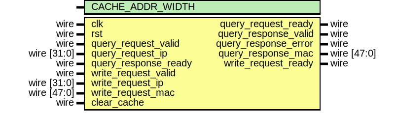

# Entity: arp_cache

- **File**: arp_cache.v
## Diagram

## Description

Language: Verilog 2001
 
## Generics

| Generic name     | Type | Value | Description |
| ---------------- | ---- | ----- | ----------- |
| CACHE_ADDR_WIDTH |      | 9     |             |
## Ports

| Port name            | Direction | Type        | Description |
| -------------------- | --------- | ----------- | ----------- |
| clk                  | input     | wire        |             |
| rst                  | input     | wire        |             |
| query_request_valid  | input     | wire        |             |
| query_request_ready  | output    | wire        |             |
| query_request_ip     | input     | wire [31:0] |             |
| query_response_valid | output    | wire        |             |
| query_response_ready | input     | wire        |             |
| query_response_error | output    | wire        |             |
| query_response_mac   | output    | wire [47:0] |             |
| write_request_valid  | input     | wire        |             |
| write_request_ready  | output    | wire        |             |
| write_request_ip     | input     | wire [31:0] |             |
| write_request_mac    | input     | wire [47:0] |             |
| clear_cache          | input     | wire        |             |
## Signals

| Name                      | Type                       | Description |
| ------------------------- | -------------------------- | ----------- |
| mem_write                 | reg                        |             |
| store_query               | reg                        |             |
| store_write               | reg                        |             |
| query_ip_valid_reg        | reg                        |             |
| query_ip_valid_next       | reg                        |             |
| query_ip_reg              | reg [31:0]                 |             |
| write_ip_valid_reg        | reg                        |             |
| write_ip_valid_next       | reg                        |             |
| write_ip_reg              | reg [31:0]                 |             |
| write_mac_reg             | reg [47:0]                 |             |
| clear_cache_reg           | reg                        |             |
| clear_cache_next          | reg                        |             |
| wr_ptr_reg                | reg [CACHE_ADDR_WIDTH-1:0] |             |
| wr_ptr_next               | reg [CACHE_ADDR_WIDTH-1:0] |             |
| rd_ptr_reg                | reg [CACHE_ADDR_WIDTH-1:0] |             |
| rd_ptr_next               | reg [CACHE_ADDR_WIDTH-1:0] |             |
| valid_mem                 | reg                        |             |
| ip_addr_mem               | reg [31:0]                 |             |
| mac_addr_mem              | reg [47:0]                 |             |
| query_request_ready_reg   | reg                        |             |
| query_request_ready_next  | reg                        |             |
| query_response_valid_reg  | reg                        |             |
| query_response_valid_next | reg                        |             |
| query_response_error_reg  | reg                        |             |
| query_response_error_next | reg                        |             |
| query_response_mac_reg    | reg [47:0]                 |             |
| write_request_ready_reg   | reg                        |             |
| write_request_ready_next  | reg                        |             |
| query_request_hash        | wire [31:0]                |             |
| write_request_hash        | wire [31:0]                |             |
| i                         | integer                    |             |
## Processes
- unnamed: ( @* )
- unnamed: ( @(posedge clk) )
## Instantiations

- rd_hash: lfsr
- wr_hash: lfsr
