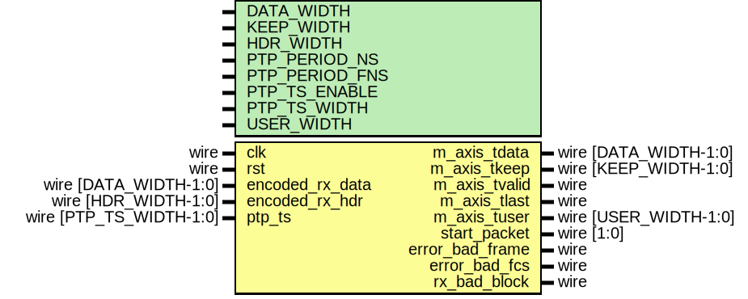

# Entity: axis_baser_rx_64

## Diagram

## Description

Language: Verilog 2001
 
## Generics

| Generic name   | Type | Value     | Description |
| -------------- | ---- | --------- | ----------- |
| DATA_WIDTH     |      | 64        |             |
| KEEP_WIDTH     |      | undefined |             |
| HDR_WIDTH      |      | 2         |             |
| PTP_PERIOD_NS  |      | 4'h6      |             |
| PTP_PERIOD_FNS |      | 16'h6666  |             |
| PTP_TS_ENABLE  |      | 0         |             |
| PTP_TS_WIDTH   |      | 96        |             |
| USER_WIDTH     |      | + 1       |             |
## Ports

| Port name       | Direction | Type                    | Description |
| --------------- | --------- | ----------------------- | ----------- |
| clk             | input     | wire                    |             |
| rst             | input     | wire                    |             |
| encoded_rx_data | input     | wire [DATA_WIDTH-1:0]   |             |
| encoded_rx_hdr  | input     | wire [HDR_WIDTH-1:0]    |             |
| m_axis_tdata    | output    | wire [DATA_WIDTH-1:0]   |             |
| m_axis_tkeep    | output    | wire [KEEP_WIDTH-1:0]   |             |
| m_axis_tvalid   | output    | wire                    |             |
| m_axis_tlast    | output    | wire                    |             |
| m_axis_tuser    | output    | wire [USER_WIDTH-1:0]   |             |
| ptp_ts          | input     | wire [PTP_TS_WIDTH-1:0] |             |
| start_packet    | output    | wire [1:0]              |             |
| error_bad_frame | output    | wire                    |             |
| error_bad_fcs   | output    | wire                    |             |
| rx_bad_block    | output    | wire                    |             |
## Signals

| Name                 | Type                   | Description               |
| -------------------- | ---------------------- | ------------------------- |
| state_reg            | reg [1:0]              |                           |
| state_next           | reg [1:0]              |                           |
| reset_crc            | reg                    | datapath control signals  |
| update_crc_last      | reg                    |                           |
| lanes_swapped        | reg                    |                           |
| swap_data            | reg [31:0]             |                           |
| delay_type_valid     | reg                    |                           |
| delay_type           | reg [3:0]              |                           |
| input_data_d0        | reg [DATA_WIDTH-1:0]   |                           |
| input_data_d1        | reg [DATA_WIDTH-1:0]   |                           |
| input_data_crc       | reg [DATA_WIDTH-1:0]   |                           |
| input_type_d0        | reg [3:0]              |                           |
| input_type_d1        | reg [3:0]              |                           |
| m_axis_tdata_reg     | reg [DATA_WIDTH-1:0]   |                           |
| m_axis_tdata_next    | reg [DATA_WIDTH-1:0]   |                           |
| m_axis_tkeep_reg     | reg [KEEP_WIDTH-1:0]   |                           |
| m_axis_tkeep_next    | reg [KEEP_WIDTH-1:0]   |                           |
| m_axis_tvalid_reg    | reg                    |                           |
| m_axis_tvalid_next   | reg                    |                           |
| m_axis_tlast_reg     | reg                    |                           |
| m_axis_tlast_next    | reg                    |                           |
| m_axis_tuser_reg     | reg                    |                           |
| m_axis_tuser_next    | reg                    |                           |
| start_packet_reg     | reg [1:0]              |                           |
| error_bad_frame_reg  | reg                    |                           |
| error_bad_frame_next | reg                    |                           |
| error_bad_fcs_reg    | reg                    |                           |
| error_bad_fcs_next   | reg                    |                           |
| rx_bad_block_reg     | reg                    |                           |
| ptp_ts_reg           | reg [PTP_TS_WIDTH-1:0] |                           |
| crc_state            | reg [31:0]             |                           |
| crc_state3           | reg [31:0]             |                           |
| crc_next0            | wire [31:0]            |                           |
| crc_next1            | wire [31:0]            |                           |
| crc_next2            | wire [31:0]            |                           |
| crc_next3            | wire [31:0]            |                           |
| crc_next7            | wire [31:0]            |                           |
| crc_valid0           | wire                   |                           |
| crc_valid1           | wire                   |                           |
| crc_valid2           | wire                   |                           |
| crc_valid3           | wire                   |                           |
| crc_valid7           | wire                   |                           |
| crc_valid7_save      | reg                    |                           |
## Constants

| Name                | Type  | Value | Description              |
| ------------------- | ----- | ----- | ------------------------ |
| ETH_PRE             | [7:0] | 8'h55 |                          |
| ETH_SFD             | [7:0] | 8'hD5 |                          |
| XGMII_IDLE          | [7:0] | 8'h07 |                          |
| XGMII_START         | [7:0] | 8'hfb |                          |
| XGMII_TERM          | [7:0] | 8'hfd |                          |
| XGMII_ERROR         | [7:0] | 8'hfe |                          |
| CTRL_IDLE           | [6:0] | 7'h00 |                          |
| CTRL_LPI            | [6:0] | 7'h06 |                          |
| CTRL_ERROR          | [6:0] | 7'h1e |                          |
| CTRL_RES_0          | [6:0] | 7'h2d |                          |
| CTRL_RES_1          | [6:0] | 7'h33 |                          |
| CTRL_RES_2          | [6:0] | 7'h4b |                          |
| CTRL_RES_3          | [6:0] | 7'h55 |                          |
| CTRL_RES_4          | [6:0] | 7'h66 |                          |
| CTRL_RES_5          | [6:0] | 7'h78 |                          |
| O_SEQ_OS            | [3:0] | 4'h0  |                          |
| O_SIG_OS            | [3:0] | 4'hf  |                          |
| SYNC_DATA           | [1:0] | 2'b10 |                          |
| SYNC_CTRL           | [1:0] | 2'b01 |                          |
| BLOCK_TYPE_CTRL     | [7:0] | 8'h1e |                          |
| BLOCK_TYPE_OS_4     | [7:0] | 8'h2d |                          |
| BLOCK_TYPE_START_4  | [7:0] | 8'h33 |                          |
| BLOCK_TYPE_OS_START | [7:0] | 8'h66 |                          |
| BLOCK_TYPE_OS_04    | [7:0] | 8'h55 |                          |
| BLOCK_TYPE_START_0  | [7:0] | 8'h78 |                          |
| BLOCK_TYPE_OS_0     | [7:0] | 8'h4b |                          |
| BLOCK_TYPE_TERM_0   | [7:0] | 8'h87 |                          |
| BLOCK_TYPE_TERM_1   | [7:0] | 8'h99 |                          |
| BLOCK_TYPE_TERM_2   | [7:0] | 8'haa |                          |
| BLOCK_TYPE_TERM_3   | [7:0] | 8'hb4 |                          |
| BLOCK_TYPE_TERM_4   | [7:0] | 8'hcc |                          |
| BLOCK_TYPE_TERM_5   | [7:0] | 8'hd2 |                          |
| BLOCK_TYPE_TERM_6   | [7:0] | 8'he1 |                          |
| BLOCK_TYPE_TERM_7   | [7:0] | 8'hff |                          |
| INPUT_TYPE_IDLE     | [3:0] | 4'd0  | D6 D5 D4 D3 D2 D1 D0 BT  |
| INPUT_TYPE_ERROR    | [3:0] | 4'd1  | D6 D5 D4 D3 D2 D1 D0 BT  |
| INPUT_TYPE_START_0  | [3:0] | 4'd2  | D6 D5 D4 D3 D2 D1 D0 BT  |
| INPUT_TYPE_START_4  | [3:0] | 4'd3  | D6 D5 D4 D3 D2 D1 D0 BT  |
| INPUT_TYPE_DATA     | [3:0] | 4'd4  | D6 D5 D4 D3 D2 D1 D0 BT  |
| INPUT_TYPE_TERM_0   | [3:0] | 4'd8  | D6 D5 D4 D3 D2 D1 D0 BT  |
| INPUT_TYPE_TERM_1   | [3:0] | 4'd9  | D6 D5 D4 D3 D2 D1 D0 BT  |
| INPUT_TYPE_TERM_2   | [3:0] | 4'd10 | D6 D5 D4 D3 D2 D1 D0 BT  |
| INPUT_TYPE_TERM_3   | [3:0] | 4'd11 | D6 D5 D4 D3 D2 D1 D0 BT  |
| INPUT_TYPE_TERM_4   | [3:0] | 4'd12 | D6 D5 D4 D3 D2 D1 D0 BT  |
| INPUT_TYPE_TERM_5   | [3:0] | 4'd13 | D6 D5 D4 D3 D2 D1 D0 BT  |
| INPUT_TYPE_TERM_6   | [3:0] | 4'd14 | D6 D5 D4 D3 D2 D1 D0 BT  |
| INPUT_TYPE_TERM_7   | [3:0] | 4'd15 | D6 D5 D4 D3 D2 D1 D0 BT  |
| STATE_IDLE          | [1:0] | 2'd0  |                          |
| STATE_PAYLOAD       | [1:0] | 2'd1  |                          |
| STATE_LAST          | [1:0] | 2'd2  |                          |
## Processes
- unnamed: ( @* )
- unnamed: ( @(posedge clk) )
## Instantiations

- eth_crc_8: lfsr
- eth_crc_16: lfsr
- eth_crc_24: lfsr
- eth_crc_32: lfsr
- eth_crc_64: lfsr
