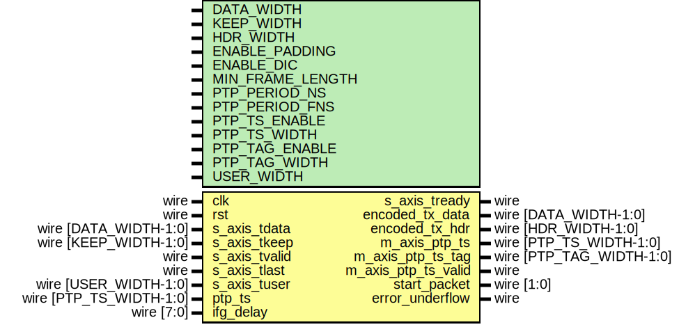

# Entity: axis_baser_tx_64

- **File**: axis_baser_tx_64.v
## Diagram

## Description

 Language: Verilog 2001

## Generics

| Generic name     | Type | Value         | Description |
| ---------------- | ---- | ------------- | ----------- |
| DATA_WIDTH       |      | 64            |             |
| KEEP_WIDTH       |      | undefined     |             |
| HDR_WIDTH        |      | 2             |             |
| ENABLE_PADDING   |      | 1             |             |
| ENABLE_DIC       |      | 1             |             |
| MIN_FRAME_LENGTH |      | 64            |             |
| PTP_PERIOD_NS    |      | 4'h6          |             |
| PTP_PERIOD_FNS   |      | 16'h6666      |             |
| PTP_TS_ENABLE    |      | 0             |             |
| PTP_TS_WIDTH     |      | 96            |             |
| PTP_TAG_ENABLE   |      | PTP_TS_ENABLE |             |
| PTP_TAG_WIDTH    |      | 16            |             |
| USER_WIDTH       |      | + 1           |             |
## Ports

| Port name           | Direction | Type                     | Description                                 |
| ------------------- | --------- | ------------------------ | ------------------------------------------- |
| clk                 | input     | wire                     |                                             |
| rst                 | input     | wire                     |                                             |
| s_axis_tdata        | input     | wire [DATA_WIDTH-1:0]    |      * AXI input      */                    |
| s_axis_tkeep        | input     | wire [KEEP_WIDTH-1:0]    |                                             |
| s_axis_tvalid       | input     | wire                     |                                             |
| s_axis_tready       | output    | wire                     |                                             |
| s_axis_tlast        | input     | wire                     |                                             |
| s_axis_tuser        | input     | wire [USER_WIDTH-1:0]    |                                             |
| encoded_tx_data     | output    | wire [DATA_WIDTH-1:0]    |      * 10GBASE-R encoded interface      */  |
| encoded_tx_hdr      | output    | wire [HDR_WIDTH-1:0]     |                                             |
| ptp_ts              | input     | wire [PTP_TS_WIDTH-1:0]  |      * PTP      */                          |
| m_axis_ptp_ts       | output    | wire [PTP_TS_WIDTH-1:0]  |                                             |
| m_axis_ptp_ts_tag   | output    | wire [PTP_TAG_WIDTH-1:0] |                                             |
| m_axis_ptp_ts_valid | output    | wire                     |                                             |
| ifg_delay           | input     | wire [7:0]               |      * Configuration      */                |
| start_packet        | output    | wire [1:0]               |      * Status      */                       |
| error_underflow     | output    | wire                     |                                             |
## Signals

| Name                         | Type                    | Description                |
| ---------------------------- | ----------------------- | -------------------------- |
| state_reg                    | reg [2:0]               |                            |
| state_next                   | reg [2:0]               |                            |
| reset_crc                    | reg                     |  datapath control signals  |
| update_crc                   | reg                     |                            |
| swap_lanes                   | reg                     |                            |
| unswap_lanes                 | reg                     |                            |
| lanes_swapped                | reg                     |                            |
| swap_data                    | reg [31:0]              |                            |
| delay_type_valid             | reg                     |                            |
| delay_type                   | reg [3:0]               |                            |
| s_axis_tdata_masked          | reg [DATA_WIDTH-1:0]    |                            |
| s_tdata_reg                  | reg [DATA_WIDTH-1:0]    |                            |
| s_tdata_next                 | reg [DATA_WIDTH-1:0]    |                            |
| s_tkeep_reg                  | reg [7:0]               |                            |
| s_tkeep_next                 | reg [7:0]               |                            |
| fcs_output_data_0            | reg [DATA_WIDTH-1:0]    |                            |
| fcs_output_data_1            | reg [DATA_WIDTH-1:0]    |                            |
| fcs_output_type_0            | reg [3:0]               |                            |
| fcs_output_type_1            | reg [3:0]               |                            |
| ifg_offset                   | reg [7:0]               |                            |
| extra_cycle                  | reg                     |                            |
| frame_ptr_reg                | reg [15:0]              |                            |
| frame_ptr_next               | reg [15:0]              |                            |
| ifg_count_reg                | reg [7:0]               |                            |
| ifg_count_next               | reg [7:0]               |                            |
| deficit_idle_count_reg       | reg [1:0]               |                            |
| deficit_idle_count_next      | reg [1:0]               |                            |
| s_axis_tready_reg            | reg                     |                            |
| s_axis_tready_next           | reg                     |                            |
| m_axis_ptp_ts_reg            | reg [PTP_TS_WIDTH-1:0]  |                            |
| m_axis_ptp_ts_next           | reg [PTP_TS_WIDTH-1:0]  |                            |
| m_axis_ptp_ts_tag_reg        | reg [PTP_TAG_WIDTH-1:0] |                            |
| m_axis_ptp_ts_tag_next       | reg [PTP_TAG_WIDTH-1:0] |                            |
| m_axis_ptp_ts_valid_reg      | reg                     |                            |
| m_axis_ptp_ts_valid_next     | reg                     |                            |
| m_axis_ptp_ts_valid_int_reg  | reg                     |                            |
| m_axis_ptp_ts_valid_int_next | reg                     |                            |
| crc_state                    | reg [31:0]              |                            |
| crc_next0                    | wire [31:0]             |                            |
| crc_next1                    | wire [31:0]             |                            |
| crc_next2                    | wire [31:0]             |                            |
| crc_next3                    | wire [31:0]             |                            |
| crc_next4                    | wire [31:0]             |                            |
| crc_next5                    | wire [31:0]             |                            |
| crc_next6                    | wire [31:0]             |                            |
| crc_next7                    | wire [31:0]             |                            |
| encoded_tx_data_reg          | reg [DATA_WIDTH-1:0]    |                            |
| encoded_tx_hdr_reg           | reg [HDR_WIDTH-1:0]     |                            |
| output_data_reg              | reg [DATA_WIDTH-1:0]    |                            |
| output_data_next             | reg [DATA_WIDTH-1:0]    |                            |
| output_type_reg              | reg [3:0]               |                            |
| output_type_next             | reg [3:0]               |                            |
| start_packet_reg             | reg [1:0]               |                            |
| start_packet_next            | reg [1:0]               |                            |
| error_underflow_reg          | reg                     |                            |
| error_underflow_next         | reg                     |                            |
| j                            | integer                 |  Mask input data           |
## Constants

| Name                | Type  | Value                   | Description                  |
| ------------------- | ----- | ----------------------- | ---------------------------- |
| MIN_FL_NOCRC        |       | MIN_FRAME_LENGTH-4      |                              |
| MIN_FL_NOCRC_MS     |       | MIN_FL_NOCRC & 16'hfff8 |                              |
| MIN_FL_NOCRC_LS     |       | MIN_FL_NOCRC & 16'h0007 |                              |
| ETH_PRE             | [7:0] | 8'h55                   |                              |
| ETH_SFD             | [7:0] | 8'hD5                   |                              |
| CTRL_IDLE           | [6:0] | 7'h00                   |                              |
| CTRL_LPI            | [6:0] | 7'h06                   |                              |
| CTRL_ERROR          | [6:0] | 7'h1e                   |                              |
| CTRL_RES_0          | [6:0] | 7'h2d                   |                              |
| CTRL_RES_1          | [6:0] | 7'h33                   |                              |
| CTRL_RES_2          | [6:0] | 7'h4b                   |                              |
| CTRL_RES_3          | [6:0] | 7'h55                   |                              |
| CTRL_RES_4          | [6:0] | 7'h66                   |                              |
| CTRL_RES_5          | [6:0] | 7'h78                   |                              |
| O_SEQ_OS            | [3:0] | 4'h0                    |                              |
| O_SIG_OS            | [3:0] | 4'hf                    |                              |
| SYNC_DATA           | [1:0] | 2'b10                   |                              |
| SYNC_CTRL           | [1:0] | 2'b01                   |                              |
| BLOCK_TYPE_CTRL     | [7:0] | 8'h1e                   |                              |
| BLOCK_TYPE_OS_4     | [7:0] | 8'h2d                   |                              |
| BLOCK_TYPE_START_4  | [7:0] | 8'h33                   |                              |
| BLOCK_TYPE_OS_START | [7:0] | 8'h66                   |                              |
| BLOCK_TYPE_OS_04    | [7:0] | 8'h55                   |                              |
| BLOCK_TYPE_START_0  | [7:0] | 8'h78                   |                              |
| BLOCK_TYPE_OS_0     | [7:0] | 8'h4b                   |                              |
| BLOCK_TYPE_TERM_0   | [7:0] | 8'h87                   |                              |
| BLOCK_TYPE_TERM_1   | [7:0] | 8'h99                   |                              |
| BLOCK_TYPE_TERM_2   | [7:0] | 8'haa                   |                              |
| BLOCK_TYPE_TERM_3   | [7:0] | 8'hb4                   |                              |
| BLOCK_TYPE_TERM_4   | [7:0] | 8'hcc                   |                              |
| BLOCK_TYPE_TERM_5   | [7:0] | 8'hd2                   |                              |
| BLOCK_TYPE_TERM_6   | [7:0] | 8'he1                   |                              |
| BLOCK_TYPE_TERM_7   | [7:0] | 8'hff                   |                              |
| OUTPUT_TYPE_IDLE    | [3:0] | 4'd0                    |     D6 D5 D4 D3 D2 D1 D0 BT  |
| OUTPUT_TYPE_ERROR   | [3:0] | 4'd1                    |     D6 D5 D4 D3 D2 D1 D0 BT  |
| OUTPUT_TYPE_START_0 | [3:0] | 4'd2                    |     D6 D5 D4 D3 D2 D1 D0 BT  |
| OUTPUT_TYPE_START_4 | [3:0] | 4'd3                    |     D6 D5 D4 D3 D2 D1 D0 BT  |
| OUTPUT_TYPE_DATA    | [3:0] | 4'd4                    |     D6 D5 D4 D3 D2 D1 D0 BT  |
| OUTPUT_TYPE_TERM_0  | [3:0] | 4'd8                    |     D6 D5 D4 D3 D2 D1 D0 BT  |
| OUTPUT_TYPE_TERM_1  | [3:0] | 4'd9                    |     D6 D5 D4 D3 D2 D1 D0 BT  |
| OUTPUT_TYPE_TERM_2  | [3:0] | 4'd10                   |     D6 D5 D4 D3 D2 D1 D0 BT  |
| OUTPUT_TYPE_TERM_3  | [3:0] | 4'd11                   |     D6 D5 D4 D3 D2 D1 D0 BT  |
| OUTPUT_TYPE_TERM_4  | [3:0] | 4'd12                   |     D6 D5 D4 D3 D2 D1 D0 BT  |
| OUTPUT_TYPE_TERM_5  | [3:0] | 4'd13                   |     D6 D5 D4 D3 D2 D1 D0 BT  |
| OUTPUT_TYPE_TERM_6  | [3:0] | 4'd14                   |     D6 D5 D4 D3 D2 D1 D0 BT  |
| OUTPUT_TYPE_TERM_7  | [3:0] | 4'd15                   |     D6 D5 D4 D3 D2 D1 D0 BT  |
| STATE_IDLE          | [2:0] | 3'd0                    |                              |
| STATE_PAYLOAD       | [2:0] | 3'd1                    |                              |
| STATE_PAD           | [2:0] | 3'd2                    |                              |
| STATE_FCS_1         | [2:0] | 3'd3                    |                              |
| STATE_FCS_2         | [2:0] | 3'd4                    |                              |
| STATE_IFG           | [2:0] | 3'd5                    |                              |
| STATE_WAIT_END      | [2:0] | 3'd6                    |                              |
## Functions
- keep2count () return ([3:0])
## Processes
- unnamed: ( @* )
  - **Type:** always
- unnamed: ( @* )
  - **Type:** always
 **Description**
 FCS cycle calculation 
- unnamed: ( @* )
  - **Type:** always
- unnamed: ( @(posedge clk) )
  - **Type:** always
## Instantiations

- eth_crc_8: lfsr
- eth_crc_16: lfsr
- eth_crc_24: lfsr
- eth_crc_32: lfsr
- eth_crc_40: lfsr
- eth_crc_48: lfsr
- eth_crc_56: lfsr
- eth_crc_64: lfsr
