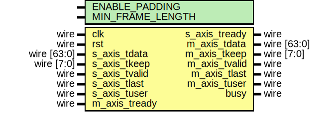

# Entity: axis_eth_fcs_insert_64

## Diagram

## Description

Language: Verilog 2001
 
## Generics

| Generic name     | Type | Value | Description |
| ---------------- | ---- | ----- | ----------- |
| ENABLE_PADDING   |      | 0     |             |
| MIN_FRAME_LENGTH |      | 64    |             |
## Ports

| Port name     | Direction | Type        | Description |
| ------------- | --------- | ----------- | ----------- |
| clk           | input     | wire        |             |
| rst           | input     | wire        |             |
| s_axis_tdata  | input     | wire [63:0] |             |
| s_axis_tkeep  | input     | wire [7:0]  |             |
| s_axis_tvalid | input     | wire        |             |
| s_axis_tready | output    | wire        |             |
| s_axis_tlast  | input     | wire        |             |
| s_axis_tuser  | input     | wire        |             |
| m_axis_tdata  | output    | wire [63:0] |             |
| m_axis_tkeep  | output    | wire [7:0]  |             |
| m_axis_tvalid | output    | wire        |             |
| m_axis_tready | input     | wire        |             |
| m_axis_tlast  | output    | wire        |             |
| m_axis_tuser  | output    | wire        |             |
| busy          | output    | wire        |             |
## Signals

| Name                      | Type        | Description               |
| ------------------------- | ----------- | ------------------------- |
| state_reg                 | reg [1:0]   |                           |
| state_next                | reg [1:0]   |                           |
| reset_crc                 | reg         | datapath control signals  |
| update_crc                | reg         |                           |
| s_axis_tdata_masked       | reg [63:0]  |                           |
| fcs_s_tdata               | reg [63:0]  |                           |
| fcs_s_tkeep               | reg [7:0]   |                           |
| fcs_m_tdata_0             | reg [63:0]  |                           |
| fcs_m_tdata_1             | reg [63:0]  |                           |
| fcs_m_tkeep_0             | reg [7:0]   |                           |
| fcs_m_tkeep_1             | reg [7:0]   |                           |
| frame_ptr_reg             | reg [15:0]  |                           |
| frame_ptr_next            | reg [15:0]  |                           |
| last_cycle_tdata_reg      | reg [63:0]  |                           |
| last_cycle_tdata_next     | reg [63:0]  |                           |
| last_cycle_tkeep_reg      | reg [7:0]   |                           |
| last_cycle_tkeep_next     | reg [7:0]   |                           |
| busy_reg                  | reg         |                           |
| s_axis_tready_reg         | reg         |                           |
| s_axis_tready_next        | reg         |                           |
| crc_state                 | reg [31:0]  |                           |
| crc_next0                 | wire [31:0] |                           |
| crc_next1                 | wire [31:0] |                           |
| crc_next2                 | wire [31:0] |                           |
| crc_next3                 | wire [31:0] |                           |
| crc_next4                 | wire [31:0] |                           |
| crc_next5                 | wire [31:0] |                           |
| crc_next6                 | wire [31:0] |                           |
| crc_next7                 | wire [31:0] |                           |
| m_axis_tdata_int          | reg [63:0]  | internal datapath         |
| m_axis_tkeep_int          | reg [7:0]   |                           |
| m_axis_tvalid_int         | reg         |                           |
| m_axis_tready_int_reg     | reg         |                           |
| m_axis_tlast_int          | reg         |                           |
| m_axis_tuser_int          | reg         |                           |
| m_axis_tready_int_early   | wire        |                           |
| j                         | integer     | Mask input data           |
| m_axis_tdata_reg          | reg [63:0]  | output datapath logic     |
| m_axis_tkeep_reg          | reg [7:0]   |                           |
| m_axis_tvalid_reg         | reg         |                           |
| m_axis_tvalid_next        | reg         |                           |
| m_axis_tlast_reg          | reg         |                           |
| m_axis_tuser_reg          | reg         |                           |
| temp_m_axis_tdata_reg     | reg [63:0]  |                           |
| temp_m_axis_tkeep_reg     | reg [7:0]   |                           |
| temp_m_axis_tvalid_reg    | reg         |                           |
| temp_m_axis_tvalid_next   | reg         |                           |
| temp_m_axis_tlast_reg     | reg         |                           |
| temp_m_axis_tuser_reg     | reg         |                           |
| store_axis_int_to_output  | reg         | datapath control          |
| store_axis_int_to_temp    | reg         |                           |
| store_axis_temp_to_output | reg         |                           |
## Constants

| Name          | Type  | Value | Description |
| ------------- | ----- | ----- | ----------- |
| STATE_IDLE    | [1:0] | 2'd0  |             |
| STATE_PAYLOAD | [1:0] | 2'd1  |             |
| STATE_PAD     | [1:0] | 2'd2  |             |
| STATE_FCS     | [1:0] | 2'd3  |             |
## Functions
- keep2count () return ([3:0])
- count2keep () return ([7:0])
## Processes
- unnamed: ( @* )
- unnamed: ( @* )
**Description**
FCS cycle calculation

- unnamed: ( @* )
- unnamed: ( @(posedge clk) )
- unnamed: ( @* )
- unnamed: ( @(posedge clk) )
## Instantiations

- eth_crc_8: lfsr
- eth_crc_16: lfsr
- eth_crc_24: lfsr
- eth_crc_32: lfsr
- eth_crc_40: lfsr
- eth_crc_48: lfsr
- eth_crc_56: lfsr
- eth_crc_64: lfsr
