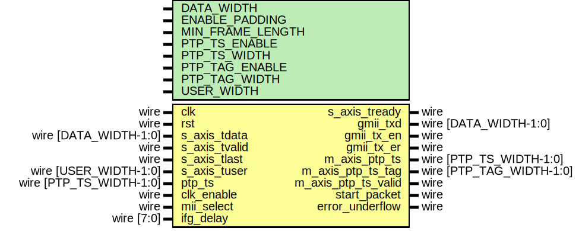

# Entity: axis_gmii_tx

- **File**: axis_gmii_tx.v
## Diagram

## Description

Language: Verilog 2001
 
## Generics

| Generic name     | Type | Value         | Description |
| ---------------- | ---- | ------------- | ----------- |
| DATA_WIDTH       |      | 8             |             |
| ENABLE_PADDING   |      | 1             |             |
| MIN_FRAME_LENGTH |      | 64            |             |
| PTP_TS_ENABLE    |      | 0             |             |
| PTP_TS_WIDTH     |      | 96            |             |
| PTP_TAG_ENABLE   |      | PTP_TS_ENABLE |             |
| PTP_TAG_WIDTH    |      | 16            |             |
| USER_WIDTH       |      | + 1           |             |
## Ports

| Port name           | Direction | Type                     | Description |
| ------------------- | --------- | ------------------------ | ----------- |
| clk                 | input     | wire                     |             |
| rst                 | input     | wire                     |             |
| s_axis_tdata        | input     | wire [DATA_WIDTH-1:0]    |             |
| s_axis_tvalid       | input     | wire                     |             |
| s_axis_tready       | output    | wire                     |             |
| s_axis_tlast        | input     | wire                     |             |
| s_axis_tuser        | input     | wire [USER_WIDTH-1:0]    |             |
| gmii_txd            | output    | wire [DATA_WIDTH-1:0]    |             |
| gmii_tx_en          | output    | wire                     |             |
| gmii_tx_er          | output    | wire                     |             |
| ptp_ts              | input     | wire [PTP_TS_WIDTH-1:0]  |             |
| m_axis_ptp_ts       | output    | wire [PTP_TS_WIDTH-1:0]  |             |
| m_axis_ptp_ts_tag   | output    | wire [PTP_TAG_WIDTH-1:0] |             |
| m_axis_ptp_ts_valid | output    | wire                     |             |
| clk_enable          | input     | wire                     |             |
| mii_select          | input     | wire                     |             |
| ifg_delay           | input     | wire [7:0]               |             |
| start_packet        | output    | wire                     |             |
| error_underflow     | output    | wire                     |             |
## Signals

| Name                     | Type                    | Description               |
| ------------------------ | ----------------------- | ------------------------- |
| state_reg                | reg [2:0]               |                           |
| state_next               | reg [2:0]               |                           |
| reset_crc                | reg                     | datapath control signals  |
| update_crc               | reg                     |                           |
| s_tdata_reg              | reg [7:0]               |                           |
| s_tdata_next             | reg [7:0]               |                           |
| mii_odd_reg              | reg                     |                           |
| mii_odd_next             | reg                     |                           |
| mii_msn_reg              | reg [3:0]               |                           |
| mii_msn_next             | reg [3:0]               |                           |
| frame_ptr_reg            | reg [15:0]              |                           |
| frame_ptr_next           | reg [15:0]              |                           |
| gmii_txd_reg             | reg [7:0]               |                           |
| gmii_txd_next            | reg [7:0]               |                           |
| gmii_tx_en_reg           | reg                     |                           |
| gmii_tx_en_next          | reg                     |                           |
| gmii_tx_er_reg           | reg                     |                           |
| gmii_tx_er_next          | reg                     |                           |
| s_axis_tready_reg        | reg                     |                           |
| s_axis_tready_next       | reg                     |                           |
| m_axis_ptp_ts_reg        | reg [PTP_TS_WIDTH-1:0]  |                           |
| m_axis_ptp_ts_next       | reg [PTP_TS_WIDTH-1:0]  |                           |
| m_axis_ptp_ts_tag_reg    | reg [PTP_TAG_WIDTH-1:0] |                           |
| m_axis_ptp_ts_tag_next   | reg [PTP_TAG_WIDTH-1:0] |                           |
| m_axis_ptp_ts_valid_reg  | reg                     |                           |
| m_axis_ptp_ts_valid_next | reg                     |                           |
| start_packet_reg         | reg                     |                           |
| start_packet_next        | reg                     |                           |
| error_underflow_reg      | reg                     |                           |
| error_underflow_next     | reg                     |                           |
| crc_state                | reg [31:0]              |                           |
| crc_next                 | wire [31:0]             |                           |
## Constants

| Name           | Type  | Value | Description |
| -------------- | ----- | ----- | ----------- |
| ETH_PRE        | [7:0] | 8'h55 |             |
| ETH_SFD        | [7:0] | 8'hD5 |             |
| STATE_IDLE     | [2:0] | 3'd0  |             |
| STATE_PREAMBLE | [2:0] | 3'd1  |             |
| STATE_PAYLOAD  | [2:0] | 3'd2  |             |
| STATE_LAST     | [2:0] | 3'd3  |             |
| STATE_PAD      | [2:0] | 3'd4  |             |
| STATE_FCS      | [2:0] | 3'd5  |             |
| STATE_WAIT_END | [2:0] | 3'd6  |             |
| STATE_IFG      | [2:0] | 3'd7  |             |
## Processes
- unnamed: ( @* )
- unnamed: ( @(posedge clk) )
## Instantiations

- eth_crc_8: lfsr
