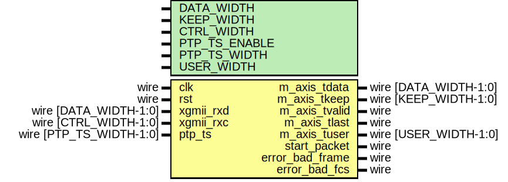

# Entity: axis_xgmii_rx_32

## Diagram

## Description

Language: Verilog 2001
 
## Generics

| Generic name  | Type | Value     | Description |
| ------------- | ---- | --------- | ----------- |
| DATA_WIDTH    |      | 32        |             |
| KEEP_WIDTH    |      | undefined |             |
| CTRL_WIDTH    |      | undefined |             |
| PTP_TS_ENABLE |      | 0         |             |
| PTP_TS_WIDTH  |      | 96        |             |
| USER_WIDTH    |      | + 1       |             |
## Ports

| Port name       | Direction | Type                    | Description |
| --------------- | --------- | ----------------------- | ----------- |
| clk             | input     | wire                    |             |
| rst             | input     | wire                    |             |
| xgmii_rxd       | input     | wire [DATA_WIDTH-1:0]   |             |
| xgmii_rxc       | input     | wire [CTRL_WIDTH-1:0]   |             |
| m_axis_tdata    | output    | wire [DATA_WIDTH-1:0]   |             |
| m_axis_tkeep    | output    | wire [KEEP_WIDTH-1:0]   |             |
| m_axis_tvalid   | output    | wire                    |             |
| m_axis_tlast    | output    | wire                    |             |
| m_axis_tuser    | output    | wire [USER_WIDTH-1:0]   |             |
| ptp_ts          | input     | wire [PTP_TS_WIDTH-1:0] |             |
| start_packet    | output    | wire                    |             |
| error_bad_frame | output    | wire                    |             |
| error_bad_fcs   | output    | wire                    |             |
## Signals

| Name                  | Type                   | Description                   |
| --------------------- | ---------------------- | ----------------------------- |
| state_reg             | reg [1:0]              |                               |
| state_next            | reg [1:0]              |                               |
| reset_crc             | reg                    | datapath control signals      |
| last_cycle_tkeep_reg  | reg [3:0]              |                               |
| last_cycle_tkeep_next | reg [3:0]              |                               |
| xgmii_rxd_d0          | reg [DATA_WIDTH-1:0]   |                               |
| xgmii_rxd_d1          | reg [DATA_WIDTH-1:0]   |                               |
| xgmii_rxd_d2          | reg [DATA_WIDTH-1:0]   |                               |
| xgmii_rxc_d0          | reg [CTRL_WIDTH-1:0]   |                               |
| xgmii_rxc_d1          | reg [CTRL_WIDTH-1:0]   |                               |
| xgmii_rxc_d2          | reg [CTRL_WIDTH-1:0]   |                               |
| m_axis_tdata_reg      | reg [DATA_WIDTH-1:0]   |                               |
| m_axis_tdata_next     | reg [DATA_WIDTH-1:0]   |                               |
| m_axis_tkeep_reg      | reg [KEEP_WIDTH-1:0]   |                               |
| m_axis_tkeep_next     | reg [KEEP_WIDTH-1:0]   |                               |
| m_axis_tvalid_reg     | reg                    |                               |
| m_axis_tvalid_next    | reg                    |                               |
| m_axis_tlast_reg      | reg                    |                               |
| m_axis_tlast_next     | reg                    |                               |
| m_axis_tuser_reg      | reg                    |                               |
| m_axis_tuser_next     | reg                    |                               |
| start_packet_reg      | reg                    |                               |
| start_packet_next     | reg                    |                               |
| error_bad_frame_reg   | reg                    |                               |
| error_bad_frame_next  | reg                    |                               |
| error_bad_fcs_reg     | reg                    |                               |
| error_bad_fcs_next    | reg                    |                               |
| ptp_ts_reg            | reg [PTP_TS_WIDTH-1:0] |                               |
| ptp_ts_next           | reg [PTP_TS_WIDTH-1:0] |                               |
| crc_state             | reg [31:0]             |                               |
| crc_next0             | wire [31:0]            |                               |
| crc_next1             | wire [31:0]            |                               |
| crc_next2             | wire [31:0]            |                               |
| crc_next3             | wire [31:0]            |                               |
| crc_valid0            | wire                   |                               |
| crc_valid1            | wire                   |                               |
| crc_valid2            | wire                   |                               |
| crc_valid3            | wire                   |                               |
| crc_valid0_save       | reg                    |                               |
| crc_valid1_save       | reg                    |                               |
| crc_valid2_save       | reg                    |                               |
| crc_valid3_save       | reg                    |                               |
| last_cycle            | wire                   |                               |
| detect_term           | reg [3:0]              | detect control characters     |
| detect_term_save      | reg [3:0]              |                               |
| i                     | integer                |                               |
| control_masked        | reg [3:0]              | mask errors to within packet  |
| tkeep_mask            | reg [3:0]              |                               |
## Constants

| Name           | Type  | Value | Description |
| -------------- | ----- | ----- | ----------- |
| ETH_PRE        | [7:0] | 8'h55 |             |
| ETH_SFD        | [7:0] | 8'hD5 |             |
| XGMII_IDLE     | [7:0] | 8'h07 |             |
| XGMII_START    | [7:0] | 8'hfb |             |
| XGMII_TERM     | [7:0] | 8'hfd |             |
| XGMII_ERROR    | [7:0] | 8'hfe |             |
| STATE_IDLE     | [1:0] | 2'd0  |             |
| STATE_PREAMBLE | [1:0] | 2'd1  |             |
| STATE_PAYLOAD  | [1:0] | 2'd2  |             |
| STATE_LAST     | [1:0] | 2'd3  |             |
## Processes
- unnamed: ( @* )
- unnamed: ( @* )
- unnamed: ( @(posedge clk) )
## Instantiations

- eth_crc_8: lfsr
- eth_crc_16: lfsr
- eth_crc_24: lfsr
- eth_crc_32: lfsr
