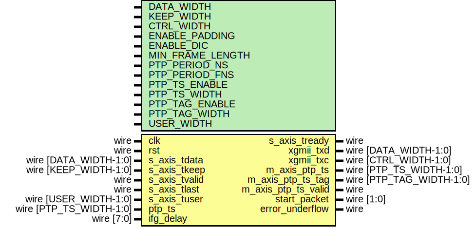

# Entity: axis_xgmii_tx_64

## Diagram

## Description

Language: Verilog 2001
 
## Generics

| Generic name     | Type | Value         | Description |
| ---------------- | ---- | ------------- | ----------- |
| DATA_WIDTH       |      | 64            |             |
| KEEP_WIDTH       |      | undefined     |             |
| CTRL_WIDTH       |      | undefined     |             |
| ENABLE_PADDING   |      | 1             |             |
| ENABLE_DIC       |      | 1             |             |
| MIN_FRAME_LENGTH |      | 64            |             |
| PTP_PERIOD_NS    |      | 4'h6          |             |
| PTP_PERIOD_FNS   |      | 16'h6666      |             |
| PTP_TS_ENABLE    |      | 0             |             |
| PTP_TS_WIDTH     |      | 96            |             |
| PTP_TAG_ENABLE   |      | PTP_TS_ENABLE |             |
| PTP_TAG_WIDTH    |      | 16            |             |
| USER_WIDTH       |      | + 1           |             |
## Ports

| Port name           | Direction | Type                     | Description |
| ------------------- | --------- | ------------------------ | ----------- |
| clk                 | input     | wire                     |             |
| rst                 | input     | wire                     |             |
| s_axis_tdata        | input     | wire [DATA_WIDTH-1:0]    |             |
| s_axis_tkeep        | input     | wire [KEEP_WIDTH-1:0]    |             |
| s_axis_tvalid       | input     | wire                     |             |
| s_axis_tready       | output    | wire                     |             |
| s_axis_tlast        | input     | wire                     |             |
| s_axis_tuser        | input     | wire [USER_WIDTH-1:0]    |             |
| xgmii_txd           | output    | wire [DATA_WIDTH-1:0]    |             |
| xgmii_txc           | output    | wire [CTRL_WIDTH-1:0]    |             |
| ptp_ts              | input     | wire [PTP_TS_WIDTH-1:0]  |             |
| m_axis_ptp_ts       | output    | wire [PTP_TS_WIDTH-1:0]  |             |
| m_axis_ptp_ts_tag   | output    | wire [PTP_TAG_WIDTH-1:0] |             |
| m_axis_ptp_ts_valid | output    | wire                     |             |
| ifg_delay           | input     | wire [7:0]               |             |
| start_packet        | output    | wire [1:0]               |             |
| error_underflow     | output    | wire                     |             |
## Signals

| Name                         | Type                    | Description               |
| ---------------------------- | ----------------------- | ------------------------- |
| state_reg                    | reg [2:0]               |                           |
| state_next                   | reg [2:0]               |                           |
| reset_crc                    | reg                     | datapath control signals  |
| update_crc                   | reg                     |                           |
| swap_lanes                   | reg                     |                           |
| unswap_lanes                 | reg                     |                           |
| lanes_swapped                | reg                     |                           |
| swap_txd                     | reg [31:0]              |                           |
| swap_txc                     | reg [3:0]               |                           |
| s_axis_tdata_masked          | reg [DATA_WIDTH-1:0]    |                           |
| s_tdata_reg                  | reg [DATA_WIDTH-1:0]    |                           |
| s_tdata_next                 | reg [DATA_WIDTH-1:0]    |                           |
| s_tkeep_reg                  | reg [KEEP_WIDTH-1:0]    |                           |
| s_tkeep_next                 | reg [KEEP_WIDTH-1:0]    |                           |
| fcs_output_txd_0             | reg [DATA_WIDTH-1:0]    |                           |
| fcs_output_txd_1             | reg [DATA_WIDTH-1:0]    |                           |
| fcs_output_txc_0             | reg [CTRL_WIDTH-1:0]    |                           |
| fcs_output_txc_1             | reg [CTRL_WIDTH-1:0]    |                           |
| ifg_offset                   | reg [7:0]               |                           |
| extra_cycle                  | reg                     |                           |
| frame_ptr_reg                | reg [15:0]              |                           |
| frame_ptr_next               | reg [15:0]              |                           |
| ifg_count_reg                | reg [7:0]               |                           |
| ifg_count_next               | reg [7:0]               |                           |
| deficit_idle_count_reg       | reg [1:0]               |                           |
| deficit_idle_count_next      | reg [1:0]               |                           |
| s_axis_tready_reg            | reg                     |                           |
| s_axis_tready_next           | reg                     |                           |
| m_axis_ptp_ts_reg            | reg [PTP_TS_WIDTH-1:0]  |                           |
| m_axis_ptp_ts_next           | reg [PTP_TS_WIDTH-1:0]  |                           |
| m_axis_ptp_ts_tag_reg        | reg [PTP_TAG_WIDTH-1:0] |                           |
| m_axis_ptp_ts_tag_next       | reg [PTP_TAG_WIDTH-1:0] |                           |
| m_axis_ptp_ts_valid_reg      | reg                     |                           |
| m_axis_ptp_ts_valid_next     | reg                     |                           |
| m_axis_ptp_ts_valid_int_reg  | reg                     |                           |
| m_axis_ptp_ts_valid_int_next | reg                     |                           |
| crc_state                    | reg [31:0]              |                           |
| crc_next0                    | wire [31:0]             |                           |
| crc_next1                    | wire [31:0]             |                           |
| crc_next2                    | wire [31:0]             |                           |
| crc_next3                    | wire [31:0]             |                           |
| crc_next4                    | wire [31:0]             |                           |
| crc_next5                    | wire [31:0]             |                           |
| crc_next6                    | wire [31:0]             |                           |
| crc_next7                    | wire [31:0]             |                           |
| xgmii_txd_reg                | reg [DATA_WIDTH-1:0]    |                           |
| xgmii_txd_next               | reg [DATA_WIDTH-1:0]    |                           |
| xgmii_txc_reg                | reg [CTRL_WIDTH-1:0]    |                           |
| xgmii_txc_next               | reg [CTRL_WIDTH-1:0]    |                           |
| start_packet_reg             | reg                     |                           |
| start_packet_next            | reg                     |                           |
| error_underflow_reg          | reg                     |                           |
| error_underflow_next         | reg                     |                           |
| j                            | integer                 | Mask input data           |
## Constants

| Name            | Type  | Value                   | Description |
| --------------- | ----- | ----------------------- | ----------- |
| MIN_FL_NOCRC    |       | MIN_FRAME_LENGTH-4      |             |
| MIN_FL_NOCRC_MS |       | MIN_FL_NOCRC & 16'hfff8 |             |
| MIN_FL_NOCRC_LS |       | MIN_FL_NOCRC & 16'h0007 |             |
| ETH_PRE         | [7:0] | 8'h55                   |             |
| ETH_SFD         | [7:0] | 8'hD5                   |             |
| XGMII_IDLE      | [7:0] | 8'h07                   |             |
| XGMII_START     | [7:0] | 8'hfb                   |             |
| XGMII_TERM      | [7:0] | 8'hfd                   |             |
| XGMII_ERROR     | [7:0] | 8'hfe                   |             |
| STATE_IDLE      | [2:0] | 3'd0                    |             |
| STATE_PAYLOAD   | [2:0] | 3'd1                    |             |
| STATE_PAD       | [2:0] | 3'd2                    |             |
| STATE_FCS_1     | [2:0] | 3'd3                    |             |
| STATE_FCS_2     | [2:0] | 3'd4                    |             |
| STATE_IFG       | [2:0] | 3'd5                    |             |
| STATE_WAIT_END  | [2:0] | 3'd6                    |             |
## Functions
- keep2count () return ([3:0])
## Processes
- unnamed: ( @* )
- unnamed: ( @* )
**Description**
FCS cycle calculation

- unnamed: ( @* )
- unnamed: ( @(posedge clk) )
## Instantiations

- eth_crc_8: lfsr
- eth_crc_16: lfsr
- eth_crc_24: lfsr
- eth_crc_32: lfsr
- eth_crc_40: lfsr
- eth_crc_48: lfsr
- eth_crc_56: lfsr
- eth_crc_64: lfsr
