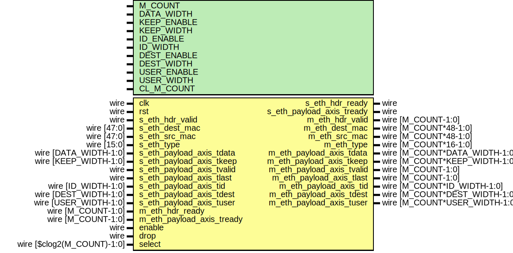

# Entity: eth_demux

- **File**: eth_demux.v
## Diagram

## Description

Language: Verilog 2001
 
## Generics

| Generic name | Type | Value           | Description |
| ------------ | ---- | --------------- | ----------- |
| M_COUNT      |      | 4               |             |
| DATA_WIDTH   |      | 8               |             |
| KEEP_ENABLE  |      | undefined       |             |
| KEEP_WIDTH   |      | undefined       |             |
| ID_ENABLE    |      | 0               |             |
| ID_WIDTH     |      | 8               |             |
| DEST_ENABLE  |      | 0               |             |
| DEST_WIDTH   |      | 8               |             |
| USER_ENABLE  |      | 1               |             |
| USER_WIDTH   |      | 1               |             |
| CL_M_COUNT   |      | $clog2(M_COUNT) |             |
## Ports

| Port name                 | Direction | Type                          | Description |
| ------------------------- | --------- | ----------------------------- | ----------- |
| clk                       | input     | wire                          |             |
| rst                       | input     | wire                          |             |
| s_eth_hdr_valid           | input     | wire                          |             |
| s_eth_hdr_ready           | output    | wire                          |             |
| s_eth_dest_mac            | input     | wire [47:0]                   |             |
| s_eth_src_mac             | input     | wire [47:0]                   |             |
| s_eth_type                | input     | wire [15:0]                   |             |
| s_eth_payload_axis_tdata  | input     | wire [DATA_WIDTH-1:0]         |             |
| s_eth_payload_axis_tkeep  | input     | wire [KEEP_WIDTH-1:0]         |             |
| s_eth_payload_axis_tvalid | input     | wire                          |             |
| s_eth_payload_axis_tready | output    | wire                          |             |
| s_eth_payload_axis_tlast  | input     | wire                          |             |
| s_eth_payload_axis_tid    | input     | wire [ID_WIDTH-1:0]           |             |
| s_eth_payload_axis_tdest  | input     | wire [DEST_WIDTH-1:0]         |             |
| s_eth_payload_axis_tuser  | input     | wire [USER_WIDTH-1:0]         |             |
| m_eth_hdr_valid           | output    | wire [M_COUNT-1:0]            |             |
| m_eth_hdr_ready           | input     | wire [M_COUNT-1:0]            |             |
| m_eth_dest_mac            | output    | wire [M_COUNT*48-1:0]         |             |
| m_eth_src_mac             | output    | wire [M_COUNT*48-1:0]         |             |
| m_eth_type                | output    | wire [M_COUNT*16-1:0]         |             |
| m_eth_payload_axis_tdata  | output    | wire [M_COUNT*DATA_WIDTH-1:0] |             |
| m_eth_payload_axis_tkeep  | output    | wire [M_COUNT*KEEP_WIDTH-1:0] |             |
| m_eth_payload_axis_tvalid | output    | wire [M_COUNT-1:0]            |             |
| m_eth_payload_axis_tready | input     | wire [M_COUNT-1:0]            |             |
| m_eth_payload_axis_tlast  | output    | wire [M_COUNT-1:0]            |             |
| m_eth_payload_axis_tid    | output    | wire [M_COUNT*ID_WIDTH-1:0]   |             |
| m_eth_payload_axis_tdest  | output    | wire [M_COUNT*DEST_WIDTH-1:0] |             |
| m_eth_payload_axis_tuser  | output    | wire [M_COUNT*USER_WIDTH-1:0] |             |
| enable                    | input     | wire                          |             |
| drop                      | input     | wire                          |             |
| select                    | input     | wire [$clog2(M_COUNT)-1:0]    |             |
## Signals

| Name                                  | Type                  | Description            |
| ------------------------------------- | --------------------- | ---------------------- |
| select_reg                            | reg [CL_M_COUNT-1:0]  |                        |
| select_ctl                            | reg [CL_M_COUNT-1:0]  |                        |
| select_next                           | reg [CL_M_COUNT-1:0]  |                        |
| drop_reg                              | reg                   |                        |
| drop_ctl                              | reg                   |                        |
| drop_next                             | reg                   |                        |
| frame_reg                             | reg                   |                        |
| frame_ctl                             | reg                   |                        |
| frame_next                            | reg                   |                        |
| s_eth_hdr_ready_reg                   | reg                   |                        |
| s_eth_hdr_ready_next                  | reg                   |                        |
| s_eth_payload_axis_tready_reg         | reg                   |                        |
| s_eth_payload_axis_tready_next        | reg                   |                        |
| m_eth_hdr_valid_reg                   | reg [M_COUNT-1:0]     |                        |
| m_eth_hdr_valid_next                  | reg [M_COUNT-1:0]     |                        |
| m_eth_dest_mac_reg                    | reg [47:0]            |                        |
| m_eth_dest_mac_next                   | reg [47:0]            |                        |
| m_eth_src_mac_reg                     | reg [47:0]            |                        |
| m_eth_src_mac_next                    | reg [47:0]            |                        |
| m_eth_type_reg                        | reg [15:0]            |                        |
| m_eth_type_next                       | reg [15:0]            |                        |
| m_eth_payload_axis_tdata_int          | reg  [DATA_WIDTH-1:0] | internal datapath      |
| m_eth_payload_axis_tkeep_int          | reg  [KEEP_WIDTH-1:0] |                        |
| m_eth_payload_axis_tvalid_int         | reg  [M_COUNT-1:0]    |                        |
| m_eth_payload_axis_tready_int_reg     | reg                   |                        |
| m_eth_payload_axis_tlast_int          | reg                   |                        |
| m_eth_payload_axis_tid_int            | reg  [ID_WIDTH-1:0]   |                        |
| m_eth_payload_axis_tdest_int          | reg  [DEST_WIDTH-1:0] |                        |
| m_eth_payload_axis_tuser_int          | reg  [USER_WIDTH-1:0] |                        |
| m_eth_payload_axis_tready_int_early   | wire                  |                        |
| i                                     | integer               |                        |
| m_eth_payload_axis_tdata_reg          | reg [DATA_WIDTH-1:0]  | output datapath logic  |
| m_eth_payload_axis_tkeep_reg          | reg [KEEP_WIDTH-1:0]  |                        |
| m_eth_payload_axis_tvalid_reg         | reg [M_COUNT-1:0]     |                        |
| m_eth_payload_axis_tvalid_next        | reg [M_COUNT-1:0]     |                        |
| m_eth_payload_axis_tlast_reg          | reg                   |                        |
| m_eth_payload_axis_tid_reg            | reg [ID_WIDTH-1:0]    |                        |
| m_eth_payload_axis_tdest_reg          | reg [DEST_WIDTH-1:0]  |                        |
| m_eth_payload_axis_tuser_reg          | reg [USER_WIDTH-1:0]  |                        |
| temp_m_eth_payload_axis_tdata_reg     | reg [DATA_WIDTH-1:0]  |                        |
| temp_m_eth_payload_axis_tkeep_reg     | reg [KEEP_WIDTH-1:0]  |                        |
| temp_m_eth_payload_axis_tvalid_reg    | reg [M_COUNT-1:0]     |                        |
| temp_m_eth_payload_axis_tvalid_next   | reg [M_COUNT-1:0]     |                        |
| temp_m_eth_payload_axis_tlast_reg     | reg                   |                        |
| temp_m_eth_payload_axis_tid_reg       | reg [ID_WIDTH-1:0]    |                        |
| temp_m_eth_payload_axis_tdest_reg     | reg [DEST_WIDTH-1:0]  |                        |
| temp_m_eth_payload_axis_tuser_reg     | reg [USER_WIDTH-1:0]  |                        |
| store_axis_int_to_output              | reg                   | datapath control       |
| store_axis_int_to_temp                | reg                   |                        |
| store_eth_payload_axis_temp_to_output | reg                   |                        |
## Processes
- unnamed: ( @* )
- unnamed: ( @(posedge clk) )
- unnamed: ( @* )
- unnamed: ( @(posedge clk) )
