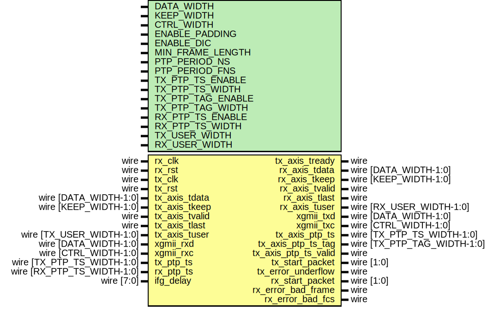

# Entity: eth_mac_10g

## Diagram

## Description

Language: Verilog 2001
 
## Generics

| Generic name      | Type | Value            | Description |
| ----------------- | ---- | ---------------- | ----------- |
| DATA_WIDTH        |      | 64               |             |
| KEEP_WIDTH        |      | undefined        |             |
| CTRL_WIDTH        |      | undefined        |             |
| ENABLE_PADDING    |      | 1                |             |
| ENABLE_DIC        |      | 1                |             |
| MIN_FRAME_LENGTH  |      | 64               |             |
| PTP_PERIOD_NS     |      | 4'h6             |             |
| PTP_PERIOD_FNS    |      | 16'h6666         |             |
| TX_PTP_TS_ENABLE  |      | 0                |             |
| TX_PTP_TS_WIDTH   |      | 96               |             |
| TX_PTP_TAG_ENABLE |      | TX_PTP_TS_ENABLE |             |
| TX_PTP_TAG_WIDTH  |      | 16               |             |
| RX_PTP_TS_ENABLE  |      | 0                |             |
| RX_PTP_TS_WIDTH   |      | 96               |             |
| TX_USER_WIDTH     |      | + 1              |             |
| RX_USER_WIDTH     |      | + 1              |             |
## Ports

| Port name            | Direction | Type                        | Description |
| -------------------- | --------- | --------------------------- | ----------- |
| rx_clk               | input     | wire                        |             |
| rx_rst               | input     | wire                        |             |
| tx_clk               | input     | wire                        |             |
| tx_rst               | input     | wire                        |             |
| tx_axis_tdata        | input     | wire [DATA_WIDTH-1:0]       |             |
| tx_axis_tkeep        | input     | wire [KEEP_WIDTH-1:0]       |             |
| tx_axis_tvalid       | input     | wire                        |             |
| tx_axis_tready       | output    | wire                        |             |
| tx_axis_tlast        | input     | wire                        |             |
| tx_axis_tuser        | input     | wire [TX_USER_WIDTH-1:0]    |             |
| rx_axis_tdata        | output    | wire [DATA_WIDTH-1:0]       |             |
| rx_axis_tkeep        | output    | wire [KEEP_WIDTH-1:0]       |             |
| rx_axis_tvalid       | output    | wire                        |             |
| rx_axis_tlast        | output    | wire                        |             |
| rx_axis_tuser        | output    | wire [RX_USER_WIDTH-1:0]    |             |
| xgmii_rxd            | input     | wire [DATA_WIDTH-1:0]       |             |
| xgmii_rxc            | input     | wire [CTRL_WIDTH-1:0]       |             |
| xgmii_txd            | output    | wire [DATA_WIDTH-1:0]       |             |
| xgmii_txc            | output    | wire [CTRL_WIDTH-1:0]       |             |
| tx_ptp_ts            | input     | wire [TX_PTP_TS_WIDTH-1:0]  |             |
| rx_ptp_ts            | input     | wire [RX_PTP_TS_WIDTH-1:0]  |             |
| tx_axis_ptp_ts       | output    | wire [TX_PTP_TS_WIDTH-1:0]  |             |
| tx_axis_ptp_ts_tag   | output    | wire [TX_PTP_TAG_WIDTH-1:0] |             |
| tx_axis_ptp_ts_valid | output    | wire                        |             |
| tx_start_packet      | output    | wire [1:0]                  |             |
| tx_error_underflow   | output    | wire                        |             |
| rx_start_packet      | output    | wire [1:0]                  |             |
| rx_error_bad_frame   | output    | wire                        |             |
| rx_error_bad_fcs     | output    | wire                        |             |
| ifg_delay            | input     | wire [7:0]                  |             |
