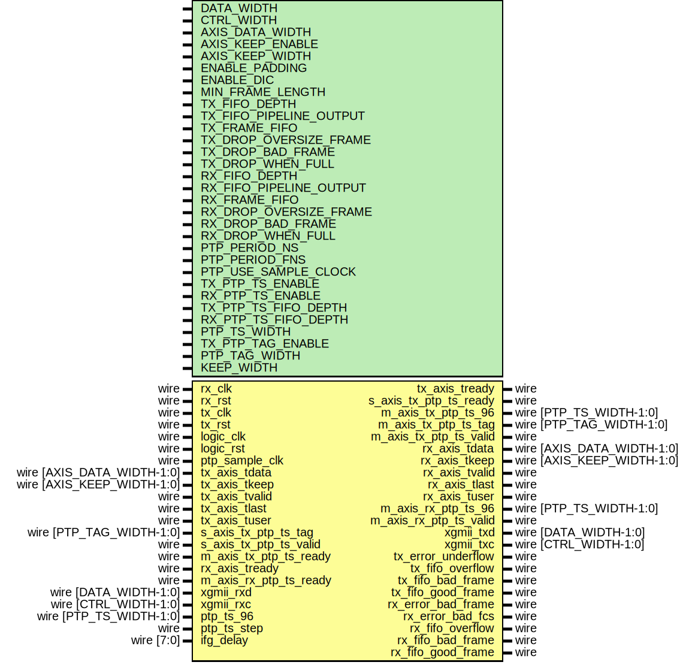

# Entity: eth_mac_10g_fifo

- **File**: eth_mac_10g_fifo.v
## Diagram

## Description

Language: Verilog 2001
 
## Generics

| Generic name            | Type | Value         | Description |
| ----------------------- | ---- | ------------- | ----------- |
| DATA_WIDTH              |      | 64            |             |
| CTRL_WIDTH              |      | undefined     |             |
| AXIS_DATA_WIDTH         |      | DATA_WIDTH    |             |
| AXIS_KEEP_ENABLE        |      | undefined     |             |
| AXIS_KEEP_WIDTH         |      | undefined     |             |
| ENABLE_PADDING          |      | 1             |             |
| ENABLE_DIC              |      | 1             |             |
| MIN_FRAME_LENGTH        |      | 64            |             |
| TX_FIFO_DEPTH           |      | 4096          |             |
| TX_FIFO_PIPELINE_OUTPUT |      | 2             |             |
| TX_FRAME_FIFO           |      | 1             |             |
| TX_DROP_BAD_FRAME       |      | TX_FRAME_FIFO |             |
| TX_DROP_WHEN_FULL       |      | 0             |             |
| RX_FIFO_DEPTH           |      | 4096          |             |
| RX_FIFO_PIPELINE_OUTPUT |      | 2             |             |
| RX_FRAME_FIFO           |      | 1             |             |
| RX_DROP_BAD_FRAME       |      | RX_FRAME_FIFO |             |
| RX_DROP_WHEN_FULL       |      | RX_FRAME_FIFO |             |
| PTP_PERIOD_NS           |      | 4'h6          |             |
| PTP_PERIOD_FNS          |      | 16'h6666      |             |
| PTP_USE_SAMPLE_CLOCK    |      | 0             |             |
| TX_PTP_TS_ENABLE        |      | 0             |             |
| RX_PTP_TS_ENABLE        |      | 0             |             |
| TX_PTP_TS_FIFO_DEPTH    |      | 64            |             |
| RX_PTP_TS_FIFO_DEPTH    |      | 64            |             |
| PTP_TS_WIDTH            |      | 96            |             |
| TX_PTP_TAG_ENABLE       |      | 0             |             |
| PTP_TAG_WIDTH           |      | 16            |             |
| KEEP_WIDTH              |      | DATA_WIDTH/8  |             |
## Ports

| Port name              | Direction | Type                       | Description |
| ---------------------- | --------- | -------------------------- | ----------- |
| rx_clk                 | input     | wire                       |             |
| rx_rst                 | input     | wire                       |             |
| tx_clk                 | input     | wire                       |             |
| tx_rst                 | input     | wire                       |             |
| logic_clk              | input     | wire                       |             |
| logic_rst              | input     | wire                       |             |
| ptp_sample_clk         | input     | wire                       |             |
| tx_axis_tdata          | input     | wire [AXIS_DATA_WIDTH-1:0] |             |
| tx_axis_tkeep          | input     | wire [AXIS_KEEP_WIDTH-1:0] |             |
| tx_axis_tvalid         | input     | wire                       |             |
| tx_axis_tready         | output    | wire                       |             |
| tx_axis_tlast          | input     | wire                       |             |
| tx_axis_tuser          | input     | wire                       |             |
| s_axis_tx_ptp_ts_tag   | input     | wire [PTP_TAG_WIDTH-1:0]   |             |
| s_axis_tx_ptp_ts_valid | input     | wire                       |             |
| s_axis_tx_ptp_ts_ready | output    | wire                       |             |
| m_axis_tx_ptp_ts_96    | output    | wire [PTP_TS_WIDTH-1:0]    |             |
| m_axis_tx_ptp_ts_tag   | output    | wire [PTP_TAG_WIDTH-1:0]   |             |
| m_axis_tx_ptp_ts_valid | output    | wire                       |             |
| m_axis_tx_ptp_ts_ready | input     | wire                       |             |
| rx_axis_tdata          | output    | wire [AXIS_DATA_WIDTH-1:0] |             |
| rx_axis_tkeep          | output    | wire [AXIS_KEEP_WIDTH-1:0] |             |
| rx_axis_tvalid         | output    | wire                       |             |
| rx_axis_tready         | input     | wire                       |             |
| rx_axis_tlast          | output    | wire                       |             |
| rx_axis_tuser          | output    | wire                       |             |
| m_axis_rx_ptp_ts_96    | output    | wire [PTP_TS_WIDTH-1:0]    |             |
| m_axis_rx_ptp_ts_valid | output    | wire                       |             |
| m_axis_rx_ptp_ts_ready | input     | wire                       |             |
| xgmii_rxd              | input     | wire [DATA_WIDTH-1:0]      |             |
| xgmii_rxc              | input     | wire [CTRL_WIDTH-1:0]      |             |
| xgmii_txd              | output    | wire [DATA_WIDTH-1:0]      |             |
| xgmii_txc              | output    | wire [CTRL_WIDTH-1:0]      |             |
| tx_error_underflow     | output    | wire                       |             |
| tx_fifo_overflow       | output    | wire                       |             |
| tx_fifo_bad_frame      | output    | wire                       |             |
| tx_fifo_good_frame     | output    | wire                       |             |
| rx_error_bad_frame     | output    | wire                       |             |
| rx_error_bad_fcs       | output    | wire                       |             |
| rx_fifo_overflow       | output    | wire                       |             |
| rx_fifo_bad_frame      | output    | wire                       |             |
| rx_fifo_good_frame     | output    | wire                       |             |
| ptp_ts_96              | input     | wire [PTP_TS_WIDTH-1:0]    |             |
| ptp_ts_step            | input     | wire                       |             |
| ifg_delay              | input     | wire [7:0]                 |             |
## Signals

| Name                   | Type                       | Description                                             |
| ---------------------- | -------------------------- | ------------------------------------------------------- |
| tx_fifo_axis_tdata     | wire [DATA_WIDTH-1:0]      |                                                         |
| tx_fifo_axis_tkeep     | wire [KEEP_WIDTH-1:0]      |                                                         |
| tx_fifo_axis_tvalid    | wire                       |                                                         |
| tx_fifo_axis_tready    | wire                       |                                                         |
| tx_fifo_axis_tlast     | wire                       |                                                         |
| tx_fifo_axis_tuser     | wire [TX_USER_WIDTH-1:0]   |                                                         |
| tx_axis_tdata_int      | wire [AXIS_DATA_WIDTH-1:0] |                                                         |
| tx_axis_tkeep_int      | wire [AXIS_KEEP_WIDTH-1:0] |                                                         |
| tx_axis_tvalid_int     | wire                       |                                                         |
| tx_axis_tready_int     | wire                       |                                                         |
| tx_axis_tlast_int      | wire                       |                                                         |
| tx_axis_tuser_int      | wire [TX_USER_WIDTH-1:0]   |                                                         |
| rx_fifo_axis_tdata     | wire [DATA_WIDTH-1:0]      |                                                         |
| rx_fifo_axis_tkeep     | wire [KEEP_WIDTH-1:0]      |                                                         |
| rx_fifo_axis_tvalid    | wire                       |                                                         |
| rx_fifo_axis_tlast     | wire                       |                                                         |
| rx_fifo_axis_tuser     | wire [RX_USER_WIDTH-1:0]   |                                                         |
| rx_axis_tuser_int      | wire [RX_USER_WIDTH-1:0]   |                                                         |
| tx_ptp_ts_96           | wire [PTP_TS_WIDTH-1:0]    |                                                         |
| rx_ptp_ts_96           | wire [PTP_TS_WIDTH-1:0]    |                                                         |
| tx_axis_ptp_ts_96      | wire [PTP_TS_WIDTH-1:0]    |                                                         |
| tx_axis_ptp_ts_tag     | wire [PTP_TAG_WIDTH-1:0]   |                                                         |
| tx_axis_ptp_ts_valid   | wire                       |                                                         |
| rx_axis_ptp_ts_96      | wire [PTP_TS_WIDTH-1:0]    |                                                         |
| rx_axis_ptp_ts_valid   | wire                       |                                                         |
| tx_error_underflow_int | wire                       | synchronize MAC status signals into logic clock domain  |
| tx_sync_reg_1          | reg [0:0]                  |                                                         |
| tx_sync_reg_2          | reg [0:0]                  |                                                         |
| tx_sync_reg_3          | reg [0:0]                  |                                                         |
| tx_sync_reg_4          | reg [0:0]                  |                                                         |
| rx_error_bad_frame_int | wire                       |                                                         |
| rx_error_bad_fcs_int   | wire                       |                                                         |
| rx_sync_reg_1          | reg [1:0]                  |                                                         |
| rx_sync_reg_2          | reg [1:0]                  |                                                         |
| rx_sync_reg_3          | reg [1:0]                  |                                                         |
| rx_sync_reg_4          | reg [1:0]                  |                                                         |
## Constants

| Name          | Type | Value | Description |
| ------------- | ---- | ----- | ----------- |
| TX_USER_WIDTH |      | + 1   |             |
| RX_USER_WIDTH |      | + 1   |             |
## Processes
- unnamed: ( @(posedge tx_clk or posedge tx_rst) )
- unnamed: ( @(posedge logic_clk or posedge logic_rst) )
- unnamed: ( @(posedge rx_clk or posedge rx_rst) )
- unnamed: ( @(posedge logic_clk or posedge logic_rst) )
## Instantiations

- eth_mac_10g_inst: eth_mac_10g
- tx_fifo: axis_async_fifo_adapter
- rx_fifo: axis_async_fifo_adapter
