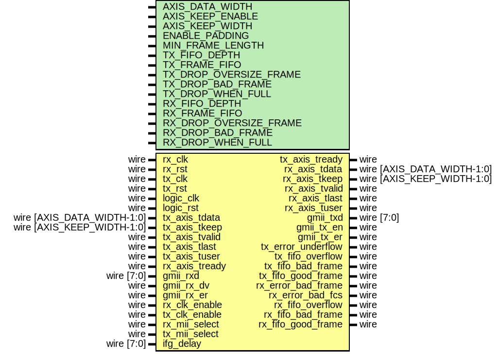

# Entity: eth_mac_1g_fifo

- **File**: eth_mac_1g_fifo.v
## Diagram

## Description

Language: Verilog 2001
 
## Generics

| Generic name      | Type | Value         | Description |
| ----------------- | ---- | ------------- | ----------- |
| AXIS_DATA_WIDTH   |      | 8             |             |
| AXIS_KEEP_ENABLE  |      | undefined     |             |
| AXIS_KEEP_WIDTH   |      | undefined     |             |
| ENABLE_PADDING    |      | 1             |             |
| MIN_FRAME_LENGTH  |      | 64            |             |
| TX_FIFO_DEPTH     |      | 4096          |             |
| TX_FRAME_FIFO     |      | 1             |             |
| TX_DROP_BAD_FRAME |      | TX_FRAME_FIFO |             |
| TX_DROP_WHEN_FULL |      | 0             |             |
| RX_FIFO_DEPTH     |      | 4096          |             |
| RX_FRAME_FIFO     |      | 1             |             |
| RX_DROP_BAD_FRAME |      | RX_FRAME_FIFO |             |
| RX_DROP_WHEN_FULL |      | RX_FRAME_FIFO |             |
## Ports

| Port name          | Direction | Type                       | Description |
| ------------------ | --------- | -------------------------- | ----------- |
| rx_clk             | input     | wire                       |             |
| rx_rst             | input     | wire                       |             |
| tx_clk             | input     | wire                       |             |
| tx_rst             | input     | wire                       |             |
| logic_clk          | input     | wire                       |             |
| logic_rst          | input     | wire                       |             |
| tx_axis_tdata      | input     | wire [AXIS_DATA_WIDTH-1:0] |             |
| tx_axis_tkeep      | input     | wire [AXIS_KEEP_WIDTH-1:0] |             |
| tx_axis_tvalid     | input     | wire                       |             |
| tx_axis_tready     | output    | wire                       |             |
| tx_axis_tlast      | input     | wire                       |             |
| tx_axis_tuser      | input     | wire                       |             |
| rx_axis_tdata      | output    | wire [AXIS_DATA_WIDTH-1:0] |             |
| rx_axis_tkeep      | output    | wire [AXIS_KEEP_WIDTH-1:0] |             |
| rx_axis_tvalid     | output    | wire                       |             |
| rx_axis_tready     | input     | wire                       |             |
| rx_axis_tlast      | output    | wire                       |             |
| rx_axis_tuser      | output    | wire                       |             |
| gmii_rxd           | input     | wire [7:0]                 |             |
| gmii_rx_dv         | input     | wire                       |             |
| gmii_rx_er         | input     | wire                       |             |
| gmii_txd           | output    | wire [7:0]                 |             |
| gmii_tx_en         | output    | wire                       |             |
| gmii_tx_er         | output    | wire                       |             |
| rx_clk_enable      | input     | wire                       |             |
| tx_clk_enable      | input     | wire                       |             |
| rx_mii_select      | input     | wire                       |             |
| tx_mii_select      | input     | wire                       |             |
| tx_error_underflow | output    | wire                       |             |
| tx_fifo_overflow   | output    | wire                       |             |
| tx_fifo_bad_frame  | output    | wire                       |             |
| tx_fifo_good_frame | output    | wire                       |             |
| rx_error_bad_frame | output    | wire                       |             |
| rx_error_bad_fcs   | output    | wire                       |             |
| rx_fifo_overflow   | output    | wire                       |             |
| rx_fifo_bad_frame  | output    | wire                       |             |
| rx_fifo_good_frame | output    | wire                       |             |
| ifg_delay          | input     | wire [7:0]                 |             |
## Signals

| Name                   | Type       | Description                                             |
| ---------------------- | ---------- | ------------------------------------------------------- |
| tx_fifo_axis_tdata     | wire [7:0] |                                                         |
| tx_fifo_axis_tvalid    | wire       |                                                         |
| tx_fifo_axis_tready    | wire       |                                                         |
| tx_fifo_axis_tlast     | wire       |                                                         |
| tx_fifo_axis_tuser     | wire       |                                                         |
| rx_fifo_axis_tdata     | wire [7:0] |                                                         |
| rx_fifo_axis_tvalid    | wire       |                                                         |
| rx_fifo_axis_tlast     | wire       |                                                         |
| rx_fifo_axis_tuser     | wire       |                                                         |
| tx_error_underflow_int | wire       | synchronize MAC status signals into logic clock domain  |
| tx_sync_reg_1          | reg [0:0]  |                                                         |
| tx_sync_reg_2          | reg [0:0]  |                                                         |
| tx_sync_reg_3          | reg [0:0]  |                                                         |
| tx_sync_reg_4          | reg [0:0]  |                                                         |
| rx_error_bad_frame_int | wire       |                                                         |
| rx_error_bad_fcs_int   | wire       |                                                         |
| rx_sync_reg_1          | reg [1:0]  |                                                         |
| rx_sync_reg_2          | reg [1:0]  |                                                         |
| rx_sync_reg_3          | reg [1:0]  |                                                         |
| rx_sync_reg_4          | reg [1:0]  |                                                         |
## Processes
- unnamed: ( @(posedge tx_clk or posedge tx_rst) )
- unnamed: ( @(posedge logic_clk or posedge logic_rst) )
- unnamed: ( @(posedge rx_clk or posedge rx_rst) )
- unnamed: ( @(posedge logic_clk or posedge logic_rst) )
## Instantiations

- eth_mac_1g_inst: eth_mac_1g
- tx_fifo: axis_async_fifo_adapter
- rx_fifo: axis_async_fifo_adapter
