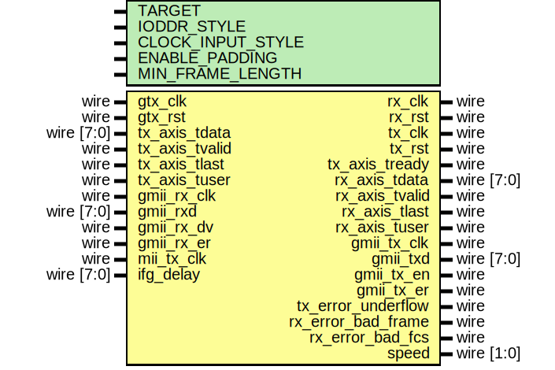

# Entity: eth_mac_1g_gmii

- **File**: eth_mac_1g_gmii.v
## Diagram

## Description

Language: Verilog 2001
 
## Generics

| Generic name      | Type | Value     | Description                                                                                                                                       |
| ----------------- | ---- | --------- | ------------------------------------------------------------------------------------------------------------------------------------------------- |
| TARGET            |      | "GENERIC" | target ("SIM", "GENERIC", "XILINX", "ALTERA")                                                                                                     |
| IODDR_STYLE       |      | "IODDR2"  | IODDR style ("IODDR", "IODDR2") Use IODDR for Virtex-4, Virtex-5, Virtex-6, 7 Series, Ultrascale Use IODDR2 for Spartan-6                         |
| CLOCK_INPUT_STYLE |      | "BUFIO2"  | Clock input style ("BUFG", "BUFR", "BUFIO", "BUFIO2") Use BUFR for Virtex-5, Virtex-6, 7-series Use BUFG for Ultrascale Use BUFIO2 for Spartan-6  |
| ENABLE_PADDING    |      | 1         |                                                                                                                                                   |
| MIN_FRAME_LENGTH  |      | 64        |                                                                                                                                                   |
## Ports

| Port name          | Direction | Type       | Description |
| ------------------ | --------- | ---------- | ----------- |
| gtx_clk            | input     | wire       |             |
| gtx_rst            | input     | wire       |             |
| rx_clk             | output    | wire       |             |
| rx_rst             | output    | wire       |             |
| tx_clk             | output    | wire       |             |
| tx_rst             | output    | wire       |             |
| tx_axis_tdata      | input     | wire [7:0] |             |
| tx_axis_tvalid     | input     | wire       |             |
| tx_axis_tready     | output    | wire       |             |
| tx_axis_tlast      | input     | wire       |             |
| tx_axis_tuser      | input     | wire       |             |
| rx_axis_tdata      | output    | wire [7:0] |             |
| rx_axis_tvalid     | output    | wire       |             |
| rx_axis_tlast      | output    | wire       |             |
| rx_axis_tuser      | output    | wire       |             |
| gmii_rx_clk        | input     | wire       |             |
| gmii_rxd           | input     | wire [7:0] |             |
| gmii_rx_dv         | input     | wire       |             |
| gmii_rx_er         | input     | wire       |             |
| mii_tx_clk         | input     | wire       |             |
| gmii_tx_clk        | output    | wire       |             |
| gmii_txd           | output    | wire [7:0] |             |
| gmii_tx_en         | output    | wire       |             |
| gmii_tx_er         | output    | wire       |             |
| tx_error_underflow | output    | wire       |             |
| rx_error_bad_frame | output    | wire       |             |
| rx_error_bad_fcs   | output    | wire       |             |
| speed              | output    | wire [1:0] |             |
| ifg_delay          | input     | wire [7:0] |             |
## Signals

| Name               | Type       | Description          |
| ------------------ | ---------- | -------------------- |
| mac_gmii_rxd       | wire [7:0] |                      |
| mac_gmii_rx_dv     | wire       |                      |
| mac_gmii_rx_er     | wire       |                      |
| mac_gmii_txd       | wire [7:0] |                      |
| mac_gmii_tx_en     | wire       |                      |
| mac_gmii_tx_er     | wire       |                      |
| speed_reg          | reg [1:0]  |                      |
| mii_select_reg     | reg        |                      |
| tx_mii_select_sync | reg [1:0]  |                      |
| rx_mii_select_sync | reg [1:0]  |                      |
| rx_prescale        | reg [2:0]  | PHY speed detection  |
| rx_prescale_sync   | reg [2:0]  |                      |
| rx_speed_count_1   | reg [6:0]  |                      |
| rx_speed_count_2   | reg [1:0]  |                      |
## Processes
- unnamed: ( @(posedge tx_clk) )
- unnamed: ( @(posedge rx_clk) )
- unnamed: ( @(posedge rx_clk) )
- unnamed: ( @(posedge gtx_clk) )
- unnamed: ( @(posedge gtx_clk) )
## Instantiations

- gmii_phy_if_inst: gmii_phy_if
- eth_mac_1g_inst: eth_mac_1g
