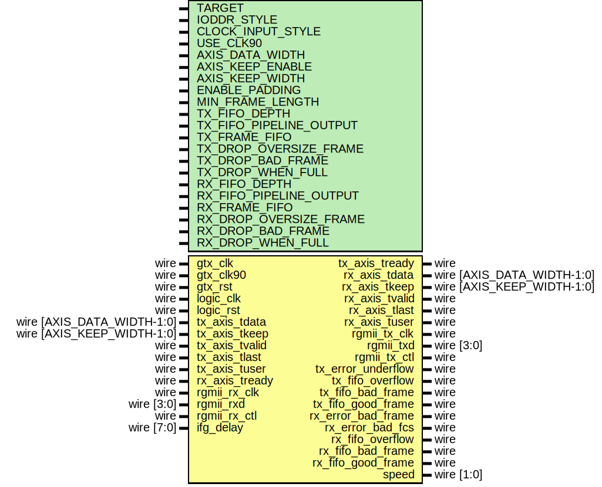

# Entity: eth_mac_1g_rgmii_fifo

- **File**: eth_mac_1g_rgmii_fifo.v
## Diagram

## Description

 Language: Verilog 2001

## Generics

| Generic name            | Type | Value                  | Description                                                                                                                            |
| ----------------------- | ---- | ---------------------- | -------------------------------------------------------------------------------------------------------------------------------------- |
| TARGET                  |      | "GENERIC"              |  target ("SIM", "GENERIC", "XILINX", "ALTERA")                                                                                         |
| IODDR_STYLE             |      | "IODDR2"               |  IODDR style ("IODDR", "IODDR2")  Use IODDR for Virtex-4, Virtex-5, Virtex-6, 7 Series, Ultrascale  Use IODDR2 for Spartan-6           |
| CLOCK_INPUT_STYLE       |      | "BUFG"                 |  Clock input style ("BUFG", "BUFR", "BUFIO", "BUFIO2")  Use BUFR for Virtex-6, 7-series  Use BUFG for Virtex-5, Spartan-6, Ultrascale  |
| USE_CLK90               |      | "TRUE"                 |  Use 90 degree clock for RGMII transmit ("TRUE", "FALSE")                                                                              |
| AXIS_DATA_WIDTH         |      | 8                      |                                                                                                                                        |
| AXIS_KEEP_ENABLE        |      | undefined              |                                                                                                                                        |
| AXIS_KEEP_WIDTH         |      | undefined              |                                                                                                                                        |
| ENABLE_PADDING          |      | 1                      |                                                                                                                                        |
| MIN_FRAME_LENGTH        |      | 64                     |                                                                                                                                        |
| TX_FIFO_DEPTH           |      | 4096                   |                                                                                                                                        |
| TX_FIFO_PIPELINE_OUTPUT |      | 2                      |                                                                                                                                        |
| TX_FRAME_FIFO           |      | 1                      |                                                                                                                                        |
| TX_DROP_OVERSIZE_FRAME  |      | TX_FRAME_FIFO          |                                                                                                                                        |
| TX_DROP_BAD_FRAME       |      | TX_DROP_OVERSIZE_FRAME |                                                                                                                                        |
| TX_DROP_WHEN_FULL       |      | 0                      |                                                                                                                                        |
| RX_FIFO_DEPTH           |      | 4096                   |                                                                                                                                        |
| RX_FIFO_PIPELINE_OUTPUT |      | 2                      |                                                                                                                                        |
| RX_FRAME_FIFO           |      | 1                      |                                                                                                                                        |
| RX_DROP_OVERSIZE_FRAME  |      | RX_FRAME_FIFO          |                                                                                                                                        |
| RX_DROP_BAD_FRAME       |      | RX_DROP_OVERSIZE_FRAME |                                                                                                                                        |
| RX_DROP_WHEN_FULL       |      | RX_DROP_OVERSIZE_FRAME |                                                                                                                                        |
## Ports

| Port name          | Direction | Type                       | Description                     |
| ------------------ | --------- | -------------------------- | ------------------------------- |
| gtx_clk            | input     | wire                       |                                 |
| gtx_clk90          | input     | wire                       |                                 |
| gtx_rst            | input     | wire                       |                                 |
| logic_clk          | input     | wire                       |                                 |
| logic_rst          | input     | wire                       |                                 |
| tx_axis_tdata      | input     | wire [AXIS_DATA_WIDTH-1:0] |      * AXI input      */        |
| tx_axis_tkeep      | input     | wire [AXIS_KEEP_WIDTH-1:0] |                                 |
| tx_axis_tvalid     | input     | wire                       |                                 |
| tx_axis_tready     | output    | wire                       |                                 |
| tx_axis_tlast      | input     | wire                       |                                 |
| tx_axis_tuser      | input     | wire                       |                                 |
| rx_axis_tdata      | output    | wire [AXIS_DATA_WIDTH-1:0] |      * AXI output      */       |
| rx_axis_tkeep      | output    | wire [AXIS_KEEP_WIDTH-1:0] |                                 |
| rx_axis_tvalid     | output    | wire                       |                                 |
| rx_axis_tready     | input     | wire                       |                                 |
| rx_axis_tlast      | output    | wire                       |                                 |
| rx_axis_tuser      | output    | wire                       |                                 |
| rgmii_rx_clk       | input     | wire                       |      * RGMII interface      */  |
| rgmii_rxd          | input     | wire [3:0]                 |                                 |
| rgmii_rx_ctl       | input     | wire                       |                                 |
| rgmii_tx_clk       | output    | wire                       |                                 |
| rgmii_txd          | output    | wire [3:0]                 |                                 |
| rgmii_tx_ctl       | output    | wire                       |                                 |
| tx_error_underflow | output    | wire                       |      * Status      */           |
| tx_fifo_overflow   | output    | wire                       |                                 |
| tx_fifo_bad_frame  | output    | wire                       |                                 |
| tx_fifo_good_frame | output    | wire                       |                                 |
| rx_error_bad_frame | output    | wire                       |                                 |
| rx_error_bad_fcs   | output    | wire                       |                                 |
| rx_fifo_overflow   | output    | wire                       |                                 |
| rx_fifo_bad_frame  | output    | wire                       |                                 |
| rx_fifo_good_frame | output    | wire                       |                                 |
| speed              | output    | wire [1:0]                 |                                 |
| ifg_delay          | input     | wire [7:0]                 |      * Configuration      */    |
## Signals

| Name                   | Type       | Description                                              |
| ---------------------- | ---------- | -------------------------------------------------------- |
| tx_clk                 | wire       |                                                          |
| rx_clk                 | wire       |                                                          |
| tx_rst                 | wire       |                                                          |
| rx_rst                 | wire       |                                                          |
| tx_fifo_axis_tdata     | wire [7:0] |                                                          |
| tx_fifo_axis_tvalid    | wire       |                                                          |
| tx_fifo_axis_tready    | wire       |                                                          |
| tx_fifo_axis_tlast     | wire       |                                                          |
| tx_fifo_axis_tuser     | wire       |                                                          |
| rx_fifo_axis_tdata     | wire [7:0] |                                                          |
| rx_fifo_axis_tvalid    | wire       |                                                          |
| rx_fifo_axis_tlast     | wire       |                                                          |
| rx_fifo_axis_tuser     | wire       |                                                          |
| tx_error_underflow_int | wire       |  synchronize MAC status signals into logic clock domain  |
| tx_sync_reg_1          | reg [0:0]  |                                                          |
| tx_sync_reg_2          | reg [0:0]  |                                                          |
| tx_sync_reg_3          | reg [0:0]  |                                                          |
| tx_sync_reg_4          | reg [0:0]  |                                                          |
| rx_error_bad_frame_int | wire       |                                                          |
| rx_error_bad_fcs_int   | wire       |                                                          |
| rx_sync_reg_1          | reg [1:0]  |                                                          |
| rx_sync_reg_2          | reg [1:0]  |                                                          |
| rx_sync_reg_3          | reg [1:0]  |                                                          |
| rx_sync_reg_4          | reg [1:0]  |                                                          |
| speed_int              | wire [1:0] |                                                          |
| speed_sync_reg_1       | reg [1:0]  |                                                          |
| speed_sync_reg_2       | reg [1:0]  |                                                          |
## Processes
- unnamed: ( @(posedge tx_clk or posedge tx_rst) )
  - **Type:** always
- unnamed: ( @(posedge logic_clk or posedge logic_rst) )
  - **Type:** always
- unnamed: ( @(posedge rx_clk or posedge rx_rst) )
  - **Type:** always
- unnamed: ( @(posedge logic_clk or posedge logic_rst) )
  - **Type:** always
- unnamed: ( @(posedge logic_clk) )
  - **Type:** always
## Instantiations

- eth_mac_1g_rgmii_inst: eth_mac_1g_rgmii
- tx_fifo: axis_async_fifo_adapter
- rx_fifo: axis_async_fifo_adapter
