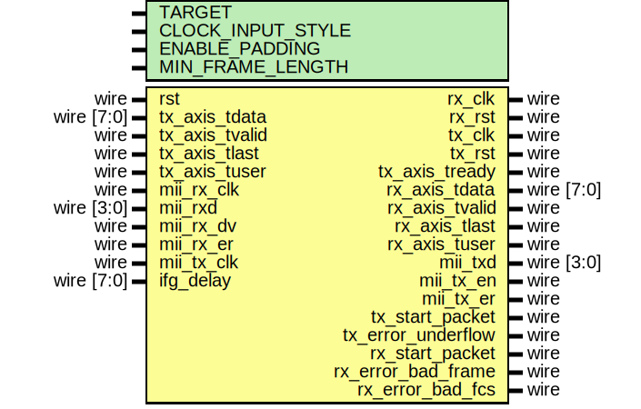

# Entity: eth_mac_mii

- **File**: eth_mac_mii.v
## Diagram

## Description

Language: Verilog 2001
 
## Generics

| Generic name      | Type | Value     | Description                                                                                                                                       |
| ----------------- | ---- | --------- | ------------------------------------------------------------------------------------------------------------------------------------------------- |
| TARGET            |      | "GENERIC" | target ("SIM", "GENERIC", "XILINX", "ALTERA")                                                                                                     |
| CLOCK_INPUT_STYLE |      | "BUFIO2"  | Clock input style ("BUFG", "BUFR", "BUFIO", "BUFIO2") Use BUFR for Virtex-5, Virtex-6, 7-series Use BUFG for Ultrascale Use BUFIO2 for Spartan-6  |
| ENABLE_PADDING    |      | 1         |                                                                                                                                                   |
| MIN_FRAME_LENGTH  |      | 64        |                                                                                                                                                   |
## Ports

| Port name          | Direction | Type       | Description |
| ------------------ | --------- | ---------- | ----------- |
| rst                | input     | wire       |             |
| rx_clk             | output    | wire       |             |
| rx_rst             | output    | wire       |             |
| tx_clk             | output    | wire       |             |
| tx_rst             | output    | wire       |             |
| tx_axis_tdata      | input     | wire [7:0] |             |
| tx_axis_tvalid     | input     | wire       |             |
| tx_axis_tready     | output    | wire       |             |
| tx_axis_tlast      | input     | wire       |             |
| tx_axis_tuser      | input     | wire       |             |
| rx_axis_tdata      | output    | wire [7:0] |             |
| rx_axis_tvalid     | output    | wire       |             |
| rx_axis_tlast      | output    | wire       |             |
| rx_axis_tuser      | output    | wire       |             |
| mii_rx_clk         | input     | wire       |             |
| mii_rxd            | input     | wire [3:0] |             |
| mii_rx_dv          | input     | wire       |             |
| mii_rx_er          | input     | wire       |             |
| mii_tx_clk         | input     | wire       |             |
| mii_txd            | output    | wire [3:0] |             |
| mii_tx_en          | output    | wire       |             |
| mii_tx_er          | output    | wire       |             |
| tx_start_packet    | output    | wire       |             |
| tx_error_underflow | output    | wire       |             |
| rx_start_packet    | output    | wire       |             |
| rx_error_bad_frame | output    | wire       |             |
| rx_error_bad_fcs   | output    | wire       |             |
| ifg_delay          | input     | wire [7:0] |             |
## Signals

| Name          | Type       | Description |
| ------------- | ---------- | ----------- |
| mac_mii_rxd   | wire [3:0] |             |
| mac_mii_rx_dv | wire       |             |
| mac_mii_rx_er | wire       |             |
| mac_mii_txd   | wire [3:0] |             |
| mac_mii_tx_en | wire       |             |
| mac_mii_tx_er | wire       |             |
## Instantiations

- mii_phy_if_inst: mii_phy_if
- eth_mac_1g_inst: eth_mac_1g
