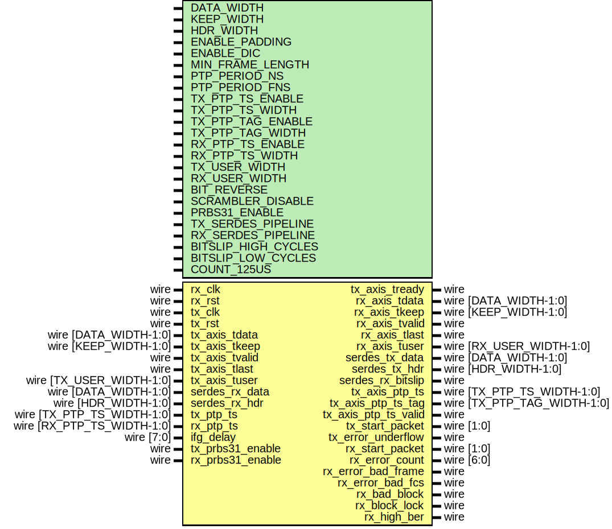

# Entity: eth_mac_phy_10g

- **File**: eth_mac_phy_10g.v
## Diagram

## Description

 Language: Verilog 2001

## Generics

| Generic name        | Type | Value            | Description |
| ------------------- | ---- | ---------------- | ----------- |
| DATA_WIDTH          |      | 64               |             |
| KEEP_WIDTH          |      | undefined        |             |
| HDR_WIDTH           |      | undefined        |             |
| ENABLE_PADDING      |      | 1                |             |
| ENABLE_DIC          |      | 1                |             |
| MIN_FRAME_LENGTH    |      | 64               |             |
| PTP_PERIOD_NS       |      | 4'h6             |             |
| PTP_PERIOD_FNS      |      | 16'h6666         |             |
| TX_PTP_TS_ENABLE    |      | 0                |             |
| TX_PTP_TS_WIDTH     |      | 96               |             |
| TX_PTP_TAG_ENABLE   |      | TX_PTP_TS_ENABLE |             |
| TX_PTP_TAG_WIDTH    |      | 16               |             |
| RX_PTP_TS_ENABLE    |      | 0                |             |
| RX_PTP_TS_WIDTH     |      | 96               |             |
| TX_USER_WIDTH       |      | + 1              |             |
| RX_USER_WIDTH       |      | + 1              |             |
| BIT_REVERSE         |      | 0                |             |
| SCRAMBLER_DISABLE   |      | 0                |             |
| PRBS31_ENABLE       |      | 0                |             |
| TX_SERDES_PIPELINE  |      | 0                |             |
| RX_SERDES_PIPELINE  |      | 0                |             |
| BITSLIP_HIGH_CYCLES |      | 1                |             |
| BITSLIP_LOW_CYCLES  |      | 8                |             |
| COUNT_125US         |      | 125000/6.4       |             |
## Ports

| Port name            | Direction | Type                        | Description                      |
| -------------------- | --------- | --------------------------- | -------------------------------- |
| rx_clk               | input     | wire                        |                                  |
| rx_rst               | input     | wire                        |                                  |
| tx_clk               | input     | wire                        |                                  |
| tx_rst               | input     | wire                        |                                  |
| tx_axis_tdata        | input     | wire [DATA_WIDTH-1:0]       |      * AXI input      */         |
| tx_axis_tkeep        | input     | wire [KEEP_WIDTH-1:0]       |                                  |
| tx_axis_tvalid       | input     | wire                        |                                  |
| tx_axis_tready       | output    | wire                        |                                  |
| tx_axis_tlast        | input     | wire                        |                                  |
| tx_axis_tuser        | input     | wire [TX_USER_WIDTH-1:0]    |                                  |
| rx_axis_tdata        | output    | wire [DATA_WIDTH-1:0]       |      * AXI output      */        |
| rx_axis_tkeep        | output    | wire [KEEP_WIDTH-1:0]       |                                  |
| rx_axis_tvalid       | output    | wire                        |                                  |
| rx_axis_tlast        | output    | wire                        |                                  |
| rx_axis_tuser        | output    | wire [RX_USER_WIDTH-1:0]    |                                  |
| serdes_tx_data       | output    | wire [DATA_WIDTH-1:0]       |      * SERDES interface      */  |
| serdes_tx_hdr        | output    | wire [HDR_WIDTH-1:0]        |                                  |
| serdes_rx_data       | input     | wire [DATA_WIDTH-1:0]       |                                  |
| serdes_rx_hdr        | input     | wire [HDR_WIDTH-1:0]        |                                  |
| serdes_rx_bitslip    | output    | wire                        |                                  |
| tx_ptp_ts            | input     | wire [TX_PTP_TS_WIDTH-1:0]  |      * PTP      */               |
| rx_ptp_ts            | input     | wire [RX_PTP_TS_WIDTH-1:0]  |                                  |
| tx_axis_ptp_ts       | output    | wire [TX_PTP_TS_WIDTH-1:0]  |                                  |
| tx_axis_ptp_ts_tag   | output    | wire [TX_PTP_TAG_WIDTH-1:0] |                                  |
| tx_axis_ptp_ts_valid | output    | wire                        |                                  |
| tx_start_packet      | output    | wire [1:0]                  |      * Status      */            |
| tx_error_underflow   | output    | wire                        |                                  |
| rx_start_packet      | output    | wire [1:0]                  |                                  |
| rx_error_count       | output    | wire [6:0]                  |                                  |
| rx_error_bad_frame   | output    | wire                        |                                  |
| rx_error_bad_fcs     | output    | wire                        |                                  |
| rx_bad_block         | output    | wire                        |                                  |
| rx_block_lock        | output    | wire                        |                                  |
| rx_high_ber          | output    | wire                        |                                  |
| ifg_delay            | input     | wire [7:0]                  |      * Configuration      */     |
| tx_prbs31_enable     | input     | wire                        |                                  |
| rx_prbs31_enable     | input     | wire                        |                                  |
## Instantiations

- eth_mac_phy_10g_rx_inst: eth_mac_phy_10g_rx
- eth_mac_phy_10g_tx_inst: eth_mac_phy_10g_tx
