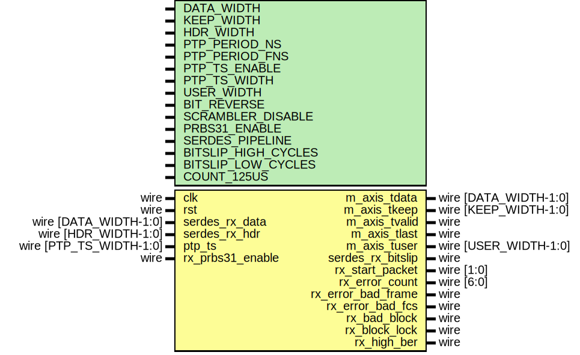

# Entity: eth_mac_phy_10g_rx

## Diagram

## Description

Language: Verilog 2001
 
## Generics

| Generic name        | Type | Value      | Description |
| ------------------- | ---- | ---------- | ----------- |
| DATA_WIDTH          |      | 64         |             |
| KEEP_WIDTH          |      | undefined  |             |
| HDR_WIDTH           |      | undefined  |             |
| PTP_PERIOD_NS       |      | 4'h6       |             |
| PTP_PERIOD_FNS      |      | 16'h6666   |             |
| PTP_TS_ENABLE       |      | 0          |             |
| PTP_TS_WIDTH        |      | 96         |             |
| USER_WIDTH          |      | + 1        |             |
| BIT_REVERSE         |      | 0          |             |
| SCRAMBLER_DISABLE   |      | 0          |             |
| PRBS31_ENABLE       |      | 0          |             |
| SERDES_PIPELINE     |      | 0          |             |
| BITSLIP_HIGH_CYCLES |      | 1          |             |
| BITSLIP_LOW_CYCLES  |      | 8          |             |
| COUNT_125US         |      | 125000/6.4 |             |
## Ports

| Port name          | Direction | Type                    | Description |
| ------------------ | --------- | ----------------------- | ----------- |
| clk                | input     | wire                    |             |
| rst                | input     | wire                    |             |
| m_axis_tdata       | output    | wire [DATA_WIDTH-1:0]   |             |
| m_axis_tkeep       | output    | wire [KEEP_WIDTH-1:0]   |             |
| m_axis_tvalid      | output    | wire                    |             |
| m_axis_tlast       | output    | wire                    |             |
| m_axis_tuser       | output    | wire [USER_WIDTH-1:0]   |             |
| serdes_rx_data     | input     | wire [DATA_WIDTH-1:0]   |             |
| serdes_rx_hdr      | input     | wire [HDR_WIDTH-1:0]    |             |
| serdes_rx_bitslip  | output    | wire                    |             |
| ptp_ts             | input     | wire [PTP_TS_WIDTH-1:0] |             |
| rx_start_packet    | output    | wire [1:0]              |             |
| rx_error_count     | output    | wire [6:0]              |             |
| rx_error_bad_frame | output    | wire                    |             |
| rx_error_bad_fcs   | output    | wire                    |             |
| rx_bad_block       | output    | wire                    |             |
| rx_block_lock      | output    | wire                    |             |
| rx_high_ber        | output    | wire                    |             |
| rx_prbs31_enable   | input     | wire                    |             |
## Signals

| Name            | Type                  | Description |
| --------------- | --------------------- | ----------- |
| encoded_rx_data | wire [DATA_WIDTH-1:0] |             |
| encoded_rx_hdr  | wire [HDR_WIDTH-1:0]  |             |
## Instantiations

- eth_phy_10g_rx_if_inst: eth_phy_10g_rx_if
- axis_baser_rx_inst: axis_baser_rx_64
