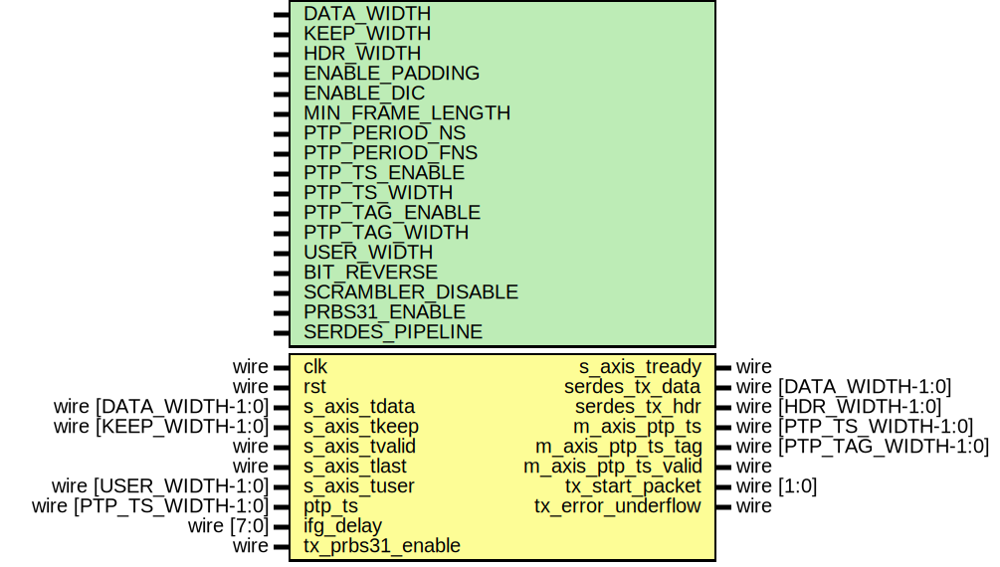

# Entity: eth_mac_phy_10g_tx

## Diagram

## Description

Language: Verilog 2001
 
## Generics

| Generic name      | Type | Value         | Description |
| ----------------- | ---- | ------------- | ----------- |
| DATA_WIDTH        |      | 64            |             |
| KEEP_WIDTH        |      | undefined     |             |
| HDR_WIDTH         |      | undefined     |             |
| ENABLE_PADDING    |      | 1             |             |
| ENABLE_DIC        |      | 1             |             |
| MIN_FRAME_LENGTH  |      | 64            |             |
| PTP_PERIOD_NS     |      | 4'h6          |             |
| PTP_PERIOD_FNS    |      | 16'h6666      |             |
| PTP_TS_ENABLE     |      | 0             |             |
| PTP_TS_WIDTH      |      | 96            |             |
| PTP_TAG_ENABLE    |      | PTP_TS_ENABLE |             |
| PTP_TAG_WIDTH     |      | 16            |             |
| USER_WIDTH        |      | + 1           |             |
| BIT_REVERSE       |      | 0             |             |
| SCRAMBLER_DISABLE |      | 0             |             |
| PRBS31_ENABLE     |      | 0             |             |
| SERDES_PIPELINE   |      | 0             |             |
## Ports

| Port name           | Direction | Type                     | Description |
| ------------------- | --------- | ------------------------ | ----------- |
| clk                 | input     | wire                     |             |
| rst                 | input     | wire                     |             |
| s_axis_tdata        | input     | wire [DATA_WIDTH-1:0]    |             |
| s_axis_tkeep        | input     | wire [KEEP_WIDTH-1:0]    |             |
| s_axis_tvalid       | input     | wire                     |             |
| s_axis_tready       | output    | wire                     |             |
| s_axis_tlast        | input     | wire                     |             |
| s_axis_tuser        | input     | wire [USER_WIDTH-1:0]    |             |
| serdes_tx_data      | output    | wire [DATA_WIDTH-1:0]    |             |
| serdes_tx_hdr       | output    | wire [HDR_WIDTH-1:0]     |             |
| ptp_ts              | input     | wire [PTP_TS_WIDTH-1:0]  |             |
| m_axis_ptp_ts       | output    | wire [PTP_TS_WIDTH-1:0]  |             |
| m_axis_ptp_ts_tag   | output    | wire [PTP_TAG_WIDTH-1:0] |             |
| m_axis_ptp_ts_valid | output    | wire                     |             |
| tx_start_packet     | output    | wire [1:0]               |             |
| tx_error_underflow  | output    | wire                     |             |
| ifg_delay           | input     | wire [7:0]               |             |
| tx_prbs31_enable    | input     | wire                     |             |
## Signals

| Name            | Type                  | Description |
| --------------- | --------------------- | ----------- |
| encoded_tx_data | wire [DATA_WIDTH-1:0] |             |
| encoded_tx_hdr  | wire [HDR_WIDTH-1:0]  |             |
## Instantiations

- axis_baser_tx_inst: axis_baser_tx_64
- eth_phy_10g_tx_if_inst: eth_phy_10g_tx_if
