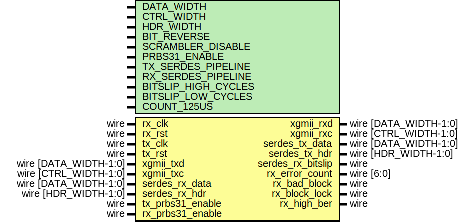

# Entity: eth_phy_10g

- **File**: eth_phy_10g.v
## Diagram

## Description

Language: Verilog 2001
 
## Generics

| Generic name        | Type | Value      | Description |
| ------------------- | ---- | ---------- | ----------- |
| DATA_WIDTH          |      | 64         |             |
| CTRL_WIDTH          |      | undefined  |             |
| HDR_WIDTH           |      | 2          |             |
| BIT_REVERSE         |      | 0          |             |
| SCRAMBLER_DISABLE   |      | 0          |             |
| PRBS31_ENABLE       |      | 0          |             |
| TX_SERDES_PIPELINE  |      | 0          |             |
| RX_SERDES_PIPELINE  |      | 0          |             |
| BITSLIP_HIGH_CYCLES |      | 1          |             |
| BITSLIP_LOW_CYCLES  |      | 8          |             |
| COUNT_125US         |      | 125000/6.4 |             |
## Ports

| Port name         | Direction | Type                  | Description |
| ----------------- | --------- | --------------------- | ----------- |
| rx_clk            | input     | wire                  |             |
| rx_rst            | input     | wire                  |             |
| tx_clk            | input     | wire                  |             |
| tx_rst            | input     | wire                  |             |
| xgmii_txd         | input     | wire [DATA_WIDTH-1:0] |             |
| xgmii_txc         | input     | wire [CTRL_WIDTH-1:0] |             |
| xgmii_rxd         | output    | wire [DATA_WIDTH-1:0] |             |
| xgmii_rxc         | output    | wire [CTRL_WIDTH-1:0] |             |
| serdes_tx_data    | output    | wire [DATA_WIDTH-1:0] |             |
| serdes_tx_hdr     | output    | wire [HDR_WIDTH-1:0]  |             |
| serdes_rx_data    | input     | wire [DATA_WIDTH-1:0] |             |
| serdes_rx_hdr     | input     | wire [HDR_WIDTH-1:0]  |             |
| serdes_rx_bitslip | output    | wire                  |             |
| rx_error_count    | output    | wire [6:0]            |             |
| rx_bad_block      | output    | wire                  |             |
| rx_block_lock     | output    | wire                  |             |
| rx_high_ber       | output    | wire                  |             |
| tx_prbs31_enable  | input     | wire                  |             |
| rx_prbs31_enable  | input     | wire                  |             |
## Instantiations

- eth_phy_10g_rx_inst: eth_phy_10g_rx
- eth_phy_10g_tx_inst: eth_phy_10g_tx
