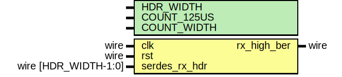

# Entity: eth_phy_10g_rx_ber_mon

## Diagram

## Description

Language: Verilog 2001
 
## Generics

| Generic name | Type | Value               | Description |
| ------------ | ---- | ------------------- | ----------- |
| HDR_WIDTH    |      | 2                   |             |
| COUNT_125US  |      | 125000/6.4          |             |
| COUNT_WIDTH  |      | $clog2(COUNT_125US) |             |
## Ports

| Port name     | Direction | Type                 | Description |
| ------------- | --------- | -------------------- | ----------- |
| clk           | input     | wire                 |             |
| rst           | input     | wire                 |             |
| serdes_rx_hdr | input     | wire [HDR_WIDTH-1:0] |             |
| rx_high_ber   | output    | wire                 |             |
## Signals

| Name             | Type                  | Description |
| ---------------- | --------------------- | ----------- |
| time_count_reg   | reg [COUNT_WIDTH-1:0] |             |
| time_count_next  | reg [COUNT_WIDTH-1:0] |             |
| ber_count_reg    | reg [3:0]             |             |
| ber_count_next   | reg [3:0]             |             |
| rx_high_ber_reg  | reg                   |             |
| rx_high_ber_next | reg                   |             |
## Constants

| Name      | Type  | Value | Description |
| --------- | ----- | ----- | ----------- |
| SYNC_DATA | [1:0] | 2'b10 |             |
| SYNC_CTRL | [1:0] | 2'b01 |             |
## Processes
- unnamed: ( @* )
- unnamed: ( @(posedge clk) )
