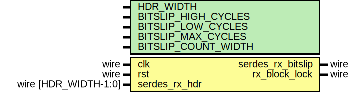

# Entity: eth_phy_10g_rx_frame_sync

- **File**: eth_phy_10g_rx_frame_sync.v
## Diagram

## Description

 Language: Verilog 2001

## Generics

| Generic name        | Type | Value                                                                               | Description |
| ------------------- | ---- | ----------------------------------------------------------------------------------- | ----------- |
| HDR_WIDTH           |      | 2                                                                                   |             |
| BITSLIP_HIGH_CYCLES |      | 1                                                                                   |             |
| BITSLIP_LOW_CYCLES  |      | 8                                                                                   |             |
| BITSLIP_MAX_CYCLES  |      | BITSLIP_HIGH_CYCLES > BITSLIP_LOW_CYCLES ? BITSLIP_HIGH_CYCLES : BITSLIP_LOW_CYCLES |             |
| BITSLIP_COUNT_WIDTH |      | $clog2(BITSLIP_MAX_CYCLES)                                                          |             |
## Ports

| Port name         | Direction | Type                 | Description                      |
| ----------------- | --------- | -------------------- | -------------------------------- |
| clk               | input     | wire                 |                                  |
| rst               | input     | wire                 |                                  |
| serdes_rx_hdr     | input     | wire [HDR_WIDTH-1:0] |      * SERDES interface      */  |
| serdes_rx_bitslip | output    | wire                 |                                  |
| rx_block_lock     | output    | wire                 |      * Status      */            |
## Signals

| Name                   | Type                          | Description |
| ---------------------- | ----------------------------- | ----------- |
| sh_count_reg           | reg [5:0]                     |             |
| sh_count_next          | reg [5:0]                     |             |
| sh_invalid_count_reg   | reg [3:0]                     |             |
| sh_invalid_count_next  | reg [3:0]                     |             |
| bitslip_count_reg      | reg [BITSLIP_COUNT_WIDTH-1:0] |             |
| bitslip_count_next     | reg [BITSLIP_COUNT_WIDTH-1:0] |             |
| serdes_rx_bitslip_reg  | reg                           |             |
| serdes_rx_bitslip_next | reg                           |             |
| rx_block_lock_reg      | reg                           |             |
| rx_block_lock_next     | reg                           |             |
## Constants

| Name      | Type  | Value | Description |
| --------- | ----- | ----- | ----------- |
| SYNC_DATA | [1:0] | 2'b10 |             |
| SYNC_CTRL | [1:0] | 2'b01 |             |
## Processes
- unnamed: ( @* )
  - **Type:** always
- unnamed: ( @(posedge clk) )
  - **Type:** always
