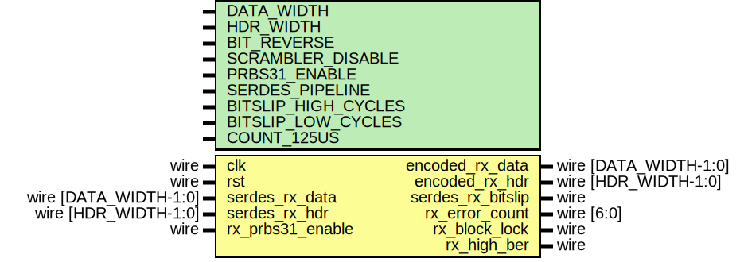

# Entity: eth_phy_10g_rx_if

- **File**: eth_phy_10g_rx_if.v
## Diagram

## Description

Language: Verilog 2001
 
## Generics

| Generic name        | Type | Value      | Description |
| ------------------- | ---- | ---------- | ----------- |
| DATA_WIDTH          |      | 64         |             |
| HDR_WIDTH           |      | 2          |             |
| BIT_REVERSE         |      | 0          |             |
| SCRAMBLER_DISABLE   |      | 0          |             |
| PRBS31_ENABLE       |      | 0          |             |
| SERDES_PIPELINE     |      | 0          |             |
| BITSLIP_HIGH_CYCLES |      | 1          |             |
| BITSLIP_LOW_CYCLES  |      | 8          |             |
| COUNT_125US         |      | 125000/6.4 |             |
## Ports

| Port name         | Direction | Type                  | Description |
| ----------------- | --------- | --------------------- | ----------- |
| clk               | input     | wire                  |             |
| rst               | input     | wire                  |             |
| encoded_rx_data   | output    | wire [DATA_WIDTH-1:0] |             |
| encoded_rx_hdr    | output    | wire [HDR_WIDTH-1:0]  |             |
| serdes_rx_data    | input     | wire [DATA_WIDTH-1:0] |             |
| serdes_rx_hdr     | input     | wire [HDR_WIDTH-1:0]  |             |
| serdes_rx_bitslip | output    | wire                  |             |
| rx_error_count    | output    | wire [6:0]            |             |
| rx_block_lock     | output    | wire                  |             |
| rx_high_ber       | output    | wire                  |             |
| rx_prbs31_enable  | input     | wire                  |             |
## Signals

| Name                  | Type                            | Description |
| --------------------- | ------------------------------- | ----------- |
| serdes_rx_data_rev    | wire [DATA_WIDTH-1:0]           |             |
| serdes_rx_data_int    | wire [DATA_WIDTH-1:0]           |             |
| serdes_rx_hdr_rev     | wire [HDR_WIDTH-1:0]            |             |
| serdes_rx_hdr_int     | wire [HDR_WIDTH-1:0]            |             |
| descrambled_rx_data   | wire [DATA_WIDTH-1:0]           |             |
| encoded_rx_data_reg   | reg [DATA_WIDTH-1:0]            |             |
| encoded_rx_hdr_reg    | reg [HDR_WIDTH-1:0]             |             |
| scrambler_state_reg   | reg [57:0]                      |             |
| scrambler_state       | wire [57:0]                     |             |
| prbs31_state_reg      | reg [30:0]                      |             |
| prbs31_state          | wire [30:0]                     |             |
| prbs31_data           | wire [DATA_WIDTH+HDR_WIDTH-1:0] |             |
| rx_error_count_reg    | reg [6:0]                       |             |
| rx_error_count_1_reg  | reg [5:0]                       |             |
| rx_error_count_2_reg  | reg [5:0]                       |             |
| rx_error_count_1_temp | reg [5:0]                       |             |
| rx_error_count_2_temp | reg [5:0]                       |             |
| i                     | integer                         |             |
| serdes_rx_bitslip_int | wire                            |             |
## Processes
- unnamed: ( @* )
- unnamed: ( @(posedge clk) )
## Instantiations

- descrambler_inst: lfsr
- prbs31_check_inst: lfsr
- eth_phy_10g_rx_frame_sync_inst: eth_phy_10g_rx_frame_sync
- eth_phy_10g_rx_ber_mon_inst: eth_phy_10g_rx_ber_mon
