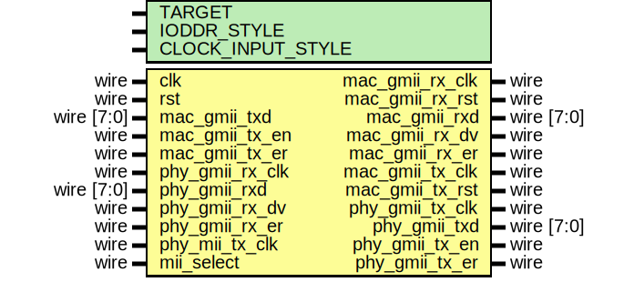

# Entity: gmii_phy_if

## Diagram

## Description

Language: Verilog 2001
 
## Generics

| Generic name      | Type | Value     | Description                                                                                                                                       |
| ----------------- | ---- | --------- | ------------------------------------------------------------------------------------------------------------------------------------------------- |
| TARGET            |      | "GENERIC" | target ("SIM", "GENERIC", "XILINX", "ALTERA")                                                                                                     |
| IODDR_STYLE       |      | "IODDR2"  | IODDR style ("IODDR", "IODDR2") Use IODDR for Virtex-4, Virtex-5, Virtex-6, 7 Series, Ultrascale Use IODDR2 for Spartan-6                         |
| CLOCK_INPUT_STYLE |      | "BUFIO2"  | Clock input style ("BUFG", "BUFR", "BUFIO", "BUFIO2") Use BUFR for Virtex-5, Virtex-6, 7-series Use BUFG for Ultrascale Use BUFIO2 for Spartan-6  |
## Ports

| Port name       | Direction | Type       | Description |
| --------------- | --------- | ---------- | ----------- |
| clk             | input     | wire       |             |
| rst             | input     | wire       |             |
| mac_gmii_rx_clk | output    | wire       |             |
| mac_gmii_rx_rst | output    | wire       |             |
| mac_gmii_rxd    | output    | wire [7:0] |             |
| mac_gmii_rx_dv  | output    | wire       |             |
| mac_gmii_rx_er  | output    | wire       |             |
| mac_gmii_tx_clk | output    | wire       |             |
| mac_gmii_tx_rst | output    | wire       |             |
| mac_gmii_txd    | input     | wire [7:0] |             |
| mac_gmii_tx_en  | input     | wire       |             |
| mac_gmii_tx_er  | input     | wire       |             |
| phy_gmii_rx_clk | input     | wire       |             |
| phy_gmii_rxd    | input     | wire [7:0] |             |
| phy_gmii_rx_dv  | input     | wire       |             |
| phy_gmii_rx_er  | input     | wire       |             |
| phy_mii_tx_clk  | input     | wire       |             |
| phy_gmii_tx_clk | output    | wire       |             |
| phy_gmii_txd    | output    | wire [7:0] |             |
| phy_gmii_tx_en  | output    | wire       |             |
| phy_gmii_tx_er  | output    | wire       |             |
| mii_select      | input     | wire       |             |
## Signals

| Name       | Type      | Description |
| ---------- | --------- | ----------- |
| tx_rst_reg | reg [3:0] | reset sync  |
| rx_rst_reg | reg [3:0] |             |
## Processes
- unnamed: ( @(posedge mac_gmii_tx_clk or posedge rst) )
- unnamed: ( @(posedge mac_gmii_rx_clk or posedge rst) )
## Instantiations

- rx_ssio_sdr_inst: ssio_sdr_in
- tx_ssio_sdr_inst: ssio_sdr_out
