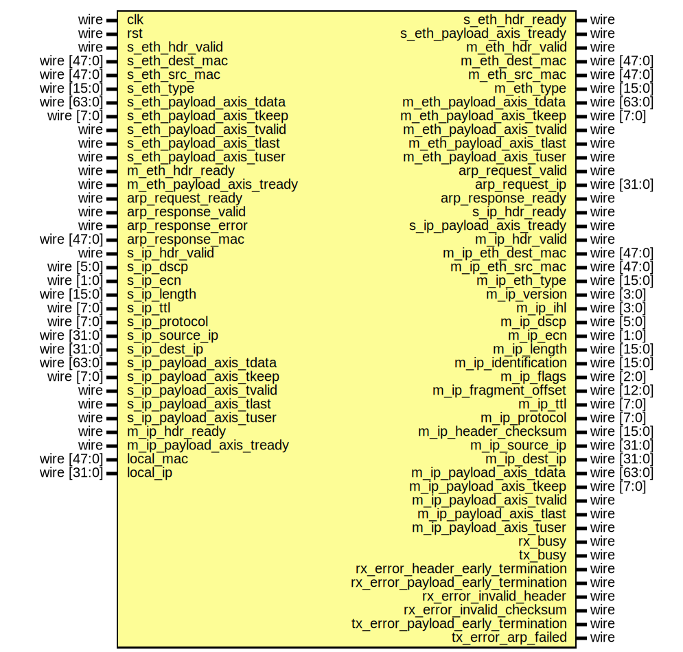

# Entity: ip_64

## Diagram

## Description

Language: Verilog 2001
 
## Ports

| Port name                          | Direction | Type        | Description |
| ---------------------------------- | --------- | ----------- | ----------- |
| clk                                | input     | wire        |             |
| rst                                | input     | wire        |             |
| s_eth_hdr_valid                    | input     | wire        |             |
| s_eth_hdr_ready                    | output    | wire        |             |
| s_eth_dest_mac                     | input     | wire [47:0] |             |
| s_eth_src_mac                      | input     | wire [47:0] |             |
| s_eth_type                         | input     | wire [15:0] |             |
| s_eth_payload_axis_tdata           | input     | wire [63:0] |             |
| s_eth_payload_axis_tkeep           | input     | wire [7:0]  |             |
| s_eth_payload_axis_tvalid          | input     | wire        |             |
| s_eth_payload_axis_tready          | output    | wire        |             |
| s_eth_payload_axis_tlast           | input     | wire        |             |
| s_eth_payload_axis_tuser           | input     | wire        |             |
| m_eth_hdr_valid                    | output    | wire        |             |
| m_eth_hdr_ready                    | input     | wire        |             |
| m_eth_dest_mac                     | output    | wire [47:0] |             |
| m_eth_src_mac                      | output    | wire [47:0] |             |
| m_eth_type                         | output    | wire [15:0] |             |
| m_eth_payload_axis_tdata           | output    | wire [63:0] |             |
| m_eth_payload_axis_tkeep           | output    | wire [7:0]  |             |
| m_eth_payload_axis_tvalid          | output    | wire        |             |
| m_eth_payload_axis_tready          | input     | wire        |             |
| m_eth_payload_axis_tlast           | output    | wire        |             |
| m_eth_payload_axis_tuser           | output    | wire        |             |
| arp_request_valid                  | output    | wire        |             |
| arp_request_ready                  | input     | wire        |             |
| arp_request_ip                     | output    | wire [31:0] |             |
| arp_response_valid                 | input     | wire        |             |
| arp_response_ready                 | output    | wire        |             |
| arp_response_error                 | input     | wire        |             |
| arp_response_mac                   | input     | wire [47:0] |             |
| s_ip_hdr_valid                     | input     | wire        |             |
| s_ip_hdr_ready                     | output    | wire        |             |
| s_ip_dscp                          | input     | wire [5:0]  |             |
| s_ip_ecn                           | input     | wire [1:0]  |             |
| s_ip_length                        | input     | wire [15:0] |             |
| s_ip_ttl                           | input     | wire [7:0]  |             |
| s_ip_protocol                      | input     | wire [7:0]  |             |
| s_ip_source_ip                     | input     | wire [31:0] |             |
| s_ip_dest_ip                       | input     | wire [31:0] |             |
| s_ip_payload_axis_tdata            | input     | wire [63:0] |             |
| s_ip_payload_axis_tkeep            | input     | wire [7:0]  |             |
| s_ip_payload_axis_tvalid           | input     | wire        |             |
| s_ip_payload_axis_tready           | output    | wire        |             |
| s_ip_payload_axis_tlast            | input     | wire        |             |
| s_ip_payload_axis_tuser            | input     | wire        |             |
| m_ip_hdr_valid                     | output    | wire        |             |
| m_ip_hdr_ready                     | input     | wire        |             |
| m_ip_eth_dest_mac                  | output    | wire [47:0] |             |
| m_ip_eth_src_mac                   | output    | wire [47:0] |             |
| m_ip_eth_type                      | output    | wire [15:0] |             |
| m_ip_version                       | output    | wire [3:0]  |             |
| m_ip_ihl                           | output    | wire [3:0]  |             |
| m_ip_dscp                          | output    | wire [5:0]  |             |
| m_ip_ecn                           | output    | wire [1:0]  |             |
| m_ip_length                        | output    | wire [15:0] |             |
| m_ip_identification                | output    | wire [15:0] |             |
| m_ip_flags                         | output    | wire [2:0]  |             |
| m_ip_fragment_offset               | output    | wire [12:0] |             |
| m_ip_ttl                           | output    | wire [7:0]  |             |
| m_ip_protocol                      | output    | wire [7:0]  |             |
| m_ip_header_checksum               | output    | wire [15:0] |             |
| m_ip_source_ip                     | output    | wire [31:0] |             |
| m_ip_dest_ip                       | output    | wire [31:0] |             |
| m_ip_payload_axis_tdata            | output    | wire [63:0] |             |
| m_ip_payload_axis_tkeep            | output    | wire [7:0]  |             |
| m_ip_payload_axis_tvalid           | output    | wire        |             |
| m_ip_payload_axis_tready           | input     | wire        |             |
| m_ip_payload_axis_tlast            | output    | wire        |             |
| m_ip_payload_axis_tuser            | output    | wire        |             |
| rx_busy                            | output    | wire        |             |
| tx_busy                            | output    | wire        |             |
| rx_error_header_early_termination  | output    | wire        |             |
| rx_error_payload_early_termination | output    | wire        |             |
| rx_error_invalid_header            | output    | wire        |             |
| rx_error_invalid_checksum          | output    | wire        |             |
| tx_error_payload_early_termination | output    | wire        |             |
| tx_error_arp_failed                | output    | wire        |             |
| local_mac                          | input     | wire [47:0] |             |
| local_ip                           | input     | wire [31:0] |             |
## Signals

| Name                            | Type       | Description |
| ------------------------------- | ---------- | ----------- |
| state_reg                       | reg [1:0]  |             |
| state_next                      | reg [1:0]  |             |
| outgoing_ip_hdr_valid_reg       | reg        |             |
| outgoing_ip_hdr_valid_next      | reg        |             |
| outgoing_ip_hdr_ready           | wire       |             |
| outgoing_eth_dest_mac_reg       | reg [47:0] |             |
| outgoing_eth_dest_mac_next      | reg [47:0] |             |
| outgoing_ip_payload_axis_tready | wire       |             |
| s_ip_hdr_ready_reg              | reg        |             |
| s_ip_hdr_ready_next             | reg        |             |
| arp_request_valid_reg           | reg        |             |
| arp_request_valid_next          | reg        |             |
| arp_response_ready_reg          | reg        |             |
| arp_response_ready_next         | reg        |             |
| drop_packet_reg                 | reg        |             |
| drop_packet_next                | reg        |             |
## Constants

| Name              | Type  | Value | Description |
| ----------------- | ----- | ----- | ----------- |
| STATE_IDLE        | [1:0] | 2'd0  |             |
| STATE_ARP_QUERY   | [1:0] | 2'd1  |             |
| STATE_WAIT_PACKET | [1:0] | 2'd2  |             |
## Processes
- unnamed: ( @* )
- unnamed: ( @(posedge clk) )
## Instantiations

- ip_eth_rx_64_inst: ip_eth_rx_64
- ip_eth_tx_64_inst: ip_eth_tx_64
