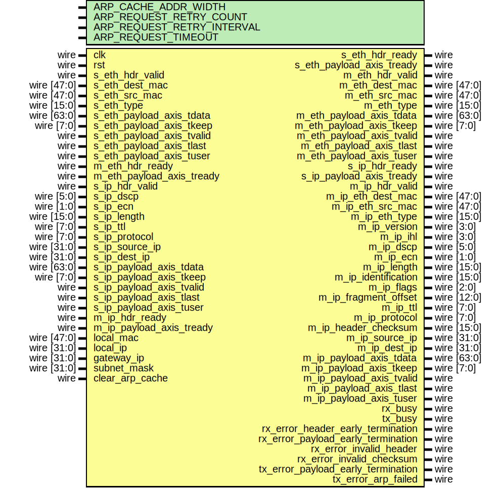

# Entity: ip_complete_64

- **File**: ip_complete_64.v
## Diagram

## Description

 Language: Verilog 2001

## Generics

| Generic name               | Type | Value        | Description |
| -------------------------- | ---- | ------------ | ----------- |
| ARP_CACHE_ADDR_WIDTH       |      | 9            |             |
| ARP_REQUEST_RETRY_COUNT    |      | 4            |             |
| ARP_REQUEST_RETRY_INTERVAL |      | 156250000*2  |             |
| ARP_REQUEST_TIMEOUT        |      | 156250000*30 |             |
## Ports

| Port name                          | Direction | Type        | Description                           |
| ---------------------------------- | --------- | ----------- | ------------------------------------- |
| clk                                | input     | wire        |                                       |
| rst                                | input     | wire        |                                       |
| s_eth_hdr_valid                    | input     | wire        |      * Ethernet frame input      */   |
| s_eth_hdr_ready                    | output    | wire        |                                       |
| s_eth_dest_mac                     | input     | wire [47:0] |                                       |
| s_eth_src_mac                      | input     | wire [47:0] |                                       |
| s_eth_type                         | input     | wire [15:0] |                                       |
| s_eth_payload_axis_tdata           | input     | wire [63:0] |                                       |
| s_eth_payload_axis_tkeep           | input     | wire [7:0]  |                                       |
| s_eth_payload_axis_tvalid          | input     | wire        |                                       |
| s_eth_payload_axis_tready          | output    | wire        |                                       |
| s_eth_payload_axis_tlast           | input     | wire        |                                       |
| s_eth_payload_axis_tuser           | input     | wire        |                                       |
| m_eth_hdr_valid                    | output    | wire        |      * Ethernet frame output      */  |
| m_eth_hdr_ready                    | input     | wire        |                                       |
| m_eth_dest_mac                     | output    | wire [47:0] |                                       |
| m_eth_src_mac                      | output    | wire [47:0] |                                       |
| m_eth_type                         | output    | wire [15:0] |                                       |
| m_eth_payload_axis_tdata           | output    | wire [63:0] |                                       |
| m_eth_payload_axis_tkeep           | output    | wire [7:0]  |                                       |
| m_eth_payload_axis_tvalid          | output    | wire        |                                       |
| m_eth_payload_axis_tready          | input     | wire        |                                       |
| m_eth_payload_axis_tlast           | output    | wire        |                                       |
| m_eth_payload_axis_tuser           | output    | wire        |                                       |
| s_ip_hdr_valid                     | input     | wire        |      * IP input      */               |
| s_ip_hdr_ready                     | output    | wire        |                                       |
| s_ip_dscp                          | input     | wire [5:0]  |                                       |
| s_ip_ecn                           | input     | wire [1:0]  |                                       |
| s_ip_length                        | input     | wire [15:0] |                                       |
| s_ip_ttl                           | input     | wire [7:0]  |                                       |
| s_ip_protocol                      | input     | wire [7:0]  |                                       |
| s_ip_source_ip                     | input     | wire [31:0] |                                       |
| s_ip_dest_ip                       | input     | wire [31:0] |                                       |
| s_ip_payload_axis_tdata            | input     | wire [63:0] |                                       |
| s_ip_payload_axis_tkeep            | input     | wire [7:0]  |                                       |
| s_ip_payload_axis_tvalid           | input     | wire        |                                       |
| s_ip_payload_axis_tready           | output    | wire        |                                       |
| s_ip_payload_axis_tlast            | input     | wire        |                                       |
| s_ip_payload_axis_tuser            | input     | wire        |                                       |
| m_ip_hdr_valid                     | output    | wire        |      * IP output      */              |
| m_ip_hdr_ready                     | input     | wire        |                                       |
| m_ip_eth_dest_mac                  | output    | wire [47:0] |                                       |
| m_ip_eth_src_mac                   | output    | wire [47:0] |                                       |
| m_ip_eth_type                      | output    | wire [15:0] |                                       |
| m_ip_version                       | output    | wire [3:0]  |                                       |
| m_ip_ihl                           | output    | wire [3:0]  |                                       |
| m_ip_dscp                          | output    | wire [5:0]  |                                       |
| m_ip_ecn                           | output    | wire [1:0]  |                                       |
| m_ip_length                        | output    | wire [15:0] |                                       |
| m_ip_identification                | output    | wire [15:0] |                                       |
| m_ip_flags                         | output    | wire [2:0]  |                                       |
| m_ip_fragment_offset               | output    | wire [12:0] |                                       |
| m_ip_ttl                           | output    | wire [7:0]  |                                       |
| m_ip_protocol                      | output    | wire [7:0]  |                                       |
| m_ip_header_checksum               | output    | wire [15:0] |                                       |
| m_ip_source_ip                     | output    | wire [31:0] |                                       |
| m_ip_dest_ip                       | output    | wire [31:0] |                                       |
| m_ip_payload_axis_tdata            | output    | wire [63:0] |                                       |
| m_ip_payload_axis_tkeep            | output    | wire [7:0]  |                                       |
| m_ip_payload_axis_tvalid           | output    | wire        |                                       |
| m_ip_payload_axis_tready           | input     | wire        |                                       |
| m_ip_payload_axis_tlast            | output    | wire        |                                       |
| m_ip_payload_axis_tuser            | output    | wire        |                                       |
| rx_busy                            | output    | wire        |      * Status      */                 |
| tx_busy                            | output    | wire        |                                       |
| rx_error_header_early_termination  | output    | wire        |                                       |
| rx_error_payload_early_termination | output    | wire        |                                       |
| rx_error_invalid_header            | output    | wire        |                                       |
| rx_error_invalid_checksum          | output    | wire        |                                       |
| tx_error_payload_early_termination | output    | wire        |                                       |
| tx_error_arp_failed                | output    | wire        |                                       |
| local_mac                          | input     | wire [47:0] |      * Configuration      */          |
| local_ip                           | input     | wire [31:0] |                                       |
| gateway_ip                         | input     | wire [31:0] |                                       |
| subnet_mask                        | input     | wire [31:0] |                                       |
| clear_arp_cache                    | input     | wire        |                                       |
## Signals

| Name                           | Type        | Description                                                                        |
| ------------------------------ | ----------- | ---------------------------------------------------------------------------------- |
| arp_request_valid              | wire        |   This module integrates the IP and ARP modules for a complete IP stack  */  |
| arp_request_ready              | wire        |                                                                                    |
| arp_request_ip                 | wire [31:0] |                                                                                    |
| arp_response_valid             | wire        |                                                                                    |
| arp_response_ready             | wire        |                                                                                    |
| arp_response_error             | wire        |                                                                                    |
| arp_response_mac               | wire [47:0] |                                                                                    |
| ip_rx_eth_hdr_valid            | wire        |                                                                                    |
| ip_rx_eth_hdr_ready            | wire        |                                                                                    |
| ip_rx_eth_dest_mac             | wire [47:0] |                                                                                    |
| ip_rx_eth_src_mac              | wire [47:0] |                                                                                    |
| ip_rx_eth_type                 | wire [15:0] |                                                                                    |
| ip_rx_eth_payload_axis_tdata   | wire [63:0] |                                                                                    |
| ip_rx_eth_payload_axis_tkeep   | wire [7:0]  |                                                                                    |
| ip_rx_eth_payload_axis_tvalid  | wire        |                                                                                    |
| ip_rx_eth_payload_axis_tready  | wire        |                                                                                    |
| ip_rx_eth_payload_axis_tlast   | wire        |                                                                                    |
| ip_rx_eth_payload_axis_tuser   | wire        |                                                                                    |
| ip_tx_eth_hdr_valid            | wire        |                                                                                    |
| ip_tx_eth_hdr_ready            | wire        |                                                                                    |
| ip_tx_eth_dest_mac             | wire [47:0] |                                                                                    |
| ip_tx_eth_src_mac              | wire [47:0] |                                                                                    |
| ip_tx_eth_type                 | wire [15:0] |                                                                                    |
| ip_tx_eth_payload_axis_tdata   | wire [63:0] |                                                                                    |
| ip_tx_eth_payload_axis_tkeep   | wire [7:0]  |                                                                                    |
| ip_tx_eth_payload_axis_tvalid  | wire        |                                                                                    |
| ip_tx_eth_payload_axis_tready  | wire        |                                                                                    |
| ip_tx_eth_payload_axis_tlast   | wire        |                                                                                    |
| ip_tx_eth_payload_axis_tuser   | wire        |                                                                                    |
| arp_rx_eth_hdr_valid           | wire        |                                                                                    |
| arp_rx_eth_hdr_ready           | wire        |                                                                                    |
| arp_rx_eth_dest_mac            | wire [47:0] |                                                                                    |
| arp_rx_eth_src_mac             | wire [47:0] |                                                                                    |
| arp_rx_eth_type                | wire [15:0] |                                                                                    |
| arp_rx_eth_payload_axis_tdata  | wire [63:0] |                                                                                    |
| arp_rx_eth_payload_axis_tkeep  | wire [7:0]  |                                                                                    |
| arp_rx_eth_payload_axis_tvalid | wire        |                                                                                    |
| arp_rx_eth_payload_axis_tready | wire        |                                                                                    |
| arp_rx_eth_payload_axis_tlast  | wire        |                                                                                    |
| arp_rx_eth_payload_axis_tuser  | wire        |                                                                                    |
| arp_tx_eth_hdr_valid           | wire        |                                                                                    |
| arp_tx_eth_hdr_ready           | wire        |                                                                                    |
| arp_tx_eth_dest_mac            | wire [47:0] |                                                                                    |
| arp_tx_eth_src_mac             | wire [47:0] |                                                                                    |
| arp_tx_eth_type                | wire [15:0] |                                                                                    |
| arp_tx_eth_payload_axis_tdata  | wire [63:0] |                                                                                    |
| arp_tx_eth_payload_axis_tkeep  | wire [7:0]  |                                                                                    |
| arp_tx_eth_payload_axis_tvalid | wire        |                                                                                    |
| arp_tx_eth_payload_axis_tready | wire        |                                                                                    |
| arp_tx_eth_payload_axis_tlast  | wire        |                                                                                    |
| arp_tx_eth_payload_axis_tuser  | wire        |                                                                                    |
| s_select_ip                    | wire        |   * Input classifier (eth_type)  */                                                |
| s_select_arp                   | wire        |                                                                                    |
| s_select_none                  | wire        |                                                                                    |
| s_select_ip_reg                | reg         |                                                                                    |
| s_select_arp_reg               | reg         |                                                                                    |
| s_select_none_reg              | reg         |                                                                                    |
## Processes
- unnamed: ( @(posedge clk) )
  - **Type:** always
## Instantiations

- eth_arb_mux_inst: eth_arb_mux
**Description**

 * Output arbiter
 */

- ip_inst: ip_64
**Description**

 * IP module
 */

- arp_inst: arp
**Description**

 * ARP module
 */

