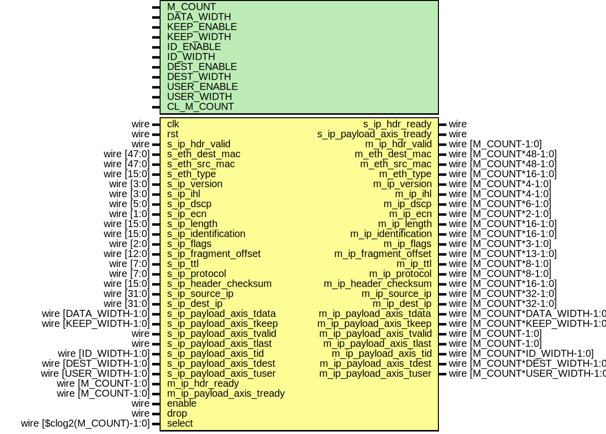

# Entity: ip_demux

- **File**: ip_demux.v
## Diagram

## Description

 Language: Verilog 2001

## Generics

| Generic name | Type | Value           | Description |
| ------------ | ---- | --------------- | ----------- |
| M_COUNT      |      | 4               |             |
| DATA_WIDTH   |      | 8               |             |
| KEEP_ENABLE  |      | undefined       |             |
| KEEP_WIDTH   |      | undefined       |             |
| ID_ENABLE    |      | 0               |             |
| ID_WIDTH     |      | 8               |             |
| DEST_ENABLE  |      | 0               |             |
| DEST_WIDTH   |      | 8               |             |
| USER_ENABLE  |      | 1               |             |
| USER_WIDTH   |      | 1               |             |
| CL_M_COUNT   |      | $clog2(M_COUNT) |             |
## Ports

| Port name                | Direction | Type                          | Description                      |
| ------------------------ | --------- | ----------------------------- | -------------------------------- |
| clk                      | input     | wire                          |                                  |
| rst                      | input     | wire                          |                                  |
| s_ip_hdr_valid           | input     | wire                          |      * IP frame input      */    |
| s_ip_hdr_ready           | output    | wire                          |                                  |
| s_eth_dest_mac           | input     | wire [47:0]                   |                                  |
| s_eth_src_mac            | input     | wire [47:0]                   |                                  |
| s_eth_type               | input     | wire [15:0]                   |                                  |
| s_ip_version             | input     | wire [3:0]                    |                                  |
| s_ip_ihl                 | input     | wire [3:0]                    |                                  |
| s_ip_dscp                | input     | wire [5:0]                    |                                  |
| s_ip_ecn                 | input     | wire [1:0]                    |                                  |
| s_ip_length              | input     | wire [15:0]                   |                                  |
| s_ip_identification      | input     | wire [15:0]                   |                                  |
| s_ip_flags               | input     | wire [2:0]                    |                                  |
| s_ip_fragment_offset     | input     | wire [12:0]                   |                                  |
| s_ip_ttl                 | input     | wire [7:0]                    |                                  |
| s_ip_protocol            | input     | wire [7:0]                    |                                  |
| s_ip_header_checksum     | input     | wire [15:0]                   |                                  |
| s_ip_source_ip           | input     | wire [31:0]                   |                                  |
| s_ip_dest_ip             | input     | wire [31:0]                   |                                  |
| s_ip_payload_axis_tdata  | input     | wire [DATA_WIDTH-1:0]         |                                  |
| s_ip_payload_axis_tkeep  | input     | wire [KEEP_WIDTH-1:0]         |                                  |
| s_ip_payload_axis_tvalid | input     | wire                          |                                  |
| s_ip_payload_axis_tready | output    | wire                          |                                  |
| s_ip_payload_axis_tlast  | input     | wire                          |                                  |
| s_ip_payload_axis_tid    | input     | wire [ID_WIDTH-1:0]           |                                  |
| s_ip_payload_axis_tdest  | input     | wire [DEST_WIDTH-1:0]         |                                  |
| s_ip_payload_axis_tuser  | input     | wire [USER_WIDTH-1:0]         |                                  |
| m_ip_hdr_valid           | output    | wire [M_COUNT-1:0]            |      * IP frame outputs      */  |
| m_ip_hdr_ready           | input     | wire [M_COUNT-1:0]            |                                  |
| m_eth_dest_mac           | output    | wire [M_COUNT*48-1:0]         |                                  |
| m_eth_src_mac            | output    | wire [M_COUNT*48-1:0]         |                                  |
| m_eth_type               | output    | wire [M_COUNT*16-1:0]         |                                  |
| m_ip_version             | output    | wire [M_COUNT*4-1:0]          |                                  |
| m_ip_ihl                 | output    | wire [M_COUNT*4-1:0]          |                                  |
| m_ip_dscp                | output    | wire [M_COUNT*6-1:0]          |                                  |
| m_ip_ecn                 | output    | wire [M_COUNT*2-1:0]          |                                  |
| m_ip_length              | output    | wire [M_COUNT*16-1:0]         |                                  |
| m_ip_identification      | output    | wire [M_COUNT*16-1:0]         |                                  |
| m_ip_flags               | output    | wire [M_COUNT*3-1:0]          |                                  |
| m_ip_fragment_offset     | output    | wire [M_COUNT*13-1:0]         |                                  |
| m_ip_ttl                 | output    | wire [M_COUNT*8-1:0]          |                                  |
| m_ip_protocol            | output    | wire [M_COUNT*8-1:0]          |                                  |
| m_ip_header_checksum     | output    | wire [M_COUNT*16-1:0]         |                                  |
| m_ip_source_ip           | output    | wire [M_COUNT*32-1:0]         |                                  |
| m_ip_dest_ip             | output    | wire [M_COUNT*32-1:0]         |                                  |
| m_ip_payload_axis_tdata  | output    | wire [M_COUNT*DATA_WIDTH-1:0] |                                  |
| m_ip_payload_axis_tkeep  | output    | wire [M_COUNT*KEEP_WIDTH-1:0] |                                  |
| m_ip_payload_axis_tvalid | output    | wire [M_COUNT-1:0]            |                                  |
| m_ip_payload_axis_tready | input     | wire [M_COUNT-1:0]            |                                  |
| m_ip_payload_axis_tlast  | output    | wire [M_COUNT-1:0]            |                                  |
| m_ip_payload_axis_tid    | output    | wire [M_COUNT*ID_WIDTH-1:0]   |                                  |
| m_ip_payload_axis_tdest  | output    | wire [M_COUNT*DEST_WIDTH-1:0] |                                  |
| m_ip_payload_axis_tuser  | output    | wire [M_COUNT*USER_WIDTH-1:0] |                                  |
| enable                   | input     | wire                          |      * Control      */           |
| drop                     | input     | wire                          |                                  |
| select                   | input     | wire [$clog2(M_COUNT)-1:0]    |                                  |
## Signals

| Name                                 | Type                  | Description             |
| ------------------------------------ | --------------------- | ----------------------- |
| select_reg                           | reg [CL_M_COUNT-1:0]  |                         |
| select_ctl                           | reg [CL_M_COUNT-1:0]  |                         |
| select_next                          | reg [CL_M_COUNT-1:0]  |                         |
| drop_reg                             | reg                   |                         |
| drop_ctl                             | reg                   |                         |
| drop_next                            | reg                   |                         |
| frame_reg                            | reg                   |                         |
| frame_ctl                            | reg                   |                         |
| frame_next                           | reg                   |                         |
| s_ip_hdr_ready_reg                   | reg                   |                         |
| s_ip_hdr_ready_next                  | reg                   |                         |
| s_ip_payload_axis_tready_reg         | reg                   |                         |
| s_ip_payload_axis_tready_next        | reg                   |                         |
| m_ip_hdr_valid_reg                   | reg [M_COUNT-1:0]     |                         |
| m_ip_hdr_valid_next                  | reg [M_COUNT-1:0]     |                         |
| m_eth_dest_mac_reg                   | reg [47:0]            |                         |
| m_eth_dest_mac_next                  | reg [47:0]            |                         |
| m_eth_src_mac_reg                    | reg [47:0]            |                         |
| m_eth_src_mac_next                   | reg [47:0]            |                         |
| m_eth_type_reg                       | reg [15:0]            |                         |
| m_eth_type_next                      | reg [15:0]            |                         |
| m_ip_version_reg                     | reg [3:0]             |                         |
| m_ip_version_next                    | reg [3:0]             |                         |
| m_ip_ihl_reg                         | reg [3:0]             |                         |
| m_ip_ihl_next                        | reg [3:0]             |                         |
| m_ip_dscp_reg                        | reg [5:0]             |                         |
| m_ip_dscp_next                       | reg [5:0]             |                         |
| m_ip_ecn_reg                         | reg [1:0]             |                         |
| m_ip_ecn_next                        | reg [1:0]             |                         |
| m_ip_length_reg                      | reg [15:0]            |                         |
| m_ip_length_next                     | reg [15:0]            |                         |
| m_ip_identification_reg              | reg [15:0]            |                         |
| m_ip_identification_next             | reg [15:0]            |                         |
| m_ip_flags_reg                       | reg [2:0]             |                         |
| m_ip_flags_next                      | reg [2:0]             |                         |
| m_ip_fragment_offset_reg             | reg [12:0]            |                         |
| m_ip_fragment_offset_next            | reg [12:0]            |                         |
| m_ip_ttl_reg                         | reg [7:0]             |                         |
| m_ip_ttl_next                        | reg [7:0]             |                         |
| m_ip_protocol_reg                    | reg [7:0]             |                         |
| m_ip_protocol_next                   | reg [7:0]             |                         |
| m_ip_header_checksum_reg             | reg [15:0]            |                         |
| m_ip_header_checksum_next            | reg [15:0]            |                         |
| m_ip_source_ip_reg                   | reg [31:0]            |                         |
| m_ip_source_ip_next                  | reg [31:0]            |                         |
| m_ip_dest_ip_reg                     | reg [31:0]            |                         |
| m_ip_dest_ip_next                    | reg [31:0]            |                         |
| m_ip_payload_axis_tdata_int          | reg  [DATA_WIDTH-1:0] |  internal datapath      |
| m_ip_payload_axis_tkeep_int          | reg  [KEEP_WIDTH-1:0] |                         |
| m_ip_payload_axis_tvalid_int         | reg  [M_COUNT-1:0]    |                         |
| m_ip_payload_axis_tready_int_reg     | reg                   |                         |
| m_ip_payload_axis_tlast_int          | reg                   |                         |
| m_ip_payload_axis_tid_int            | reg  [ID_WIDTH-1:0]   |                         |
| m_ip_payload_axis_tdest_int          | reg  [DEST_WIDTH-1:0] |                         |
| m_ip_payload_axis_tuser_int          | reg  [USER_WIDTH-1:0] |                         |
| m_ip_payload_axis_tready_int_early   | wire                  |                         |
| i                                    | integer               |                         |
| m_ip_payload_axis_tdata_reg          | reg [DATA_WIDTH-1:0]  |  output datapath logic  |
| m_ip_payload_axis_tkeep_reg          | reg [KEEP_WIDTH-1:0]  |                         |
| m_ip_payload_axis_tvalid_reg         | reg [M_COUNT-1:0]     |                         |
| m_ip_payload_axis_tvalid_next        | reg [M_COUNT-1:0]     |                         |
| m_ip_payload_axis_tlast_reg          | reg                   |                         |
| m_ip_payload_axis_tid_reg            | reg [ID_WIDTH-1:0]    |                         |
| m_ip_payload_axis_tdest_reg          | reg [DEST_WIDTH-1:0]  |                         |
| m_ip_payload_axis_tuser_reg          | reg [USER_WIDTH-1:0]  |                         |
| temp_m_ip_payload_axis_tdata_reg     | reg [DATA_WIDTH-1:0]  |                         |
| temp_m_ip_payload_axis_tkeep_reg     | reg [KEEP_WIDTH-1:0]  |                         |
| temp_m_ip_payload_axis_tvalid_reg    | reg [M_COUNT-1:0]     |                         |
| temp_m_ip_payload_axis_tvalid_next   | reg [M_COUNT-1:0]     |                         |
| temp_m_ip_payload_axis_tlast_reg     | reg                   |                         |
| temp_m_ip_payload_axis_tid_reg       | reg [ID_WIDTH-1:0]    |                         |
| temp_m_ip_payload_axis_tdest_reg     | reg [DEST_WIDTH-1:0]  |                         |
| temp_m_ip_payload_axis_tuser_reg     | reg [USER_WIDTH-1:0]  |                         |
| store_axis_int_to_output             | reg                   |  datapath control       |
| store_axis_int_to_temp               | reg                   |                         |
| store_ip_payload_axis_temp_to_output | reg                   |                         |
## Processes
- unnamed: ( @* )
  - **Type:** always
- unnamed: ( @(posedge clk) )
  - **Type:** always
- unnamed: ( @* )
  - **Type:** always
- unnamed: ( @(posedge clk) )
  - **Type:** always
